---
jupyter:
  jupytext:
    formats: ipynb,md
    text_representation:
      extension: .md
      format_name: markdown
      format_version: '1.3'
      jupytext_version: 1.14.4
  kernelspec:
    display_name: Python 3 (ipykernel)
    language: python
    name: python3
---

# Tensorflow Neural Network Regression

Using Tensorflow to predict a numerical variable based on other combination of variables.

```python
import tensorflow as tf
# print(tf.__version__)
# 2.11.0
from tensorflow.keras import Sequential, layers, optimizers
```

```python
import matplotlib.pyplot as plt
import numpy as np
import pandas as pd
from sklearn.model_selection import train_test_split
from sklearn.preprocessing import MinMaxScaler, OneHotEncoder
from sklearn.compose import make_column_transformer
```

## Create a Dataset

```python
## create features
X = np.array([-140., -110., -80., -50., -20., 10., 40., 70., 100., 130., 160., 190., 220., 250,])
## create labels
y = np.array([1., 4., 7., 10., 13., 16., 19., 22., 25., 28., 31., 34., 37., 40,])
```

```python
## visualize dataset
plt.scatter(X, y)
plt.show
```


## Input and Output Shapes

```python
# create tensors from np arrays
X = tf.cast(tf.constant(X), dtype=tf.float32)
y = tf.cast(tf.constant(y), dtype=tf.float32)

# test shape
input_shape = X.shape
output_shape = y.shape
input_shape, output_shape
## (TensorShape([8]), TensorShape([8]))
```

## Building the Model

```python
# set random seed
tf.random.set_seed(42)

# build a sequential model with Keras
model = Sequential([
    layers.Dense(1)
])

# compile the model
model.compile(
    loss="mae",
    optimizer="sgd",
    metrics=["mae"])

# model training
## error message: "Input 0 of layer "dense_3" is incompatible with the layer: expected min_ndim=2, found ndim=1. Full shape received: (None,)"
# => needed to expand input shape
model.fit(tf.expand_dims(X, axis=-1), y, epochs=99)
## Epoch 99/99
## 1/1 [==============================] - 0s 4ms/step - loss: 14.8669 - mae: 14.8669
```

## Making Predictions

```python
model.predict([70.])
# a X value of 100 would correspond to a y value of 25.0
# with an mae: 17.4613 we can expect to be around 17.5 points of with our prediction:
## array([[29.203451]], dtype=float32)
# we get 29.2 instead of the expected 25.0
```

## Improving the Model

1. __Creation__: add more layers / change activation function / prevent overfitting with dropouts
2. __Compilation__: change optimization function / learning rate
3. __Fitting__: add more epochs / add more data / training-testing split

```python
# train / test split
X_Split = np.array_split(X,2)
X_train = tf.cast(tf.constant(X_Split[0]), dtype=tf.float32)
x_test = tf.cast(tf.constant(X_Split[1]), dtype=tf.float32)

Y_Split = np.array_split(y,2)
Y_train = tf.cast(tf.constant(Y_Split[0]), dtype=tf.float32)
y_test = tf.cast(tf.constant(Y_Split[1]), dtype=tf.float32)

X_train.shape, x_test.shape
```

```python
# set random seed
tf.random.set_seed(42)

# build a sequential model with Keras
model_improved = Sequential([
    layers.Dense(128, activation="relu"),
    layers.Dense(128, activation="relu"),
    layers.Dropout(.2),
    layers.Dense(64, activation="relu"),
    layers.Dense(1)
])

# compile the model
model_improved.compile(
    loss="mae",
    optimizer=optimizers.Adam(learning_rate=0.01),
    metrics=["mae"])

# model training
model_improved.fit(tf.expand_dims(X_train, axis=-1), Y_Split, validation_data=(x_test, y_test), epochs=99)
# Epoch 99/99
# 1/1 [==============================] - 0s 27ms/step - loss: 4.0467 - mae: 4.0467 - val_loss: 2.8862 - val_mae: 2.8862
```

## Making Predictions

```python
model_improved.predict([160.])
# expected 31 for X value of 160
## array([[28.041351]], dtype=float32)
```

## Model Evaluation 


### Create a new Dataset

```python
# create a new feature matrix
X = tf.range(-100, 100, 4)
X
# <tf.Tensor: shape=(50,), dtype=int32, numpy=
# array([-100,  -96,  -92,  -88,  -84,  -80,  -76,  -72,  -68,  -64,  -60,
#         -56,  -52,  -48,  -44,  -40,  -36,  -32,  -28,  -24,  -20,  -16,
#         -12,   -8,   -4,    0,    4,    8,   12,   16,   20,   24,   28,
#          32,   36,   40,   44,   48,   52,   56,   60,   64,   68,   72,
#          76,   80,   84,   88,   92,   96], dtype=int32)>
```

```python
# create labels for those features that follow a pattern
y = X + 10
y
# <tf.Tensor: shape=(50,), dtype=int32, numpy=
# array([-90, -86, -82, -78, -74, -70, -66, -62, -58, -54, -50, -46, -42,
#        -38, -34, -30, -26, -22, -18, -14, -10,  -6,  -2,   2,   6,  10,
#         14,  18,  22,  26,  30,  34,  38,  42,  46,  50,  54,  58,  62,
#         66,  70,  74,  78,  82,  86,  90,  94,  98, 102, 106], dtype=int32)>
```

```python
# visualize the data
plt.scatter(X,y)
```

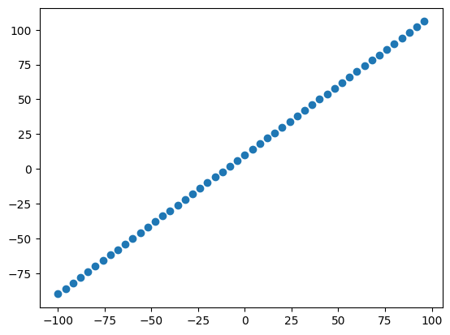


### Train-Test Datasplit

```python
len(X)
# 50 => 80:20 split
X_train = X[:40] # take first 80% of features
X_test = X[40:] # take last 20% of features
y_train = y[:40] # take first 80% of lables
y_test = y[40:] # take last 20% of lables

len(X_train), len(X_test), len(y_train), len(y_test)
# (40, 10, 40, 10)
```

```python
# visualize datasets
plt.figure(figsize=(10,7))
plt.scatter(X_train, y_train, color="blue", label="Training Data")
plt.scatter(X_test, y_test, color="hotpink", label="Testing Data")
plt.legend()
```

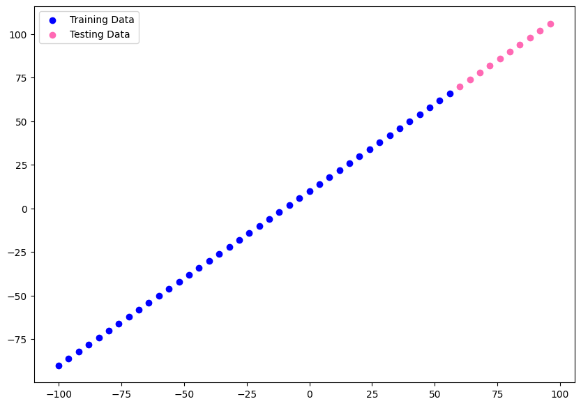

```python
# to get around biases it is better to shuffle your data
# first create random indices to be able to shuffle
# both features and lables by the same order
indices = tf.range(start=0, limit=tf.shape(X)[0], dtype=tf.int32)
shuffled_indices = tf.random.shuffle(indices)

# use random indices to shuffle both tensors
X_random = tf.gather(X, shuffled_indices)
y_random = tf.gather(y, shuffled_indices)

# re-split
X_train = X_random[:40] # take first 80% of features
X_test = X_random[40:] # take last 20% of features
y_train = y_random[:40] # take first 80% of lables
y_test = y_random[40:] # take last 20% of lables

# visualize datasets
plt.figure(figsize=(10,7))
plt.scatter(X_train, y_train, color="blue", label="Training Data")
plt.scatter(X_test, y_test, color="hotpink", label="Testing Data")
plt.legend()
```

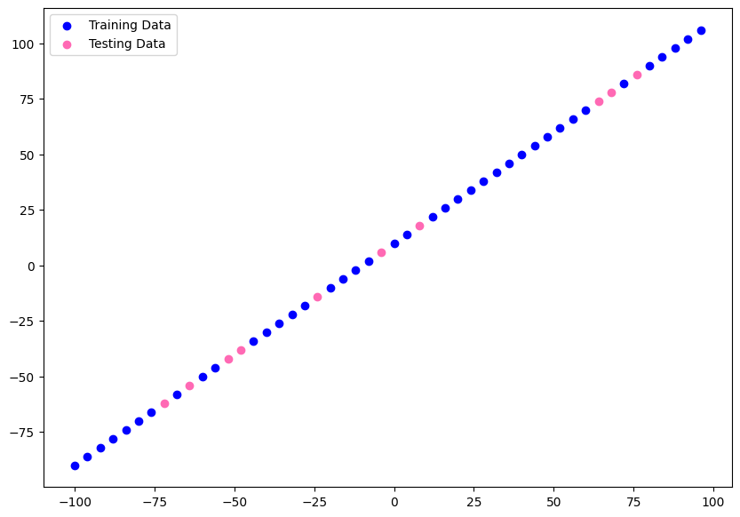


### Create the Model

```python
tf.random.set_seed(42)

model = tf.keras.Sequential([
    layers.Dense(1, input_shape=[1], name="input_layer"),
    layers.Dense(128, activation="relu", name="dense_layer1"),
    layers.Dropout(.25, name="dropout"),
    layers.Dense(64, activation="relu", name="dense_layer2"),
    layers.Dense(1, name="output_layer")
], name="my_model")
    # input and output shape is 1 - we input 1 value and create a 1 value prediction

model.compile(
    loss=tf.keras.losses.mae,
    optimizer=optimizers.Adam(learning_rate=0.01),
    metrics="mae")
```

#### Visualize the Model

```python
model.summary()
# Model: "my_model"
# _________________________________________________________________
#  Layer (type)                Output Shape              Param #   
# =================================================================
#  input_layer (Dense)         (None, 1)                 2         
                                                                 
#  dense_layer1 (Dense)        (None, 128)               256       
                                                                 
#  dropout (Dropout)           (None, 128)               0         
                                                                 
#  dense_layer2 (Dense)        (None, 64)                8256      
                                                                 
#  output_layer (Dense)        (None, 1)                 65        
                                                                 
# =================================================================
# Total params: 8,579
# Trainable params: 8,579
# Non-trainable params: 0
# _________________________________________________________________

```

```python
# plot the model
from tensorflow.keras.utils import plot_model

plot_model(model=model, show_shapes=True, show_layer_names=True, expand_nested=False)
```

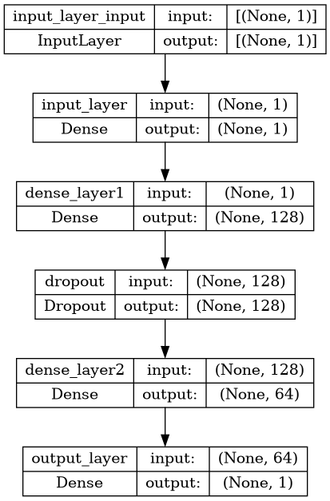

```python
model.fit(X_train, y_train, validation_data=(X_test, y_test), epochs=99)
# Epoch 99/99
# 2/2 [==============================] - 0s 25ms/step - loss: 3.1461 - mae: 3.1461 - val_loss: 3.8707 - val_mae: 3.8707
```

#### Visualize Predictions

```python
# make predictions
y_pred = model.predict(X_test)

# predicted values & true values
tf.constant(y_pred), y_test
# (<tf.Tensor: shape=(10, 1), dtype=float32, numpy=
#  array([[-44.232136],
#         [-88.13068 ],
#         [ 71.16495 ],
#         [-80.16996 ],
#         [-23.712166],
#         [ 63.83241 ],
#         [-52.232437],
#         [ 67.49867 ],
#         [ 78.4975  ],
#         [ 12.77635 ]], dtype=float32)>,
#  <tf.Tensor: shape=(10,), dtype=int32, numpy=array([-42, -86,  78, -78, -22,  70, -50,  74,  86,  14], dtype=int32)>)
```

```python
# plot train/test and compare predictions to ground truth
def plot_predictions(predictions,
                     train_data=X_train,
                     train_labels=y_train,
                     test_data=X_test,
                     test_labels=y_test):
    
    plt.figure(figsize=(10,7))
    plt.scatter(train_data, train_labels, color="green", label="training data")
    plt.scatter(test_data, test_labels, color="red", label="testing data")
    plt.scatter(test_data, predictions, color="blue", label="predictions")
    plt.legend()
```

```python
# blue dots should line up with red dots for a perfect prediction
plot_predictions(train_data=X_train,
                 train_labels=y_train,
                 test_data=X_test,
                 test_labels=y_test,
                 predictions=y_pred)
```

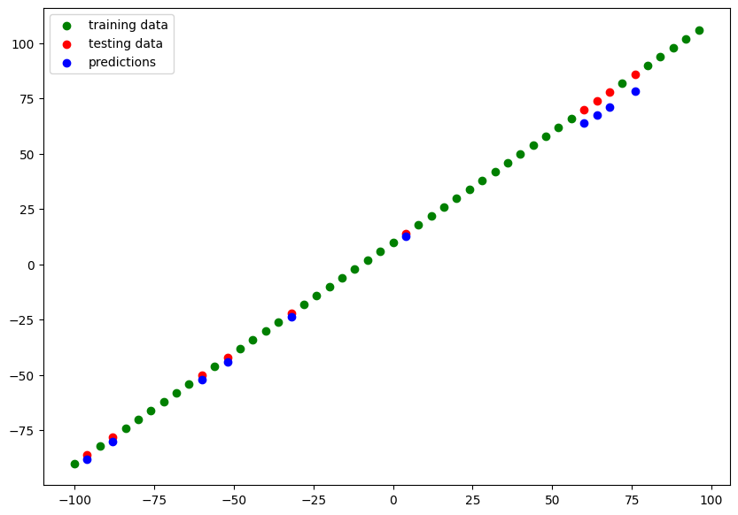


### Regression Evaluation Metrics


Regression Metrics:

* `tf.keras.losses.MAE()`, `tf.metrics.mean_absolute_error()` - Mean absolute error (absolute value my predictions - on average - will be off)
* `tf.keras.losses.MSE()`, `tf.metrics.mean_suared_error()` - Mean square error (squared average error)
* `tf.keras.losses.Huber()` - Combination of MAE & MSE (less sensitive to outliers)

```python
# get loss & metrics value in test mode
model.evaluate(X_test, y_test)
# since lossfunction & metrics are set to MAE we get the absolute error:
# [3.8707497119903564, 3.8707497119903564]
```

#### Absolute Error

```python
# to compare y_test with y_pred we must make sure they have the same shape
y_test.shape, y_pred.shape
# (TensorShape([10]), (10, 1))

# removing extra dimension from prediction array
y_pred_squeezed = tf.squeeze(y_pred)
y_pred_squeezed.shape
# TensorShape([10])
```

```python
# calculate the MAE
mae = tf.metrics.mean_absolute_error(y_true=y_test, y_pred=y_pred_squeezed)

# this returns the same value for the absolute error as the eval method above
mae
# <tf.Tensor: shape=(), dtype=float32, numpy=3.8707497>
```

#### Squared Error

```python
# calculate the MAE
mse = tf.metrics.mean_squared_error(y_true=y_test, y_pred=y_pred_squeezed)
mse
# <tf.Tensor: shape=(), dtype=float32, numpy=20.695545>
```

```python
# function to calculate both errors
def squared_and_absolute_error(y_true, y_pred):
    mae = tf.metrics.mean_absolute_error(y_true, y_pred)
    mse = tf.metrics.mean_squared_error(y_true, y_pred)
    
    return mae, mse

squared_and_absolute_error(y_true=y_test, y_pred=y_pred_squeezed)
# (<tf.Tensor: shape=(), dtype=float32, numpy=3.8707497>,
#  <tf.Tensor: shape=(), dtype=float32, numpy=20.695545>)
```

### Optimizing Model Performance


#### Get more data

```python
# create a new feature matrix
X = tf.range(-1000, 1000, 4)
# create labels for those features that follow a pattern
y = X + 10
len(X)
# 500 => 80:20 split = 400:100
```

```python
# to get around biases it is better to shuffle your data
# first create random indices to be able to shuffle
# both features and lables by the same order
indices = tf.range(start=0, limit=tf.shape(X)[0], dtype=tf.int32)
shuffled_indices = tf.random.shuffle(indices)

# use random indices to shuffle both tensors
X_random = tf.gather(X, shuffled_indices)
y_random = tf.gather(y, shuffled_indices)

# re-split
X_train = X_random[:400] # take first 80% of features
X_test = X_random[400:] # take last 20% of features
y_train = y_random[:400] # take first 80% of lables
y_test = y_random[400:] # take last 20% of lables

# visualize datasets
plt.figure(figsize=(10,7))
plt.scatter(X_train, y_train, color="blue", label="Training Data")
plt.scatter(X_test, y_test, color="hotpink", label="Testing Data")
plt.legend()
```

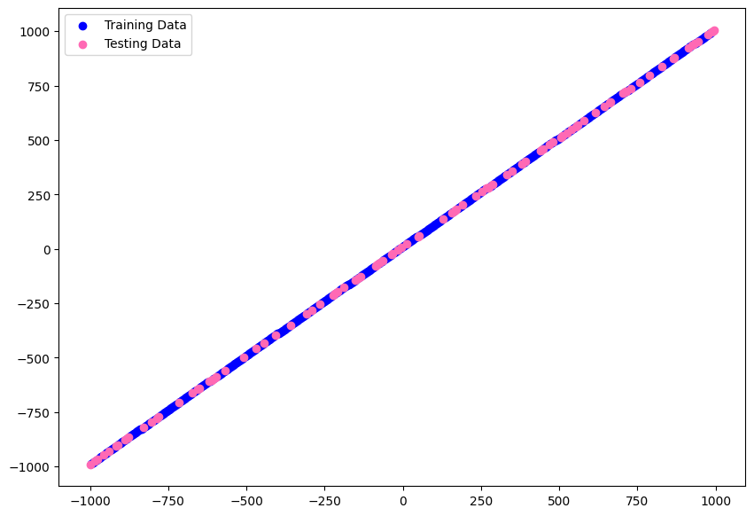


### Add Model Complexity

* `model_1` - longer training 200 epochs
* `model_2` - add another dense layer
* `model_3` - add another dropout layer
* `model_4` - same as model above but trained for 500 epochs
* ... take the best model and reduce complexity to find an optimum


#### model_1

```python
# longer training 200 epochs
model_1 = tf.keras.Sequential([
    layers.Dense(1, input_shape=[1], name="input_layer"),
    layers.Dense(128, activation="relu", name="dense_layer1"),
    layers.Dropout(.25, name="dropout"),
    layers.Dense(64, activation="relu", name="dense_layer2"),
    layers.Dense(1, name="output_layer")
], name="my_model_1")

model_1.compile(
    loss=tf.keras.losses.mae,
    optimizer=optimizers.Adam(learning_rate=0.01),
    metrics="mae")
```

```python
model_1.fit(X_train, y_train, validation_data=(X_test, y_test), epochs=200)
# Epoch 200/200
# 13/13 [==============================] - 0s 5ms/step - loss: 10.6268 - mae: 10.6268 - val_loss: 122.6467 - val_mae: 122.6467

y_pred_1 = model_1.predict(X_test)

# blue dots should line up with red dots for a perfect prediction
plot_predictions(train_data=X_train,
                 train_labels=y_train,
                 test_data=X_test,
                 test_labels=y_test,
                 predictions=y_pred_1)
```

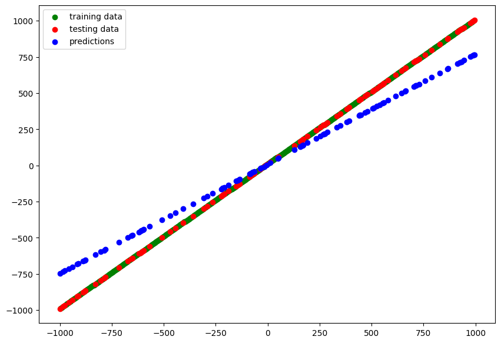


#### model_2

```python
# add another dense layer
model_2 = tf.keras.Sequential([
    layers.Dense(1, input_shape=[1], name="input_layer"),
    layers.Dense(128, activation="relu", name="dense_layer1"),
    layers.Dropout(.25, name="dropout"),
    layers.Dense(64, activation="relu", name="dense_layer2"),
    layers.Dense(32, activation="relu", name="dense_layer3"),
    layers.Dense(1, name="output_layer")
], name="my_model_2")

model_2.compile(
    loss=tf.keras.losses.mae,
    optimizer=optimizers.Adam(learning_rate=0.01),
    metrics="mae")
```

```python
model_2.fit(X_train, y_train, validation_data=(X_test, y_test), epochs=100)
# Epoch 100/100
# 13/13 [==============================] - 0s 5ms/step - loss: 31.7044 - mae: 31.7044 - val_loss: 10.8619 - val_mae: 10.8619

y_pred_2 = model_2.predict(X_test)

# blue dots should line up with red dots for a perfect prediction
plot_predictions(train_data=X_train,
                 train_labels=y_train,
                 test_data=X_test,
                 test_labels=y_test,
                 predictions=y_pred_2)
```

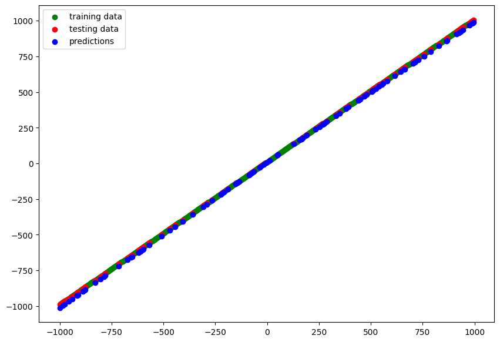


#### model_3

```python
# add another dropout layer
model_3 = tf.keras.Sequential([
    layers.Dense(1, input_shape=[1], name="input_layer"),
    layers.Dense(128, activation="relu", name="dense_layer1"),
    layers.Dropout(.25, name="dropout1"),
    layers.Dense(64, activation="relu", name="dense_layer2"),
    layers.Dropout(.25, name="dropout2"),
    layers.Dense(32, activation="relu", name="dense_layer3"),
    layers.Dense(1, name="output_layer")
], name="my_model_3")

model_3.compile(
    loss=tf.keras.losses.mae,
    optimizer=optimizers.Adam(learning_rate=0.01),
    metrics="mae")
```

```python
model_3.fit(X_train, y_train, validation_data=(X_test, y_test), epochs=100)
# Epoch 100/100
# 13/13 [==============================] - 0s 5ms/step - loss: 44.1139 - mae: 44.1139 - val_loss: 107.2299 - val_mae: 107.2299

y_pred_3 = model_3.predict(X_test)

# blue dots should line up with red dots for a perfect prediction
plot_predictions(train_data=X_train,
                 train_labels=y_train,
                 test_data=X_test,
                 test_labels=y_test,
                 predictions=y_pred_3)
```

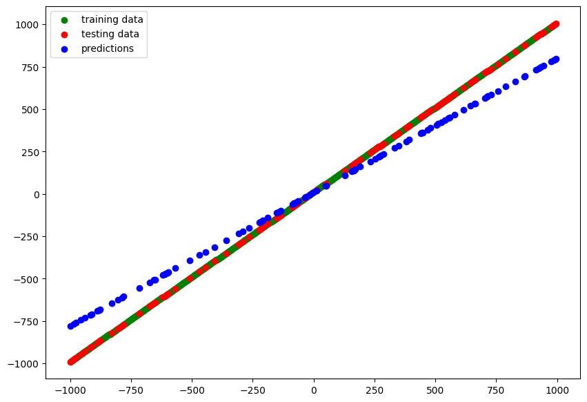


#### model_4

```python
# same as model above but trained for 500 epochs
model_4 = tf.keras.Sequential([
    layers.Dense(1, input_shape=[1], name="input_layer"),
    layers.Dense(128, activation="relu", name="dense_layer1"),
    layers.Dropout(.25, name="dropout1"),
    layers.Dense(64, activation="relu", name="dense_layer2"),
    layers.Dropout(.25, name="dropout2"),
    layers.Dense(32, activation="relu", name="dense_layer3"),
    layers.Dense(1, name="output_layer")
], name="my_model_4")

model_4.compile(
    loss=tf.keras.losses.mae,
    optimizer=optimizers.Adam(learning_rate=0.01),
    metrics="mae")
```

```python
model_4.fit(X_train, y_train, validation_data=(X_test, y_test), epochs=500)
# Epoch 500/500
# 13/13 [==============================] - 0s 5ms/step - loss: 38.3689 - mae: 38.3689 - val_loss: 143.9144 - val_mae: 143.9144

y_pred_4 = model_4.predict(X_test)

# blue dots should line up with red dots for a perfect prediction
plot_predictions(train_data=X_train,
                 train_labels=y_train,
                 test_data=X_test,
                 test_labels=y_test,
                 predictions=y_pred_4)
```

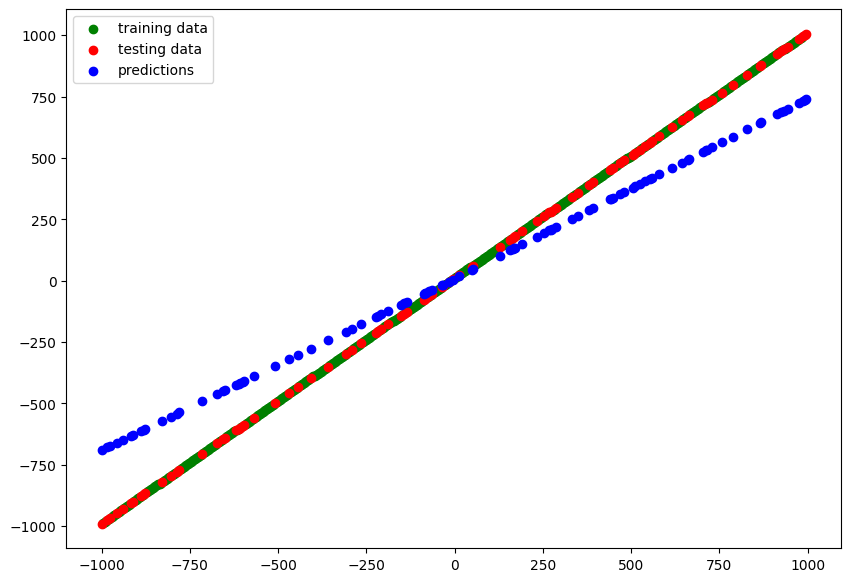


#### model_5

```python
# I am getting the best results with `model_2`
# but a 2nd dropout layer seems to reduce the performance
# let's remove the 1st dropout
model_5 = tf.keras.Sequential([
    layers.Dense(1, input_shape=[1], name="input_layer"),
    layers.Dense(128, activation="relu", name="dense_layer1"),
    layers.Dense(64, activation="relu", name="dense_layer2"),
    layers.Dense(1, name="output_layer")
], name="my_model_5")

model_5.compile(
    loss=tf.keras.losses.mae,
    optimizer=optimizers.Adam(learning_rate=0.001),
    metrics="mae")
```

```python
model_5.fit(X_train, y_train, validation_data=(X_test, y_test), epochs=100)
# Epoch 100/100
# 13/13 [==============================] - 0s 4ms/step - loss: 2.1195 - mae: 2.1195 - val_loss: 2.9318 - val_mae: 2.9318

y_pred_5 = model_5.predict(X_test)

# blue dots should line up with red dots for a perfect prediction
plot_predictions(train_data=X_train,
                 train_labels=y_train,
                 test_data=X_test,
                 test_labels=y_test,
                 predictions=y_pred_5)
```

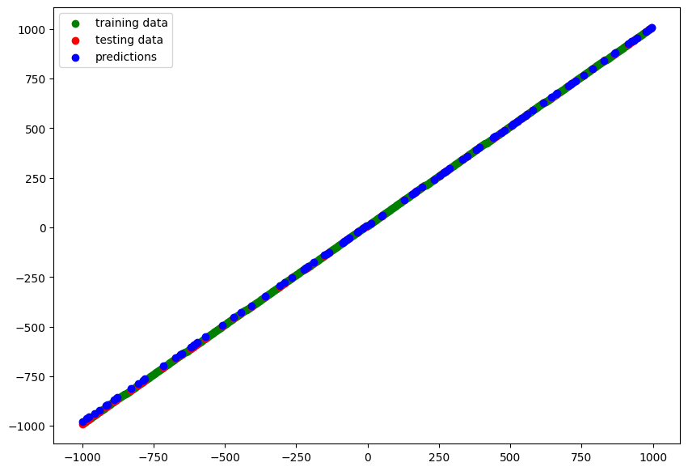


#### model_6

```python
# same as above - based on `model_2`
# but more complexity removed
model_6 = tf.keras.Sequential([
    layers.Dense(1, input_shape=[1], name="input_layer"),
    layers.Dense(64, activation="relu", name="dense_layer1"),
    layers.Dense(32, activation="relu", name="dense_layer2"),
    layers.Dense(1, name="output_layer")
], name="my_model_6")

model_6.compile(
    loss=tf.keras.losses.mae,
    optimizer=optimizers.Adam(learning_rate=0.001),
    metrics="mae")
```

```python
model_6.fit(X_train, y_train, validation_data=(X_test, y_test), epochs=100)
# Epoch 100/100
# 13/13 [==============================] - 0s 5ms/step - loss: 1.9283 - mae: 1.9283 - val_loss: 2.0062 - val_mae: 2.0062

y_pred_6 = model_6.predict(X_test)

# blue dots should line up with red dots for a perfect prediction
plot_predictions(train_data=X_train,
                 train_labels=y_train,
                 test_data=X_test,
                 test_labels=y_test,
                 predictions=y_pred_6)
```

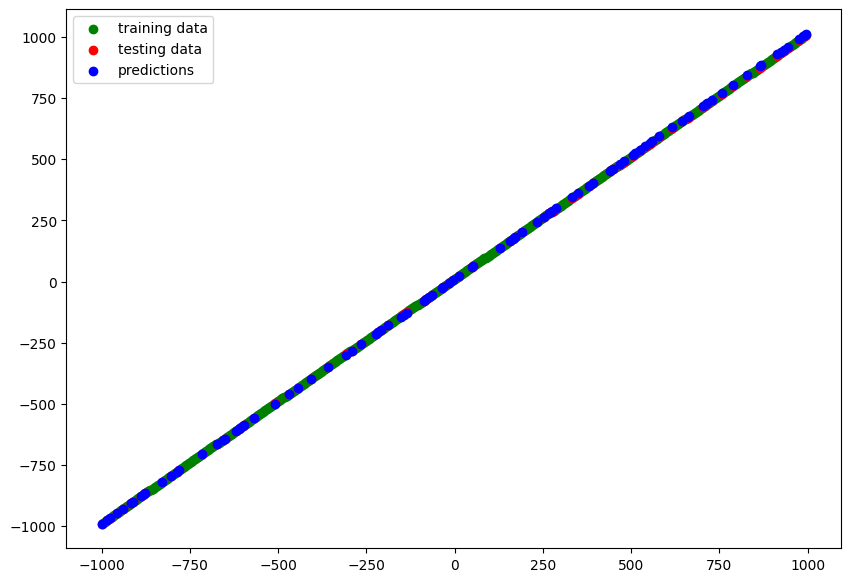


#### model_7

```python
# same as above - based on `model_2`
# but even more complexity removed
model_7 = tf.keras.Sequential([
    layers.Dense(1, input_shape=[1], name="input_layer"),
    layers.Dense(16, activation="relu", name="dense_layer1"),
    layers.Dense(8, activation="relu", name="dense_layer2"),
    layers.Dense(1, name="output_layer")
], name="my_model_6")

model_7.compile(
    loss=tf.keras.losses.mae,
    optimizer=optimizers.Adam(learning_rate=0.001),
    metrics="mae")
```

```python
# increased epochs 100 -> 500
model_7.fit(X_train, y_train, validation_data=(X_test, y_test), epochs=500)
# Epoch 500/500
# 13/13 [==============================] - 0s 5ms/step - loss: 0.6490 - mae: 0.6490 - val_loss: 0.9975 - val_mae: 0.9975

y_pred_7 = model_7.predict(X_test)

# blue dots should line up with red dots for a perfect prediction
plot_predictions(train_data=X_train,
                 train_labels=y_train,
                 test_data=X_test,
                 test_labels=y_test,
                 predictions=y_pred_7)
```

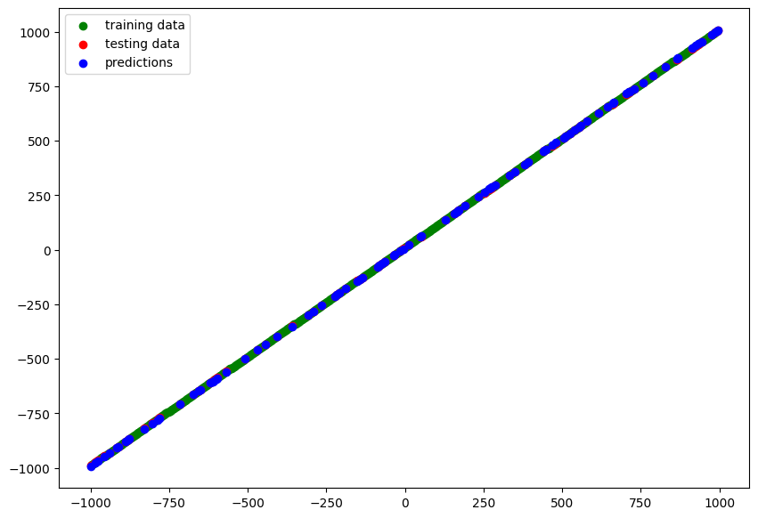


### Comparing Experiments

```python
# function to calculate mae & mse
def squared_and_absolute_error(y_true, y_pred):
    mae = tf.metrics.mean_absolute_error(y_true, tf.squeeze(y_pred))
    mse = tf.metrics.mean_squared_error(y_true, tf.squeeze(y_pred))
    
    return mae.numpy(), mse.numpy()
```

```python
# calculate errors for all models
model_1_err = squared_and_absolute_error(y_true=y_test, y_pred=y_pred_1)
model_2_err = squared_and_absolute_error(y_true=y_test, y_pred=y_pred_2)
model_3_err = squared_and_absolute_error(y_true=y_test, y_pred=y_pred_3)
model_4_err = squared_and_absolute_error(y_true=y_test, y_pred=y_pred_4)
model_5_err = squared_and_absolute_error(y_true=y_test, y_pred=y_pred_5)
model_6_err = squared_and_absolute_error(y_true=y_test, y_pred=y_pred_6)
model_7_err = squared_and_absolute_error(y_true=y_test, y_pred=y_pred_7)

```

```python
model_err = [["model_1", model_1_err[0], model_1_err[1]],
             ["model_2", model_2_err[0], model_2_err[1]],
             ["model_3", model_3_err[0], model_3_err[1]],
             ["model_4", model_4_err[0], model_4_err[1]],
             ["model_5", model_5_err[0], model_5_err[1]],
             ["model_6", model_6_err[0], model_6_err[1]],
             ["model_7", model_7_err[0], model_7_err[1]]]

result_table = pd.DataFrame(model_err, columns=["model", "mae", "mse"])
# sort results by lowest error
result_table.sort_values(by=['mae'])
```

```python
# the best performing model is `model_7`
model_7.summary()

# Model: "my_model_6"
# _________________________________________________________________
#  Layer (type)                Output Shape              Param #   
# =================================================================
#  input_layer (Dense)         (None, 1)                 2         
                                                                 
#  dense_layer1 (Dense)        (None, 16)                32        
                                                                 
#  dense_layer2 (Dense)        (None, 8)                 136       
                                                                 
#  output_layer (Dense)        (None, 1)                 9         
                                                                 
# =================================================================
# Total params: 179
# Trainable params: 179
# Non-trainable params: 0
# _________________________________________________________________
```

## Saving the Trained Models

1. `SavedModel` format (default)
2. `HDF5` format (easier to transfer outside of TF)

```python
# assign location
path='saved_models/SavedModel_Format'
# saving to SavedModel
model_7.save(path)
```

```python
# assign location
path_hdf5='saved_models/hdf5_format.h5'
# saving to HDF5
model_7.save(path_hdf5)
```

### Restoring a Saved Model

```python
loaded_SavedModel = tf.keras.models.load_model(path)
# Verify that it is the correct model
loaded_SavedModel.summary()

# Model: "my_model_6"
# _________________________________________________________________
#  Layer (type)                Output Shape              Param #   
# =================================================================
#  input_layer (Dense)         (None, 1)                 2         
                                                                 
#  dense_layer1 (Dense)        (None, 16)                32        
                                                                 
#  dense_layer2 (Dense)        (None, 8)                 136       
                                                                 
#  output_layer (Dense)        (None, 1)                 9         
                                                                 
# =================================================================
# Total params: 179
# Trainable params: 179
# Non-trainable params: 0
# _________________________________________________________________

```

```python
# make a prediction with the restored model
# lets find a value pair from the test dataset
X_test[66], y_test[66]
# (<tf.Tensor: shape=(), dtype=int32, numpy=-944>,
#  <tf.Tensor: shape=(), dtype=int32, numpy=-934>)
# So for a feature value of `-944` we should receive a label value of `-943`
```

```python
# run prediction
loaded_SavedModel.predict([-944])
# array([[-936.5761]], dtype=float32)
```

```python
loaded_HDF5Model = tf.keras.models.load_model(path_hdf5)
# Verify that it is the correct model
loaded_HDF5Model.summary()

# Model: "my_model_6"
# _________________________________________________________________
#  Layer (type)                Output Shape              Param #   
# =================================================================
#  input_layer (Dense)         (None, 1)                 2         
                                                                 
#  dense_layer1 (Dense)        (None, 16)                32        
                                                                 
#  dense_layer2 (Dense)        (None, 8)                 136       
                                                                 
#  output_layer (Dense)        (None, 1)                 9         
                                                                 
# =================================================================
# Total params: 179
# Trainable params: 179
# Non-trainable params: 0
# _________________________________________________________________
```

```python
# run prediction
loaded_HDF5Model.predict([-944])
# array([[-936.5761]], dtype=float32)
# the result is identical to the result we get from
# the restored SavedModel format model
```

```python
model_7.predict([-944]) == loaded_SavedModel.predict([-944]) == loaded_HDF5Model.predict([-944])
# array([[ True]])
# the restored models predict the identical values
```

## Medical Cost Dataset

The [Medical Cost Dataset](https://github.com/mpolinowski/Machine-Learning-with-R-datasets) investigates if you can accurately predict insurance costs based on:

* __age__: age of primary beneficiary
* __sex__: insurance contractor gender, female, male
* __bmi__: Body mass index, providing an understanding of body, weights that are relatively high or low relative to height, objective index of body weight (`kg / m ^ 2`) using the ratio of height to weight, ideally `18.5` to `24.9`
* __children__: Number of children covered by health insurance / Number of dependents
* __smoker__: Smoking
* __region__: the beneficiary's residential area in the US, northeast, southeast, southwest, northwest.
* __charges__: Individual medical costs billed by health insurance

```python
# get insurance dataset
insurance_data = pd.read_csv('https://raw.githubusercontent.com/mpolinowski/Machine-Learning-with-R-datasets/master/insurance.csv')
insurance_data
```

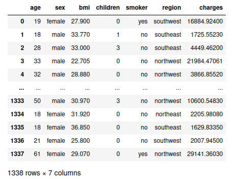

```python
# shuffle dataframe to prevent bias
insurance_data_random = insurance_data.sample(frac=1)
insurance_data_random
```

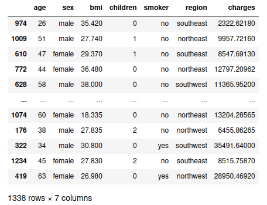

```python
# creating numerical labels for strings
# convert categorical variables into indicator variables with pandas get_dummies
insurance_one_hot = pd.get_dummies(insurance_data_random)
insurance_one_hot.head()
```

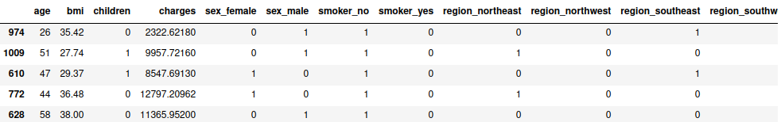

```python
# create features and labels
# we need to predict "charges" - so drop this column from features
X = insurance_one_hot.drop("charges", axis=1)
y = insurance_one_hot["charges"]
```

```python
# training and testing data split using scikit-learn
# this function actually randomizes the dataset for us
# we did not need to shuffle the dataframe before - doesn't hurt, though
X_train, X_test, y_train, y_test = train_test_split(
    X, y, test_size=0.20, random_state=42)

X_train
# 80% => 1070 rows × 11 columns
```

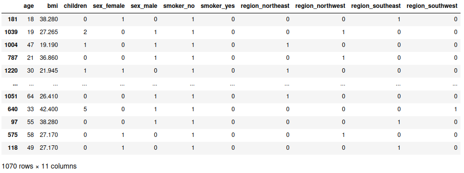


### Model Building

```python
tf.random.set_seed(42)

# building the model (based on the "best model" above)
insurance_model = tf.keras.Sequential([
    layers.Dense(10, input_shape=[11], name="input_layer"),
    layers.Dense(16, activation="relu", name="dense_layer1"),
    layers.Dense(8, activation="relu", name="dense_layer2"),
    layers.Dense(1, name="output_layer")
], name="insurance_model")

insurance_model.compile(
    loss=tf.keras.losses.mae,
    optimizer=optimizers.Adam(learning_rate=0.001),
    metrics="mae")
```

```python
# model training
insurance_model.fit(X_train, y_train, validation_data=(X_test, y_test), epochs=500)
# Epoch 500/500
# 34/34 [==============================] - 0s 3ms/step - loss: 2702.7041 - mae: 2702.7041 - val_loss: 2433.1829 - val_mae: 2433.1829
```

```python
# we have an average absolute validation error of val_mae: `2433.1829`
y_train.median(), y_train.mean()
# (9373.744050000001, 13240.898205242056)

# the arithmetic average is of medical charges is `13240.898` => 18.4% off
```

### Improving the Model

```python
# since the model was still improving I will extend the training
insurance_model.fit(X_train, y_train, validation_data=(X_test, y_test), epochs=5000)
# I am still seeing improvements after 5000 epochs

# Epoch 5000/5000
# 34/34 [==============================] - 0s 3ms/step - loss: 1498.0355 - mae: 1498.0355 - val_loss: 1543.5344 - val_mae: 1543.5344

# the error is now down to 11% from 18% before
```

```python
# since before removing complexity actually improved the model
# removing one dense layer
insurance_model_1 = tf.keras.Sequential([
    layers.Dense(10, input_shape=[11], name="input_layer"),
    layers.Dense(8, activation="relu", name="dense_layer"),
    layers.Dense(1, name="output_layer")
], name="insurance_model_1")

insurance_model_1.compile(
    loss=tf.keras.losses.mae,
    optimizer=optimizers.Adam(learning_rate=0.001),
    metrics="mae")

insurance_model_1.summary()

# Model: "insurance_model_1"
# _________________________________________________________________
#  Layer (type)                Output Shape              Param #   
# =================================================================
#  input_layer (Dense)         (None, 10)                120       
                                                                 
#  dense_layer (Dense)         (None, 8)                 88        
                                                                 
#  output_layer (Dense)        (None, 1)                 9         
                                                                 
# =================================================================
# Total params: 217
# Trainable params: 217
# Non-trainable params: 0
# _________________________________________________________________

insurance_model_1.fit(X_train, y_train, validation_data=(X_test, y_test), epochs=500)

# this decreased the performance with the error after 500 cycles
# Epoch 500/500
# 34/34 [==============================] - 0s 3ms/step - loss: 3530.7039 - mae: 3530.7039 - val_loss: 3634.2502 - val_mae: 3634.2502

# mae `2433.1829`  => mae `3634.2502`
```

```python
tf.random.set_seed(42)

# back to the initial model but with a larger learning rate
insurance_model_2 = tf.keras.Sequential([
    layers.Dense(8, input_shape=[11], name="input_layer"),
    layers.Dense(16, activation="relu", name="dense_layer1"),
    layers.Dense(8, activation="relu", name="dense_layer2"),
    layers.Dense(1, name="output_layer")
], name="insurance_model_2")

insurance_model_2.compile(
    loss=tf.keras.losses.mae,
    optimizer=optimizers.Adam(learning_rate=0.01),
    metrics="mae")

insurance_model_2.fit(X_train, y_train, validation_data=(X_test, y_test), epochs=500)
# Epoch 500/500
# 34/34 [==============================] - 0s 3ms/step - loss: 2059.1406 - mae: 2059.1406 - val_loss: 2059.2986 - val_mae: 2059.2986

# mae `2433.1829`  => mae `2059.2986`
```

```python
tf.random.set_seed(42)

# increase number of units
insurance_model_3 = tf.keras.Sequential([
    layers.Dense(8, input_shape=[11], name="input_layer"),
    layers.Dense(32, activation="relu", name="dense_layer1"),
    layers.Dense(8, activation="relu", name="dense_layer2"),
    layers.Dense(1, name="output_layer")
], name="insurance_model_3")

insurance_model_3.compile(
    loss=tf.keras.losses.mae,
    optimizer=optimizers.Adam(learning_rate=0.01),
    metrics="mae")

history = insurance_model_3.fit(X_train, y_train, validation_data=(X_test, y_test), epochs=500)

# Epoch 500/500
# 34/34 [==============================] - 0s 3ms/step - loss: 2110.4812 - mae: 2110.4812 - val_loss: 1937.2085 - val_mae: 1937.2085

# even better
# mae `2433.1829`  => mae `1937.2085`
```

```python
# history plot
pd.DataFrame(history.history).plot()
plt.ylabel("loss")
plt.xlabel("epochs")

# the improvements keep creeping in slowly.
```

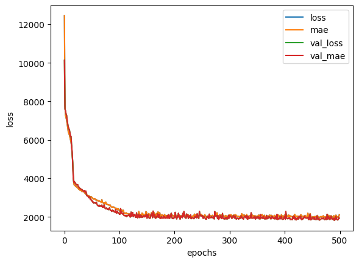


### When to stop training?

```python
# a way to keep training until a minimum of
# improvement is reached you can use the 
# `EarlyStopping()` callback

# stop when loss stops improving min 0.0001
# over 10 cycles
earlystop_callback = tf.keras.callbacks.EarlyStopping(
  monitor='val_loss', min_delta=0.0001,
  patience=10, restore_best_weights=True)

history = insurance_model_3.fit(X_train, y_train,
                                validation_data=(X_test, y_test),
                                epochs=5000, callbacks=[earlystop_callback])

# since the model is already trained it won't run for long now before the callback is triggered:
# Epoch 21/5000
# 34/34 [==============================] - 0s 3ms/step - loss: 1843.7740 - mae: 1843.7740 - val_loss: 1802.4473 - val_mae: 1802.4473

```

## Preprocessing Data

### Normalization & Standardization

Change the values of features to a common scale without distorting differences in their ranges.

```python
X["age"].plot(kind="hist")
```

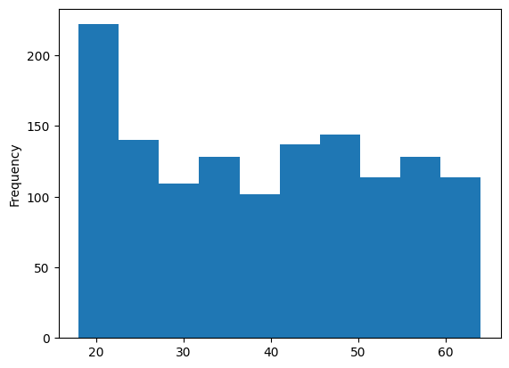

```python
X["bmi"].plot(kind="hist")
X["children"].value_counts()
# 0    574
# 1    324
# 2    240
# 3    157
# 4     25
# 5     18
# Name: children, dtype: int64
```

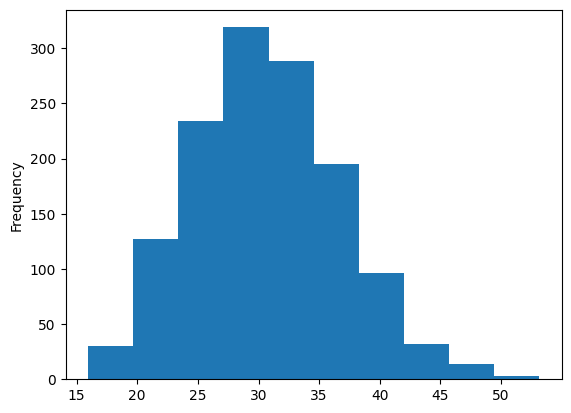


#### Feature Scaling with SciKit

To bring all values on the same scale we can use SciKit-Learn:

* __Normalization__: `MinMaxScaler` converts all values to a range between `1` and `0` while preserving the original distribution.
* __Standardization__: `StandardScaler` removes the mean and divides each value by the standard deviation (reduces effect from outliers)

```python
# get insurance dataset
insurance_data = pd.read_csv('https://raw.githubusercontent.com/mpolinowski/Machine-Learning-with-R-datasets/master/insurance.csv')
insurance_data_random = insurance_data.sample(frac=1)
```

```python
# create a column transformer
transformer = make_column_transformer(
        (MinMaxScaler(), ["age", "bmi", "children"]), # Normalize
        (OneHotEncoder(handle_unknown="ignore"), ["sex", "smoker", "region"]) # OneHotEncode
    )
```

```python
# create features and labels
# we need to predict "charges" - so drop this column from features
X = insurance_data_random.drop("charges", axis=1)
y = insurance_data_random["charges"]

# training and testing data split using scikit-learn
# this function actually randomizes the dataset for us
# we did not need to shuffle the dataframe before - doesn't hurt, though
X_train, X_test, y_train, y_test = train_test_split(
    X, y, test_size=0.20, random_state=42)

# fit transformer to training data
transformer.fit(X_train)

# normalize training and test data with transformer
X_train_norm = transformer.transform(X_train)
X_test_norm = transformer.transform(X_test)

X_train.loc[88], X_train_norm[88]

# (age                46
#  sex            female
#  bmi             27.74
#  children            0
#  smoker             no
#  region      northwest
 
#  Name: 88, dtype: object,
#  array([0.65217391, 0.52905569, 0.8       , 0.        , 1.        ,
#         1.        , 0.        , 1.        , 0.        , 0.        ,
#         0.        ]))
```

### Model Training

```python
tf.random.set_seed(42)

# increase number of units
insurance_model_norm = tf.keras.Sequential([
    layers.Dense(8, input_shape=[11], name="input_layer"),
    layers.Dense(16, activation="relu", name="dense_layer1"),
    layers.Dense(8, activation="relu", name="dense_layer2"),
    layers.Dense(1, name="output_layer")
], name="insurance_model_norm")

insurance_model_norm.compile(
    loss=tf.keras.losses.mae,
    optimizer=optimizers.Adam(learning_rate=0.01),
    metrics="mae")

earlystop_callback = tf.keras.callbacks.EarlyStopping(
  monitor='val_loss', min_delta=0.00001,
  patience=100, restore_best_weights=True)

history_norm = insurance_model_norm.fit(X_train_norm, y_train,
                                validation_data=(X_test_norm, y_test),
                                epochs=5000, callbacks=[earlystop_callback])

# Epoch 950/5000
# 34/34 [==============================] - 0s 4ms/step - loss: 1292.6730 - mae: 1292.6730 - val_loss: 2108.5374 - val_mae: 2108.5374
```

```python
# history plot
pd.DataFrame(history_norm.history).plot()
plt.ylabel("loss")
plt.xlabel("epochs")
```

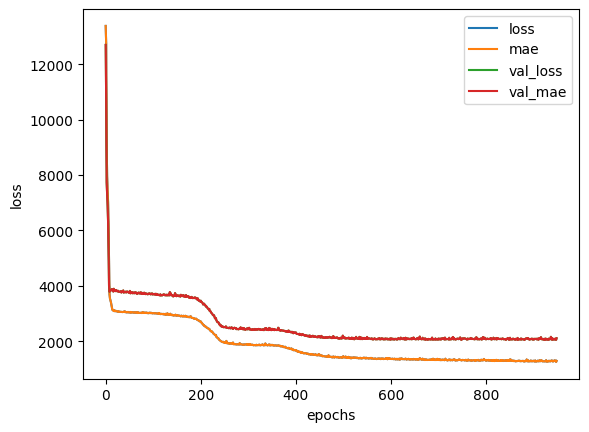

```python
tf.random.set_seed(42)

# increase number of units
insurance_model_norm_1 = tf.keras.Sequential([
    layers.Dense(11, name="input_layer"),
    layers.Dense(32, activation="relu", name="dense_layer1"),
    layers.Dense(8, activation="relu", name="dense_layer2"),
    layers.Dense(1, name="output_layer")
], name="insurance_model_norm_1")

insurance_model_norm_1.compile(
    loss=tf.keras.losses.mae,
    optimizer=optimizers.Adam(learning_rate=0.02),
    metrics="mae")

earlystop_callback = tf.keras.callbacks.EarlyStopping(
  monitor='val_loss', min_delta=0.00001,
  patience=100, restore_best_weights=True)

history_norm_1 = insurance_model_norm_1.fit(X_train_norm, y_train,
                                validation_data=(X_test_norm, y_test),
                                epochs=5000, callbacks=[earlystop_callback])

# Epoch 424/5000
# 34/34 [==============================] - 0s 4ms/step - loss: 1358.7324 - mae: 1358.7324 - val_loss: 2093.2083 - val_mae: 2093.2083
```

```python
# history plot
pd.DataFrame(history_norm_1.history).plot()
plt.ylabel("loss")
plt.xlabel("epochs")
```

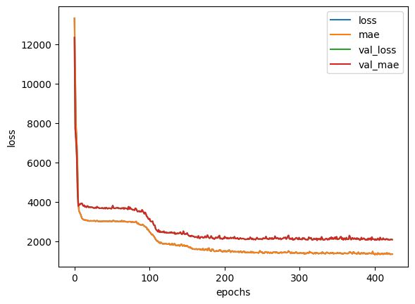

```python

```
