---
jupyter:
  jupytext:
    formats: ipynb,md
    text_representation:
      extension: .md
      format_name: markdown
      format_version: '1.3'
      jupytext_version: 1.14.4
  kernelspec:
    display_name: Python 3 (ipykernel)
    language: python
    name: python3
---

   # Tensorflow - Classification Problems
    
   * Binary Classifications
   * Multiclass Classifications
   * Multilabel Classifications

```python
import tensorflow as tf

import matplotlib.pyplot as plt
import numpy as np
import pandas as pd
from sklearn.model_selection import train_test_split 
from sklearn.datasets import make_circles
from sklearn.metrics import confusion_matrix
```

## Working with Non-Linear Datasets

```python
# creating data
n_samples = 1000
X, y = make_circles(n_samples,
                   noise=0.025,
                   random_state=42)

# check features and labels
X, y

# (array([[ 0.75424625,  0.23148074],
#         [-0.75615888,  0.15325888],
#         [-0.81539193,  0.17328203],
#         ...,
#         [-0.13690036, -0.81001183],
#         [ 0.67036156, -0.76750154],
#         [ 0.28105665,  0.96382443]]),
#  array([1, 1, 1, 1, 0, 1, 1, 1, 1, 0, 1, 0, 1, 1, 1, 1, 0, 1, 1, 0, 1, 0,
#         0, 1, 0, 0, 0, 1, 1, 1, 0, 0, 1, 0, 0, 0, 1, 1, 1, 0, 0, 0, 0, 1,
#         0, 0, 1, 1, 0, 1, 1, 1, 0, 1, 0, 0, 1, 0, 0, 1, 0, 0, 1, 0, 1, 1,
#         1, 1, 0, 1, 0, 0, 1, 1, 0, 0, 1, 0, 1, 0, 1, 0, 0, 0, 0, 1, 1, 1,
#         1, 0, 0, 0, 1, 0, 1, 0, 1, 0, 0, 1, 1, 0, 1, 0, 1, 1, 1, 1, 0, 1,
#         1, 1, 1, 1, 0, 0, 0, 1, 1, 0, 1, 0, 1, 0, 0, 1, 1, 0, 1, 1, 1, 1,
#         0, 1, 1, 0, 0, 0, 0, 0, 0, 0, 1, 0, 1, 1, 1, 0, 1, 0, 1, 0, 1, 0,
#         1, 0, 0, 1, 0, 1, 1, 1, 1, 1, 1, 1, 0, 1, 0, 0, 0, 0, 0, 1, 0, 0,
#         0, 0, 1, 1, 0, 1, 0, 1, 1, 0, 0, 0, 1, 1, 1, 1, 1, 0, 0, 0, 0, 0,
#         1, 0, 0, 1, 1, 1, 1, 1, 0, 1, 0, 1, 0, 0, 1, 1, 1, 0, 1, 0, 1, 1,
#         0, 1, 1, 0, 1, 0, 1, 0, 1, 1, 0, 1, 0, 1, 0, 0, 0, 1, 0, 0, 0, 0,
#         1, 1, 0, 0, 0, 0, 0, 0, 0, 1, 1, 1, 0, 0, 1, 1, 1, 0, 1, 0, 0, 0,
#         0, 1, 1, 0, 1, 0, 0, 0, 1, 0, 1, 0, 0, 1, 0, 1, 1, 1, 0, 0, 0, 1,
#         0, 0, 0, 1, 1, 1, 1, 0, 0, 0, 1, 0, 0, 0, 1, 0, 0, 0, 1, 1, 0, 1,
#         1, 1, 1, 1, 1, 1, 0, 0, 0, 0, 1, 0, 0, 0, 0, 1, 1, 1, 0, 0, 1, 0,
#         1, 0, 1, 1, 0, 0, 1, 1, 1, 1, 0, 0, 0, 0, 0, 0, 1, 1, 0, 1, 0, 0,
#         1, 0, 0, 0, 0, 0, 0, 0, 0, 1, 0, 0, 0, 0, 1, 0, 0, 1, 0, 1, 0, 0,
#         0, 1, 0, 0, 1, 1, 0, 0, 1, 0, 0, 1, 1, 0, 1, 1, 0, 0, 1, 0, 1, 0,
#         0, 0, 1, 1, 0, 0, 1, 1, 1, 1, 1, 0, 0, 1, 1, 1, 1, 0, 1, 1, 1, 1,
#         1, 0, 0, 1, 0, 1, 0, 0, 0, 0, 1, 0, 0, 0, 0, 0, 0, 0, 0, 0, 1, 1,
#         0, 1, 1, 1, 1, 1, 1, 0, 1, 1, 1, 1, 0, 0, 0, 1, 1, 1, 0, 0, 0, 0,
#         1, 1, 0, 0, 0, 0, 1, 0, 0, 0, 1, 0, 0, 1, 1, 1, 1, 1, 1, 0, 0, 0,
#         1, 0, 0, 0, 0, 0, 1, 1, 1, 0, 0, 0, 0, 0, 1, 1, 1, 0, 0, 1, 1, 1,
#         1, 0, 1, 1, 0, 1, 0, 0, 0, 1, 0, 0, 1, 0, 0, 1, 1, 0, 0, 1, 1, 0,
#         1, 0, 1, 0, 1, 0, 1, 0, 0, 0, 1, 0, 0, 0, 0, 0, 0, 1, 1, 1, 1, 0,
#         0, 0, 1, 0, 1, 1, 0, 0, 0, 0, 0, 1, 1, 1, 0, 0, 1, 0, 0, 1, 0, 0,
#         1, 0, 0, 1, 0, 0, 0, 1, 0, 0, 1, 1, 1, 0, 1, 1, 0, 0, 0, 1, 1, 1,
#         1, 0, 0, 1, 1, 1, 0, 0, 0, 0, 1, 1, 0, 0, 1, 1, 0, 0, 1, 1, 1, 1,
#         1, 1, 1, 0, 1, 0, 1, 0, 0, 1, 0, 1, 1, 1, 1, 0, 0, 1, 1, 0, 0, 1,
#         0, 1, 0, 0, 0, 1, 0, 0, 1, 1, 1, 1, 0, 1, 1, 1, 1, 1, 1, 1, 0, 1,
#         0, 1, 1, 1, 0, 0, 1, 0, 0, 0, 1, 1, 1, 1, 0, 0, 0, 0, 1, 0, 1, 1,
#         1, 0, 1, 0, 0, 1, 0, 0, 1, 1, 1, 1, 1, 0, 1, 0, 0, 0, 1, 1, 1, 1,
#         1, 0, 0, 0, 1, 1, 1, 1, 0, 0, 0, 0, 0, 1, 1, 0, 1, 0, 1, 0, 0, 0,
#         0, 0, 0, 0, 0, 0, 1, 1, 1, 1, 1, 0, 1, 0, 1, 1, 1, 1, 0, 1, 1, 1,
#         1, 1, 1, 1, 1, 0, 1, 1, 0, 1, 0, 0, 0, 1, 0, 1, 1, 1, 0, 1, 1, 0,
#         1, 1, 0, 1, 0, 1, 1, 0, 0, 1, 1, 1, 0, 0, 0, 0, 1, 1, 0, 0, 1, 1,
#         1, 1, 1, 1, 1, 1, 1, 1, 1, 1, 1, 1, 0, 0, 1, 0, 1, 0, 1, 0, 1, 1,
#         1, 1, 1, 1, 0, 1, 0, 1, 1, 1, 0, 1, 1, 0, 0, 1, 0, 1, 1, 0, 0, 1,
#         1, 1, 1, 1, 1, 1, 1, 0, 1, 1, 1, 0, 1, 0, 0, 1, 1, 0, 0, 0, 1, 0,
#         0, 1, 0, 0, 0, 1, 0, 1, 0, 0, 0, 0, 1, 0, 1, 1, 1, 1, 0, 1, 0, 0,
#         0, 0, 0, 0, 1, 0, 1, 0, 1, 0, 1, 1, 1, 0, 1, 0, 1, 0, 0, 1, 1, 1,
#         0, 0, 0, 1, 1, 0, 1, 0, 1, 1, 0, 1, 0, 0, 1, 1, 1, 0, 0, 0, 1, 1,
#         0, 0, 0, 0, 0, 1, 1, 0, 1, 0, 0, 0, 1, 0, 0, 0, 1, 1, 1, 1, 0, 1,
#         1, 1, 0, 1, 1, 1, 1, 0, 1, 1, 0, 1, 1, 0, 0, 1, 1, 1, 0, 0, 0, 0,
#         0, 0, 1, 0, 0, 1, 0, 0, 0, 1, 0, 1, 0, 1, 1, 0, 0, 0, 0, 0, 0, 0,
#         0, 1, 0, 1, 0, 0, 0, 1, 0, 0]))
```

```python
# the dataset has two labels 1 & 0 for datapoints
# of the inner and outer circle generated by Scikit-Learn

circles = pd.DataFrame({"X0":X[:,0], "X1": X[:, 1], "label":y})
circles, X.shape, y.shape

# (           X0        X1  label
#  0    0.754246  0.231481      1
#  1   -0.756159  0.153259      1
#  2   -0.815392  0.173282      1
#  3   -0.393731  0.692883      1
#  4    0.442208 -0.896723      0
#  ..        ...       ...    ...
#  995  0.244054  0.944125      0
#  996 -0.978655 -0.272373      0
#  997 -0.136900 -0.810012      1
#  998  0.670362 -0.767502      0
#  999  0.281057  0.963824      0
 
#  [1000 rows x 3 columns],
#  (1000, 2),
#  (1000,))
```

```python
# we can visualize them in a scatter plot
plt.scatter(X[:, 0], X[:, 1], c=y, cmap=plt.cm.RdYlBu)
```

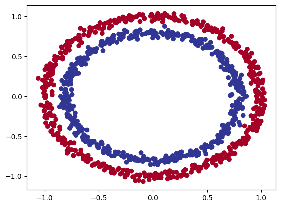


## Building the Model

We can now build a neural network that allows us to do a binary classification between datapoints that belong to the blue and red circle.

```python
tf.random.set_seed(42)

model_circles = tf.keras.Sequential([
    tf.keras.layers.Dense(1, name="input_layer")
], name="model_circles")

model_circles.compile(
    loss=tf.keras.losses.BinaryCrossentropy(),
    optimizer=tf.keras.optimizers.Adam(learning_rate=0.01),
    metrics=["accuracy"])

# earlystop_callback = tf.keras.callbacks.EarlyStopping(
#   monitor='val_loss', min_delta=0.00001,
#   patience=100, restore_best_weights=True)

model_circles.fit(X, y, epochs=10) # callbacks=[earlystop_callback]
model_circles.evaluate(X, y)

# 32/32 [==============================] - 0s 1ms/step - loss: 0.7405 - accuracy: 0.5050
# [0.7405271530151367, 0.5049999952316284
#
# currently the model only predicts with a 45% accuracy... worse than pure guessing with a binary choice
```

```python
tf.random.set_seed(42)

# adding complexity + activation functions
model_circles_1 = tf.keras.Sequential([
    tf.keras.layers.Dense(8, name="input_layer"),
    tf.keras.layers.Dense(16, name="dense_layer1"),
    tf.keras.layers.Dense(8, name="dense_layer2"),
    tf.keras.layers.Dense(1, name="output_layer")
], name="model_circles_1")

# # adding complexity + activation functions
# model_circles_1 = tf.keras.Sequential([
#     tf.keras.layers.Dense(8, activation="relu", name="input_layer"),
#     tf.keras.layers.Dense(16, activation="relu", name="dense_layer1"),
#     tf.keras.layers.Dense(8, activation="relu", name="dense_layer2"),
#     tf.keras.layers.Dense(1, activation="relu", name="output_layer")
# ], name="model_circles_1")

model_circles_1.compile(
    loss=tf.keras.losses.BinaryCrossentropy(),
    optimizer=tf.keras.optimizers.Adam(learning_rate=0.001),
    metrics=["accuracy"])

history_1 = model_circles_1.fit(X, y, epochs=150, verbose=0)
model_circles_1.evaluate(X, y)

# 32/32 [==============================] - 0s 1ms/step - loss: 0.7405 - accuracy: 0.5050
# [0.7405271530151367, 0.5049999952316284]

# not much better...
```

```python
# history plot
pd.DataFrame(history_1.history).plot()
plt.ylabel("loss")
plt.xlabel("epochs")
```

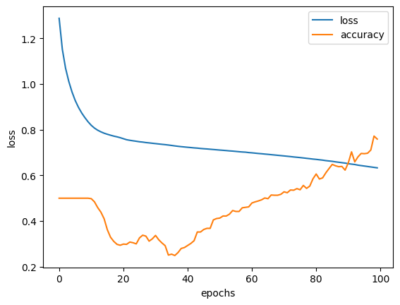


### Why it Fails

```python
# visualize predictions
# https://cs231n.github.io/neural-networks-case-study/

def decision_boundray(model, X, y):
    
    # define axis boundries for features and labels
    x_min, x_max = X[:, 0].min() - 0.1, X[:, 0].max() + 0.1
    y_min, y_max = X[:, 1].min() - 0.1, X[:, 1].max() + 0.1
    
    # create meshgrid within boundries (fresh data to run predictions on)
    xx, yy = np.meshgrid(np.linspace(x_min, x_max, 100),
                        np.linspace(y_min, y_max, 100))
    
    # stack both mesh arrays together
    x_in = np.c_[xx.ravel(), yy.ravel()]
    
    # make predictions using the trained model
    y_pred = model.predict(x_in)
    
    # check for multiclass-classification 
    if len(y_pred[0]) > 1:
        # reshape predictions
        y_pred = np.argmax(y_pred, axis=1).reshape(xx.shape)
    else:
        y_pred = np.round(y_pred).reshape(xx.shape)
        
    # plot decision boundry
    plt.contourf(xx, yy, y_pred, cmap=plt.cm.RdYlBu, alpha=0.7)
    plt.scatter(X[:, 0], X[:, 1], c=y, s=40, cmap=plt.cm.RdYlBu)
    plt.xlim(xx.min(), xx.max())
    plt.ylim(yy.min(), yy.max())
```

```python
decision_boundray(model=model_circles_1, X=X, y=y)
# the model is trying to draw a straight line through the dataset to differentiate between both classes
# it then expands this line and tries to divide both classes - and fails with a circular dataset.
```

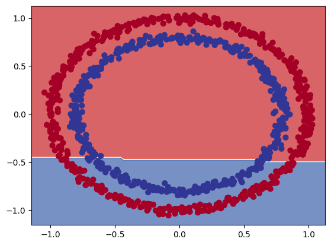


## Non Linearity


> Experimenting with the [Tensorflow Playground](https://playground.tensorflow.org/#activation=linear&batchSize=10&dataset=circle&regDataset=reg-plane&learningRate=0.001&regularizationRate=0&noise=0&networkShape=1&seed=0.14938&showTestData=false&discretize=false&percTrainData=50&x=true&y=true&xTimesY=false&xSquared=false&ySquared=false&cosX=false&sinX=false&cosY=false&sinY=false&collectStats=false&problem=classification&initZero=false&hideText=false) to find a model that works for the non-linear classification problem.

A model useable for linear problems will remain stuck at an accuracy around 50% - purely guessing when predicting:

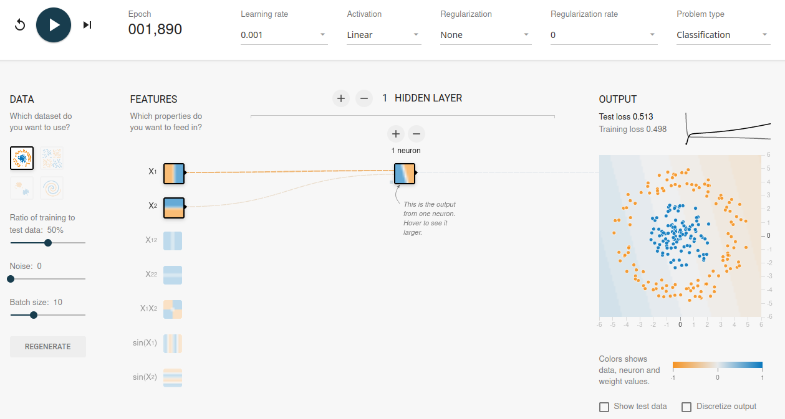

```python
# rebuilding the model (above)
tf.random.set_seed(42)

model_circles_2 = tf.keras.Sequential([
    tf.keras.layers.Dense(1, activation="linear", name="input_layer")
])

model_circles_2.compile(loss="binary_crossentropy",
                       optimizer=tf.keras.optimizers.Adam(learning_rate=0.001),
                       metrics=["accuracy"])

history_2 = model_circles_2.fit(X, y, epochs=150, verbose=0)
model_circles_2.evaluate(X, y)

# 32/32 [==============================] - 0s 1ms/step - loss: 0.7222 - accuracy: 0.4590
# [0.7222346067428589, 0.45899999141693115]
```

```python
decision_boundray(model=model_circles_2, X=X, y=y)
```

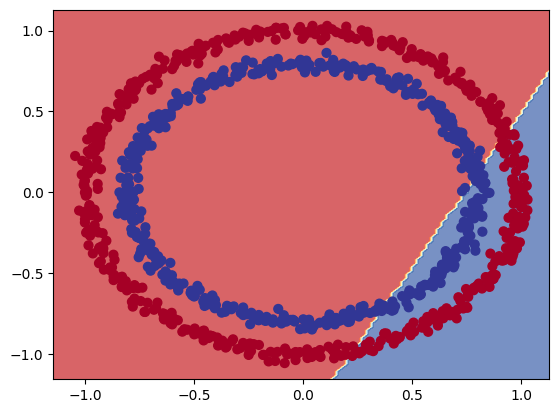

<!-- #region -->
I am starting to get a good separation with the following setup after approx. 2000 epochs:


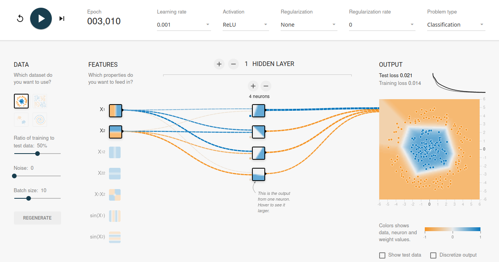
<!-- #endregion -->

```python
# rebuilding the model (above)
tf.random.set_seed(42)

model_circles_3 = tf.keras.Sequential([
    tf.keras.layers.Dense(4, activation="relu")
])

model_circles_3.compile(loss="binary_crossentropy",
                       optimizer=tf.keras.optimizers.Adam(learning_rate=0.001),
                       metrics=["accuracy"])

history_3 = model_circles_3.fit(X, y, epochs=2000, verbose=0)
model_circles_3.evaluate(X, y)

# 32/32 [==============================] - 0s 1ms/step - loss: 0.6932 - accuracy: 0.5000
# [0.693161129951477, 0.5]
```

```python
decision_boundray(model=model_circles_3, X=X, y=y)
# well, that isn't good...
```

```python
# rebuilding the model (2nd attempt)
# adding an output layer with a single neuron for the binary classification

tf.random.set_seed(42)

model_circles_4 = tf.keras.Sequential([
    tf.keras.layers.Dense(4, activation="relu", name="input_layer"),
    tf.keras.layers.Dense(1, name="output_layer")
])

model_circles_4.compile(loss="binary_crossentropy",
                       optimizer=tf.keras.optimizers.Adam(learning_rate=0.001),
                       metrics=["accuracy"])

history_4 = model_circles_4.fit(X, y, epochs=2000, verbose=0)
model_circles_4.evaluate(X, y)

# 32/32 [==============================] - 0s 2ms/step - loss: 0.3404 - accuracy: 0.8320
# [0.34036046266555786, 0.8320000171661377]
```

```python
decision_boundray(model=model_circles_4, X=X, y=y)
# much better - but not as good as the example from the tf.playground
```

```python
# rebuilding the model (2nd attempt)
# adding an "sigmoid" activation for the output layer

tf.random.set_seed(42)

model_circles_6 = tf.keras.Sequential([
    tf.keras.layers.Dense(4, activation="relu", name="input_layer"),
    tf.keras.layers.Dense(1, activation="sigmoid", name="output_layer")
])

model_circles_6.compile(loss="binary_crossentropy",
                       optimizer=tf.keras.optimizers.Adam(learning_rate=0.001),
                       metrics=["accuracy"])

model_circles_6.fit(X, y, epochs=2000, verbose=0)
model_circles_6.evaluate(X, y)
32/32 [==============================] - 0s 1ms/step - loss: 0.0241 - accuracy: 1.0000
[0.0241051334887743, 1.0]
```

```python
decision_boundray(model=model_circles_6, X=X, y=y)
# there you go...
```

## Non-linear Activation Functions

```python
# create a input tensor
input_linear = tf.cast(tf.range(-10, 10), tf.float32)

# visualize the tensor
plt.plot(input_linear)
```


### Linear Activation Function

```python
# replicating the linear activation function linear(x) = x
def linear(X):
    return X

linear(input_linear)

# <tf.Tensor: shape=(20,), dtype=float32, numpy=
# array([-10.,  -9.,  -8.,  -7.,  -6.,  -5.,  -4.,  -3.,  -2.,  -1.,   0.,
#          1.,   2.,   3.,   4.,   5.,   6.,   7.,   8.,   9.],
#       dtype=float32)>

plt.plot(linear(input_linear))
```

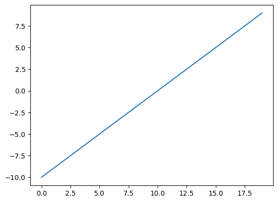


### Sigmoid Activation Function

```python
# replicating the sigmoid activation function sigmoid(x) = 1 / (1 + exp(-x))
def sigmoid(X):
    return 1/(1 + tf.exp(-X))

sigmoid(input_linear)

# <tf.Tensor: shape=(20,), dtype=float32, numpy=
# array([4.5397868e-05, 1.2339458e-04, 3.3535014e-04, 9.1105117e-04,
#        2.4726230e-03, 6.6928510e-03, 1.7986210e-02, 4.7425874e-02,
#        1.1920292e-01, 2.6894143e-01, 5.0000000e-01, 7.3105854e-01,
#        8.8079703e-01, 9.5257413e-01, 9.8201376e-01, 9.9330717e-01,
#        9.9752742e-01, 9.9908900e-01, 9.9966466e-01, 9.9987662e-01],
#       dtype=float32)>

plt.plot(sigmoid(input_linear))
```

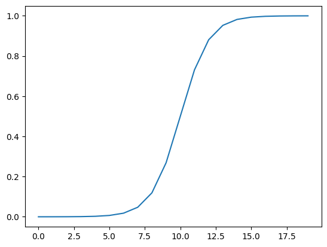


### reLU Activation Function

```python
# replicating the reLU function f(x) = 0 for x<0 and x for x>0
def relu(X):
    return tf.maximum(0, X)

relu(input_linear)
# <tf.Tensor: shape=(20,), dtype=float32, numpy=
# array([0., 0., 0., 0., 0., 0., 0., 0., 0., 0., 0., 1., 2., 3., 4., 5., 6.,
#        7., 8., 9.], dtype=float32)>

plt.plot(relu(input_linear))
```

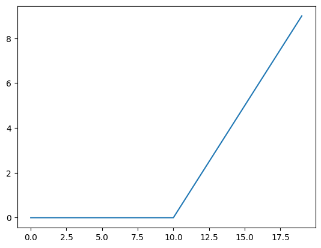


## Training & Testing Datasplit

In the example above I used a single dataset to both train and test the model. Let's split this dataset so that we have a fresh testing dataset for the model.

```python
# training and testing data split using scikit-learn
X_train, X_test, y_train, y_test = train_test_split(
    X, y, test_size=0.20, random_state=42)

# check shape
X_train.shape, X_test.shape, y_train.shape, y_test.shape
# ((800, 2), (200, 2), (800,), (200,))
```

```python
# rebuild the best model from above
# train on training set and eval on testing
tf.random.set_seed(42)

model_circles_lr10e_3 = tf.keras.Sequential([
    tf.keras.layers.Dense(4, activation="relu", name="input_layer"),
    tf.keras.layers.Dense(4, activation="relu", name="dense_layer"),
    tf.keras.layers.Dense(1, activation="sigmoid", name="output_layer")
])

model_circles_lr10e_3.compile(loss="binary_crossentropy",
                       optimizer=tf.keras.optimizers.Adam(learning_rate=0.001),
                       metrics=["accuracy"])

history_lr10e_3 = model_circles_lr10e_3.fit(X_train, y_train,
                    validation_data=(X_test, y_test),
                    epochs=2000)

# Epoch 2000/2000
# 25/25 [==============================] - 0s 4ms/step - loss: 2.2199e-04 - accuracy: 1.0000 - val_loss: 0.0131 - val_accuracy: 0.9950
```

```python
decision_boundray(model=model_circles_lr10e_3, X=X_test, y=y_test)
```

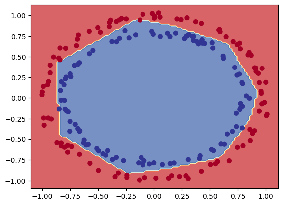


## Learning Rate

In the example above it took __256__ cycles to get to an __val_accuracy: 0.9000__:

```
25/25 [==============================] - 0s 3ms/step - loss: 0.2355 - accuracy: 0.9100 - val_loss: 0.2647 - val_accuracy: 0.8950
Epoch 255/2000
25/25 [==============================] - 0s 3ms/step - loss: 0.2338 - accuracy: 0.9137 - val_loss: 0.2636 - val_accuracy: 0.8900
Epoch 256/2000
25/25 [==============================] - 0s 3ms/step - loss: 0.2312 - accuracy: 0.9162 - val_loss: 0.2595 - val_accuracy: 0.9000
Epoch 257/2000
25/25 [==============================] - 0s 3ms/step - loss: 0.2255 - accuracy: 0.9162 - val_loss: 0.2390 - val_accuracy: 0.9000
Epoch 258/2000
25/25 [==============================] - 0s 3ms/step - loss: 0.2030 - accuracy: 0.9438 - val_loss: 0.2118 - val_accuracy: 0.9600
```

By increasing the learning rate we allow Tensorflow to make bigger changes to the model weights after each epoch. This should increase the initial speed with which the model is moving towards the optimum:

```python
tf.random.set_seed(42)

model_circles_lr10e_2 = tf.keras.Sequential([
    tf.keras.layers.Dense(4, activation="relu", name="input_layer"),
    tf.keras.layers.Dense(4, activation="relu", name="dense_layer"),
    tf.keras.layers.Dense(1, activation="sigmoid", name="output_layer")
])

model_circles_lr10e_2.compile(loss="binary_crossentropy",
                       optimizer=tf.keras.optimizers.Adam(learning_rate=0.01),
                       metrics=["accuracy"])

history_lr10e_2 = model_circles_lr10e_2.fit(X_train, y_train,
                    validation_data=(X_test, y_test),
                    epochs=2000)

# Epoch 2000/2000
# 25/25 [==============================] - 0s 3ms/step - loss: 4.2108e-04 - accuracy: 1.0000 - val_loss: 0.0158 - val_accuracy: 0.9900
```

<!-- #region -->
With the increases learning rate we alread reach __90%__ after __25__ epochs:


```
25/25 [==============================] - 0s 3ms/step - loss: 0.4151 - accuracy: 0.8475 - val_loss: 0.4481 - val_accuracy: 0.8050
Epoch 14/2000
25/25 [==============================] - 0s 3ms/step - loss: 0.3880 - accuracy: 0.8625 - val_loss: 0.4032 - val_accuracy: 0.8700
Epoch 15/2000
25/25 [==============================] - 0s 4ms/step - loss: 0.3304 - accuracy: 0.9025 - val_loss: 0.2930 - val_accuracy: 0.9550
Epoch 16/2000
25/25 [==============================] - 0s 3ms/step - loss: 0.2191 - accuracy: 0.9937 - val_loss: 0.2185 - val_accuracy: 1.0000
```
<!-- #endregion -->

```python
plt.figure(figsize=(14, 7))
plt.subplot(1, 2, 1)
plt.title("Training Dataset")
decision_boundray(model=model_circles_lr10e_2, X=X_train, y=y_train)
plt.subplot(1, 2, 2)
plt.title("Testing Dataset")
decision_boundray(model=model_circles_lr10e_2, X=X_test, y=y_test)
plt.show()
```

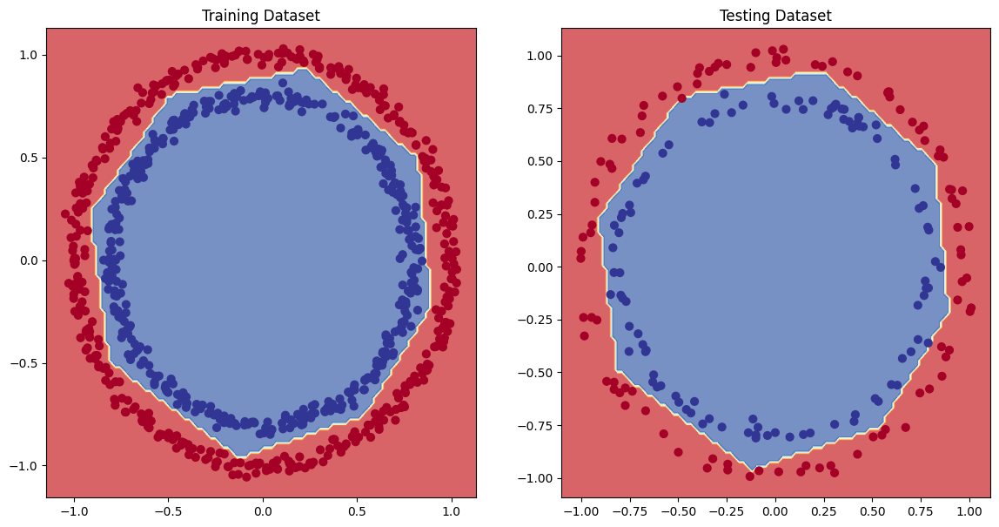


### Finding the ideal learning rate

Comparing the learning progress of the previous two identical experiments - with a difference in learning rate `1e-3` vs `1e-2`

```python
fig, axes = plt.subplots(nrows=1, ncols=2, figsize=(12, 6))
pd.DataFrame(history_lr10e_3.history).plot(ax=axes[0], title="Learning Rate 1e-3")
pd.DataFrame(history_lr10e_2.history).plot(ax=axes[1], title="Learning Rate 1e-2")
# with a larger learning rate the loss/accuracy improves much quicker
# but a larger learning rate also means that we get some overshots / fluctuations in performance
```

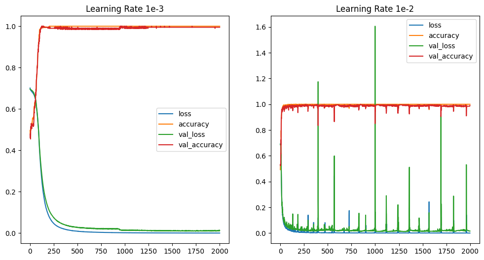


### Dynamically adjust the Learning Rate

We can use the Keras `LearningRateScheduler()` in a __Callback__ to update the learning rate of the used optimizer according to the schedule function with each new epoch.

```python
# create a new model based on model_circles_lr10e_3
tf.random.set_seed(7)

model_circles_lr_callback = tf.keras.Sequential([
    tf.keras.layers.Dense(4, activation="relu", name="input_layer"),
    tf.keras.layers.Dense(4, activation="relu", name="dense_layer"),
    tf.keras.layers.Dense(1, activation="sigmoid", name="output_layer")
])

model_circles_lr_callback.compile(loss="binary_crossentropy",
                                 optimizer=tf.keras.optimizers.Adam(learning_rate=0.001),
                                 metrics=["accuracy"])

# introduce learning scheduler callback to increase the learning rate
# with every epoch by `0.0001 times 10e(epoch/100)`
learning_rate_callback = tf.keras.callbacks.LearningRateScheduler(lambda epoch: 1e-4 * 10**(epoch/100))

history_lr_callback = model_circles_lr_callback.fit(X_train, y_train,
                                      validation_data=(X_test, y_test), epochs=500,
                                      callbacks=[learning_rate_callback], verbose=1)

# the learning rate, initially, increases sensibly. But later explodes leading to a terrible performance:
# Epoch 500/500
# 25/25 [==============================] - 0s 3ms/step - loss: 0.7646 - accuracy: 0.5025 - val_loss: 0.6961 - val_accuracy: 0.5000 - lr: 9.7724
```

```python
# plot the learning rate progression
lr = 1e-4 * (10 ** (tf.range(500)/100))
plt.plot(tf.range(500), lr)
plt.ylabel("Learning Rate")
plt.xlabel("Epoch")
plt.show()
# the adaptive learning rate stays reasonable up until the 300th epoch
```

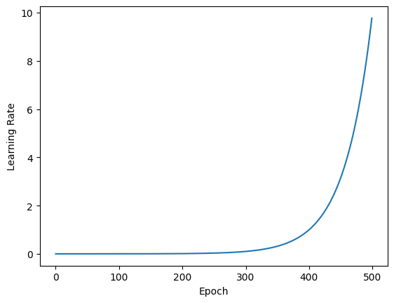

```python
pd.DataFrame(history_lr_callback.history).plot(title="Learning Rate Scheduler")
# and the learning rate abve the 200th epoch leads to more and more fluctuations in loss and accuracy.
```

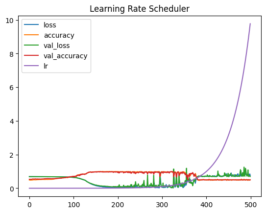

```python
# the "ideal learning rate" is usally 10 times smaller than the value at the bottom of the loss curve (`loss = f(lr)`)
plt.figure(figsize=(10, 7))
plt.xlabel("Learning Rate")
plt.ylabel("Loss")
plt.semilogx(lr, history_lr_callback.history["loss"])
plt.show()
# for the plot below this would be around `3*10e-3` and `4*10e-3`
```

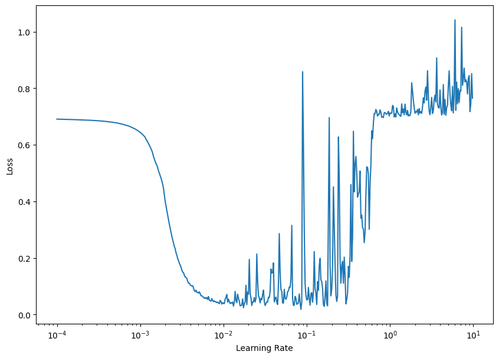

```python
# re-run the model with the ideal learning rate
tf.random.set_seed(42)

model_circles_ideal_lr = tf.keras.Sequential([
    tf.keras.layers.Dense(4, activation="relu", name="input_layer"),
    tf.keras.layers.Dense(4, activation="relu", name="dense_layer"),
    tf.keras.layers.Dense(1, activation="sigmoid", name="output_layer")
])

model_circles_ideal_lr.compile(loss="binary_crossentropy",
                                 optimizer=tf.keras.optimizers.Adam(learning_rate=4*10e-3),
                                 metrics=["accuracy"])

history_ideal_lr = model_circles_ideal_lr.fit(X_train, y_train,
                                      validation_data=(X_test, y_test),
                                      epochs=500, verbose=1)

# Epoch 500/500
# 25/25 [==============================] - 0s 3ms/step - loss: 0.0038 - accuracy: 1.0000 - val_loss: 0.0100 - val_accuracy: 1.0000
```

```python
fig, axes = plt.subplots(nrows=1, ncols=2, figsize=(12, 6))
pd.DataFrame(history_ideal_lr.history).plot(ax=axes[0], title="Ideal Learning Rate")
decision_boundray(model=model_circles_ideal_lr, X=X_test, y=y_test)
```

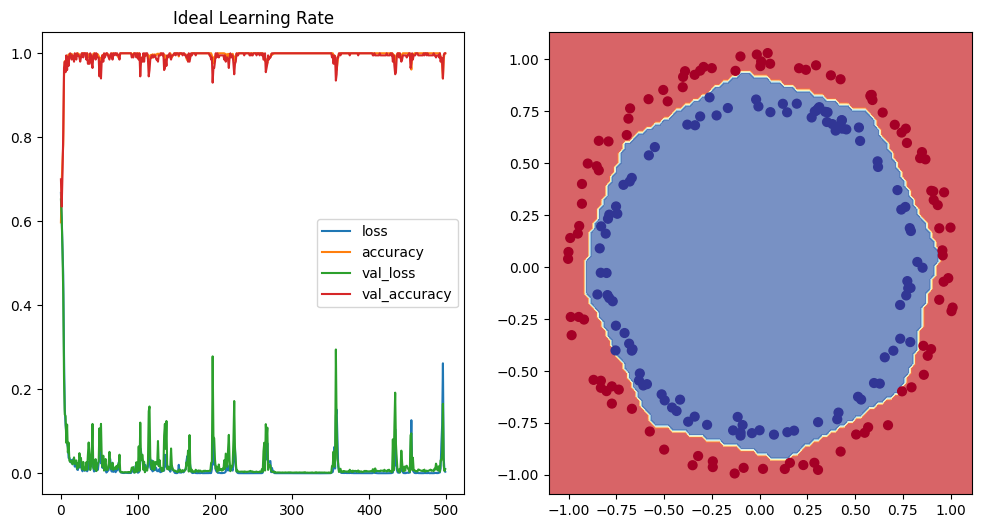


## Confusion Matrix

So far I used __Accuracy__ as metric to evaluate the performance of a trained model. But accuracy can fall short of representing a dataset with imbalanced classes. If a class only makes up 1% of a dataset even if our model fails 100% of the time to predict the class we still end up with a high accuracy overall:

* _Accuracy = (tp + tn) / (tp + tn + fp + fn)_
  * `tf.keras.metrics.Accuracy()`, `sklearn.metrics.accuracy_score()`

A metric that allows us to indicate the amount of false positive predictions is __Precision__:

* _Precision = tp / (tp + fp)_
  * `tf.keras.metrics.Precision()`, `sklearn.metrics.precision_score()`

A metric to evaluate the amount of false negative predictions is __Recall__:

* _Recall = tp / (tp + fn)_
  * `tf.keras.metrics.Recall()`, `sklearn.metrics.recall_score()`

Depending on our problem we can use precision or recall instead of accuracy as the training performance metric. A metric that combines both recall and precision is the __F1 Score__ in SciKit_Learn:

* _F1-score = 2 * (precision * recall)/(precision + recall)_
  * `sklearn.metrics.f1_score()`
  
A good visual representation of a models performance is the __Confusion Matrix__ that compares predictions to the true value `sklearn.metrics.confusion_matrix()`.

```python
# check loss and accuracy of the previous model
loss, accuracy = model_circles_ideal_lr.evaluate(X_test, y_test)
print(f"INFO :: Model loss - {loss:.5f}")
print(f"INFO :: Model accuracy - {(accuracy*100):.2f}%")
# 7/7 [==============================] - 0s 2ms/step - loss: 0.0100 - accuracy: 1.0000
# INFO :: Model loss - 0.01005
# INFO :: Model accuracy - 100.00%
```

```python
# confusion matrix
## get label predictions using the trained model
y_pred = model_circles_ideal_lr.predict(X_test)
# y_pred, y_test
# the predictions we get are floats while the true values are binary `1` or `0`
# round the prediction to be able to compare them:
y_pred_rnd = tf.round(y_pred)
```

```python
confusion_matrix(y_pred_rnd, y_test)
# array([[100,   0],
#        [  0, 100]])
```

```python
# plot confusion matrix
import itertools

def plot_confusion_matrix(y_pred=y_pred_rnd, y_test=y_test):
        figsize = (10, 10)

        # create the confusion matrix
        cm = confusion_matrix(y_pred_rnd, y_test)

        # normalize
        cm_norm = cm.astype("float") / cm.sum(axis=1)[:, np.newaxis]
        # cm_norm
        # array([[1., 0.],
        #        [0., 1.]])

        number_of_classes = cm.shape[0]
        # 2

        # plot matrix
        fig, ax = plt.subplots(figsize=figsize)
        cax = ax.matshow(cm, cmap=plt.cm.Greens)
        fig.colorbar(cax)

        # create classes
        classes = False

        if classes:
            labels = classes
        else:
            labels = np.arange(cm.shape[0])

        # axes lables
        ax.set(title="Confusion Matrix",
              xlabel="Prediction",
              ylabel="True",
              xticks=np.arange(number_of_classes),
              yticks=np.arange(number_of_classes),
              xticklabels=labels,
              yticklabels=labels)

        ax.xaxis.set_label_position("bottom")
        ax.title.set_size(20)
        ax.xaxis.label.set_size(20)
        ax.yaxis.label.set_size(20)
        ax.xaxis.tick_bottom()


        # colour threshold
        threshold = (cm.max() + cm.min()) / 2.

        # add text to cells
        for i, j in itertools.product(range(cm.shape[0]), range(cm.shape[1])):
            plt.text(j, i , f"{cm[i, j]} ({cm_norm[i, j]*100:.1f}%)",
            horizontalalignment="center",
            color="white" if cm[i, j] > threshold else "black",
            size=15)
```

```python
plot_confusion_matrix(y_pred, y_test)
```

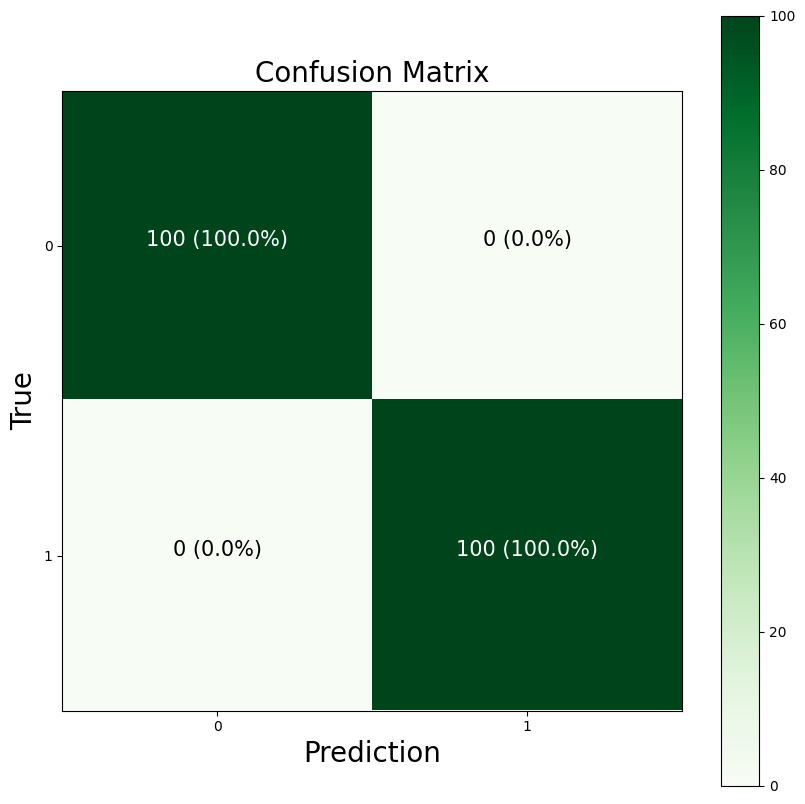

```python

```
