---
jupyter:
  jupytext:
    formats: ipynb,md
    text_representation:
      extension: .md
      format_name: markdown
      format_version: '1.3'
      jupytext_version: 1.14.4
  kernelspec:
    display_name: Python 3 (ipykernel)
    language: python
    name: python3
---

   # Tensorflow - Classification Problems
    
   * Binary Classifications
   * Multiclass Classifications
   * Multilabel Classifications

```python
import tensorflow as tf

import matplotlib.pyplot as plt
import numpy as np
import pandas as pd
import random
from sklearn.model_selection import train_test_split 
from sklearn.datasets import make_circles
from sklearn.metrics import confusion_matrix
from sklearn.preprocessing import StandardScaler
```

## Working with Non-Linear Datasets

```python
# creating data
n_samples = 1000
X, y = make_circles(n_samples,
                   noise=0.025,
                   random_state=42)

# check features and labels
X, y

# (array([[ 0.75424625,  0.23148074],
#         [-0.75615888,  0.15325888],
#         [-0.81539193,  0.17328203],
#         ...,
#         [-0.13690036, -0.81001183],
#         [ 0.67036156, -0.76750154],
#         [ 0.28105665,  0.96382443]]),
#  array([1, 1, 1, 1, 0, 1, 1, 1, 1, 0, 1, 0, 1, 1, 1, 1, 0, 1, 1, 0, 1, 0,
#         0, 1, 0, 0, 0, 1, 1, 1, 0, 0, 1, 0, 0, 0, 1, 1, 1, 0, 0, 0, 0, 1,
#         0, 0, 1, 1, 0, 1, 1, 1, 0, 1, 0, 0, 1, 0, 0, 1, 0, 0, 1, 0, 1, 1,
#         1, 1, 0, 1, 0, 0, 1, 1, 0, 0, 1, 0, 1, 0, 1, 0, 0, 0, 0, 1, 1, 1,
#         1, 0, 0, 0, 1, 0, 1, 0, 1, 0, 0, 1, 1, 0, 1, 0, 1, 1, 1, 1, 0, 1,
#         1, 1, 1, 1, 0, 0, 0, 1, 1, 0, 1, 0, 1, 0, 0, 1, 1, 0, 1, 1, 1, 1,
#         0, 1, 1, 0, 0, 0, 0, 0, 0, 0, 1, 0, 1, 1, 1, 0, 1, 0, 1, 0, 1, 0,
#         1, 0, 0, 1, 0, 1, 1, 1, 1, 1, 1, 1, 0, 1, 0, 0, 0, 0, 0, 1, 0, 0,
#         0, 0, 1, 1, 0, 1, 0, 1, 1, 0, 0, 0, 1, 1, 1, 1, 1, 0, 0, 0, 0, 0,
#         1, 0, 0, 1, 1, 1, 1, 1, 0, 1, 0, 1, 0, 0, 1, 1, 1, 0, 1, 0, 1, 1,
#         0, 1, 1, 0, 1, 0, 1, 0, 1, 1, 0, 1, 0, 1, 0, 0, 0, 1, 0, 0, 0, 0,
#         1, 1, 0, 0, 0, 0, 0, 0, 0, 1, 1, 1, 0, 0, 1, 1, 1, 0, 1, 0, 0, 0,
#         0, 1, 1, 0, 1, 0, 0, 0, 1, 0, 1, 0, 0, 1, 0, 1, 1, 1, 0, 0, 0, 1,
#         0, 0, 0, 1, 1, 1, 1, 0, 0, 0, 1, 0, 0, 0, 1, 0, 0, 0, 1, 1, 0, 1,
#         1, 1, 1, 1, 1, 1, 0, 0, 0, 0, 1, 0, 0, 0, 0, 1, 1, 1, 0, 0, 1, 0,
#         1, 0, 1, 1, 0, 0, 1, 1, 1, 1, 0, 0, 0, 0, 0, 0, 1, 1, 0, 1, 0, 0,
#         1, 0, 0, 0, 0, 0, 0, 0, 0, 1, 0, 0, 0, 0, 1, 0, 0, 1, 0, 1, 0, 0,
#         0, 1, 0, 0, 1, 1, 0, 0, 1, 0, 0, 1, 1, 0, 1, 1, 0, 0, 1, 0, 1, 0,
#         0, 0, 1, 1, 0, 0, 1, 1, 1, 1, 1, 0, 0, 1, 1, 1, 1, 0, 1, 1, 1, 1,
#         1, 0, 0, 1, 0, 1, 0, 0, 0, 0, 1, 0, 0, 0, 0, 0, 0, 0, 0, 0, 1, 1,
#         0, 1, 1, 1, 1, 1, 1, 0, 1, 1, 1, 1, 0, 0, 0, 1, 1, 1, 0, 0, 0, 0,
#         1, 1, 0, 0, 0, 0, 1, 0, 0, 0, 1, 0, 0, 1, 1, 1, 1, 1, 1, 0, 0, 0,
#         1, 0, 0, 0, 0, 0, 1, 1, 1, 0, 0, 0, 0, 0, 1, 1, 1, 0, 0, 1, 1, 1,
#         1, 0, 1, 1, 0, 1, 0, 0, 0, 1, 0, 0, 1, 0, 0, 1, 1, 0, 0, 1, 1, 0,
#         1, 0, 1, 0, 1, 0, 1, 0, 0, 0, 1, 0, 0, 0, 0, 0, 0, 1, 1, 1, 1, 0,
#         0, 0, 1, 0, 1, 1, 0, 0, 0, 0, 0, 1, 1, 1, 0, 0, 1, 0, 0, 1, 0, 0,
#         1, 0, 0, 1, 0, 0, 0, 1, 0, 0, 1, 1, 1, 0, 1, 1, 0, 0, 0, 1, 1, 1,
#         1, 0, 0, 1, 1, 1, 0, 0, 0, 0, 1, 1, 0, 0, 1, 1, 0, 0, 1, 1, 1, 1,
#         1, 1, 1, 0, 1, 0, 1, 0, 0, 1, 0, 1, 1, 1, 1, 0, 0, 1, 1, 0, 0, 1,
#         0, 1, 0, 0, 0, 1, 0, 0, 1, 1, 1, 1, 0, 1, 1, 1, 1, 1, 1, 1, 0, 1,
#         0, 1, 1, 1, 0, 0, 1, 0, 0, 0, 1, 1, 1, 1, 0, 0, 0, 0, 1, 0, 1, 1,
#         1, 0, 1, 0, 0, 1, 0, 0, 1, 1, 1, 1, 1, 0, 1, 0, 0, 0, 1, 1, 1, 1,
#         1, 0, 0, 0, 1, 1, 1, 1, 0, 0, 0, 0, 0, 1, 1, 0, 1, 0, 1, 0, 0, 0,
#         0, 0, 0, 0, 0, 0, 1, 1, 1, 1, 1, 0, 1, 0, 1, 1, 1, 1, 0, 1, 1, 1,
#         1, 1, 1, 1, 1, 0, 1, 1, 0, 1, 0, 0, 0, 1, 0, 1, 1, 1, 0, 1, 1, 0,
#         1, 1, 0, 1, 0, 1, 1, 0, 0, 1, 1, 1, 0, 0, 0, 0, 1, 1, 0, 0, 1, 1,
#         1, 1, 1, 1, 1, 1, 1, 1, 1, 1, 1, 1, 0, 0, 1, 0, 1, 0, 1, 0, 1, 1,
#         1, 1, 1, 1, 0, 1, 0, 1, 1, 1, 0, 1, 1, 0, 0, 1, 0, 1, 1, 0, 0, 1,
#         1, 1, 1, 1, 1, 1, 1, 0, 1, 1, 1, 0, 1, 0, 0, 1, 1, 0, 0, 0, 1, 0,
#         0, 1, 0, 0, 0, 1, 0, 1, 0, 0, 0, 0, 1, 0, 1, 1, 1, 1, 0, 1, 0, 0,
#         0, 0, 0, 0, 1, 0, 1, 0, 1, 0, 1, 1, 1, 0, 1, 0, 1, 0, 0, 1, 1, 1,
#         0, 0, 0, 1, 1, 0, 1, 0, 1, 1, 0, 1, 0, 0, 1, 1, 1, 0, 0, 0, 1, 1,
#         0, 0, 0, 0, 0, 1, 1, 0, 1, 0, 0, 0, 1, 0, 0, 0, 1, 1, 1, 1, 0, 1,
#         1, 1, 0, 1, 1, 1, 1, 0, 1, 1, 0, 1, 1, 0, 0, 1, 1, 1, 0, 0, 0, 0,
#         0, 0, 1, 0, 0, 1, 0, 0, 0, 1, 0, 1, 0, 1, 1, 0, 0, 0, 0, 0, 0, 0,
#         0, 1, 0, 1, 0, 0, 0, 1, 0, 0]))
```

```python
# the dataset has two labels 1 & 0 for datapoints
# of the inner and outer circle generated by Scikit-Learn

circles = pd.DataFrame({"X0":X[:,0], "X1": X[:, 1], "label":y})
circles, X.shape, y.shape

# (           X0        X1  label
#  0    0.754246  0.231481      1
#  1   -0.756159  0.153259      1
#  2   -0.815392  0.173282      1
#  3   -0.393731  0.692883      1
#  4    0.442208 -0.896723      0
#  ..        ...       ...    ...
#  995  0.244054  0.944125      0
#  996 -0.978655 -0.272373      0
#  997 -0.136900 -0.810012      1
#  998  0.670362 -0.767502      0
#  999  0.281057  0.963824      0
 
#  [1000 rows x 3 columns],
#  (1000, 2),
#  (1000,))
```

```python
# we can visualize them in a scatter plot
plt.scatter(X[:, 0], X[:, 1], c=y, cmap=plt.cm.RdYlBu)
```


## Building the Model

We can now build a neural network that allows us to do a binary classification between datapoints that belong to the blue and red circle.

```python
tf.random.set_seed(42)

model_circles = tf.keras.Sequential([
    tf.keras.layers.Dense(1, name="input_layer")
], name="model_circles")

model_circles.compile(
    loss=tf.keras.losses.BinaryCrossentropy(),
    optimizer=tf.keras.optimizers.Adam(learning_rate=0.01),
    metrics=["accuracy"])

# earlystop_callback = tf.keras.callbacks.EarlyStopping(
#   monitor='val_loss', min_delta=0.00001,
#   patience=100, restore_best_weights=True)

model_circles.fit(X, y, epochs=10) # callbacks=[earlystop_callback]
model_circles.evaluate(X, y)

# 32/32 [==============================] - 0s 1ms/step - loss: 0.7405 - accuracy: 0.5050
# [0.7405271530151367, 0.5049999952316284
#
# currently the model only predicts with a 45% accuracy... worse than pure guessing with a binary choice
```

```python
tf.random.set_seed(42)

# adding complexity + activation functions
model_circles_1 = tf.keras.Sequential([
    tf.keras.layers.Dense(8, name="input_layer"),
    tf.keras.layers.Dense(16, name="dense_layer1"),
    tf.keras.layers.Dense(8, name="dense_layer2"),
    tf.keras.layers.Dense(1, name="output_layer")
], name="model_circles_1")

# # adding complexity + activation functions
# model_circles_1 = tf.keras.Sequential([
#     tf.keras.layers.Dense(8, activation="relu", name="input_layer"),
#     tf.keras.layers.Dense(16, activation="relu", name="dense_layer1"),
#     tf.keras.layers.Dense(8, activation="relu", name="dense_layer2"),
#     tf.keras.layers.Dense(1, activation="relu", name="output_layer")
# ], name="model_circles_1")

model_circles_1.compile(
    loss=tf.keras.losses.BinaryCrossentropy(),
    optimizer=tf.keras.optimizers.Adam(learning_rate=0.001),
    metrics=["accuracy"])

history_1 = model_circles_1.fit(X, y, epochs=150, verbose=0)
model_circles_1.evaluate(X, y)

# 32/32 [==============================] - 0s 1ms/step - loss: 0.7405 - accuracy: 0.5050
# [0.7405271530151367, 0.5049999952316284]

# not much better...
```

```python
# history plot
pd.DataFrame(history_1.history).plot()
plt.ylabel("loss")
plt.xlabel("epochs")
```


### Why it Fails

```python
# visualize predictions
# https://cs231n.github.io/neural-networks-case-study/

def decision_boundray(model, X, y):
    
    # define axis boundries for features and labels
    x_min, x_max = X[:, 0].min() - 0.1, X[:, 0].max() + 0.1
    y_min, y_max = X[:, 1].min() - 0.1, X[:, 1].max() + 0.1
    
    # create meshgrid within boundries (fresh data to run predictions on)
    xx, yy = np.meshgrid(np.linspace(x_min, x_max, 100),
                        np.linspace(y_min, y_max, 100))
    
    # stack both mesh arrays together
    x_in = np.c_[xx.ravel(), yy.ravel()]
    
    # make predictions using the trained model
    y_pred = model.predict(x_in)
    
    # check for multiclass-classification 
    if len(y_pred[0]) > 1:
        # reshape predictions
        y_pred = np.argmax(y_pred, axis=1).reshape(xx.shape)
    else:
        y_pred = np.round(y_pred).reshape(xx.shape)
        
    # plot decision boundry
    plt.contourf(xx, yy, y_pred, cmap=plt.cm.RdYlBu, alpha=0.7)
    plt.scatter(X[:, 0], X[:, 1], c=y, s=40, cmap=plt.cm.RdYlBu)
    plt.xlim(xx.min(), xx.max())
    plt.ylim(yy.min(), yy.max())
```

```python
decision_boundray(model=model_circles_1, X=X, y=y)
# the model is trying to draw a straight line through the dataset to differentiate between both classes
# it then expands this line and tries to divide both classes - and fails with a circular dataset.
```


## Non Linearity


> Experimenting with the [Tensorflow Playground](https://playground.tensorflow.org/#activation=linear&batchSize=10&dataset=circle&regDataset=reg-plane&learningRate=0.001&regularizationRate=0&noise=0&networkShape=1&seed=0.14938&showTestData=false&discretize=false&percTrainData=50&x=true&y=true&xTimesY=false&xSquared=false&ySquared=false&cosX=false&sinX=false&cosY=false&sinY=false&collectStats=false&problem=classification&initZero=false&hideText=false) to find a model that works for the non-linear classification problem.

A model useable for linear problems will remain stuck at an accuracy around 50% - purely guessing when predicting:


```python
# rebuilding the model (above)
tf.random.set_seed(42)

model_circles_2 = tf.keras.Sequential([
    tf.keras.layers.Dense(1, activation="linear", name="input_layer")
])

model_circles_2.compile(loss="binary_crossentropy",
                       optimizer=tf.keras.optimizers.Adam(learning_rate=0.001),
                       metrics=["accuracy"])

history_2 = model_circles_2.fit(X, y, epochs=150, verbose=0)
model_circles_2.evaluate(X, y)

# 32/32 [==============================] - 0s 1ms/step - loss: 0.7222 - accuracy: 0.4590
# [0.7222346067428589, 0.45899999141693115]
```

```python
decision_boundray(model=model_circles_2, X=X, y=y)
```


<!-- #region -->
I am starting to get a good separation with the following setup after approx. 2000 epochs:


<!-- #endregion -->

```python
# rebuilding the model (above)
tf.random.set_seed(42)

model_circles_3 = tf.keras.Sequential([
    tf.keras.layers.Dense(4, activation="relu")
])

model_circles_3.compile(loss="binary_crossentropy",
                       optimizer=tf.keras.optimizers.Adam(learning_rate=0.001),
                       metrics=["accuracy"])

history_3 = model_circles_3.fit(X, y, epochs=2000, verbose=0)
model_circles_3.evaluate(X, y)

# 32/32 [==============================] - 0s 1ms/step - loss: 0.6932 - accuracy: 0.5000
# [0.693161129951477, 0.5]
```

```python
decision_boundray(model=model_circles_3, X=X, y=y)
# well, that isn't good...
```

```python
# rebuilding the model (2nd attempt)
# adding an output layer with a single neuron for the binary classification

tf.random.set_seed(42)

model_circles_4 = tf.keras.Sequential([
    tf.keras.layers.Dense(4, activation="relu", name="input_layer"),
    tf.keras.layers.Dense(1, name="output_layer")
])

model_circles_4.compile(loss="binary_crossentropy",
                       optimizer=tf.keras.optimizers.Adam(learning_rate=0.001),
                       metrics=["accuracy"])

history_4 = model_circles_4.fit(X, y, epochs=2000, verbose=0)
model_circles_4.evaluate(X, y)

# 32/32 [==============================] - 0s 2ms/step - loss: 0.3404 - accuracy: 0.8320
# [0.34036046266555786, 0.8320000171661377]
```

```python
decision_boundray(model=model_circles_4, X=X, y=y)
# much better - but not as good as the example from the tf.playground
```

```python
# rebuilding the model (2nd attempt)
# adding an "sigmoid" activation for the output layer

tf.random.set_seed(42)

model_circles_6 = tf.keras.Sequential([
    tf.keras.layers.Dense(4, activation="relu", name="input_layer"),
    tf.keras.layers.Dense(1, activation="sigmoid", name="output_layer")
])

model_circles_6.compile(loss="binary_crossentropy",
                       optimizer=tf.keras.optimizers.Adam(learning_rate=0.001),
                       metrics=["accuracy"])

model_circles_6.fit(X, y, epochs=2000, verbose=0)
model_circles_6.evaluate(X, y)
32/32 [==============================] - 0s 1ms/step - loss: 0.0241 - accuracy: 1.0000
[0.0241051334887743, 1.0]
```

```python
decision_boundray(model=model_circles_6, X=X, y=y)
# there you go...
```


## Non-linear Activation Functions

```python
# create a input tensor
input_linear = tf.cast(tf.range(-10, 10), tf.float32)

# visualize the tensor
plt.plot(input_linear)
```

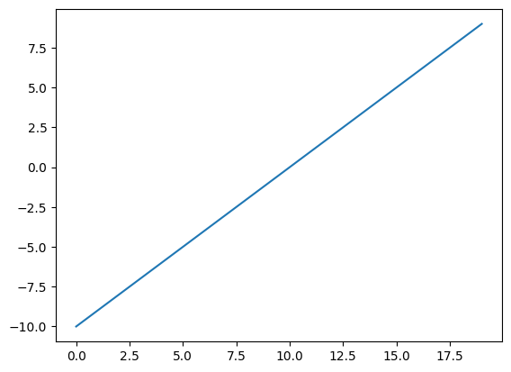


### Linear Activation Function

```python
# replicating the linear activation function linear(x) = x
def linear(X):
    return X

linear(input_linear)

# <tf.Tensor: shape=(20,), dtype=float32, numpy=
# array([-10.,  -9.,  -8.,  -7.,  -6.,  -5.,  -4.,  -3.,  -2.,  -1.,   0.,
#          1.,   2.,   3.,   4.,   5.,   6.,   7.,   8.,   9.],
#       dtype=float32)>

plt.plot(linear(input_linear))
```


### Sigmoid Activation Function

```python
# replicating the sigmoid activation function sigmoid(x) = 1 / (1 + exp(-x))
def sigmoid(X):
    return 1/(1 + tf.exp(-X))

sigmoid(input_linear)

# <tf.Tensor: shape=(20,), dtype=float32, numpy=
# array([4.5397868e-05, 1.2339458e-04, 3.3535014e-04, 9.1105117e-04,
#        2.4726230e-03, 6.6928510e-03, 1.7986210e-02, 4.7425874e-02,
#        1.1920292e-01, 2.6894143e-01, 5.0000000e-01, 7.3105854e-01,
#        8.8079703e-01, 9.5257413e-01, 9.8201376e-01, 9.9330717e-01,
#        9.9752742e-01, 9.9908900e-01, 9.9966466e-01, 9.9987662e-01],
#       dtype=float32)>

plt.plot(sigmoid(input_linear))
```

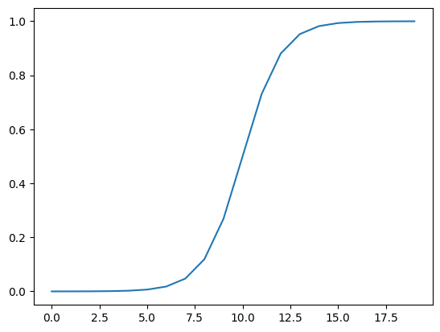


### reLU Activation Function

```python
# replicating the reLU function f(x) = 0 for x<0 and x for x>0
def relu(X):
    return tf.maximum(0, X)

relu(input_linear)
# <tf.Tensor: shape=(20,), dtype=float32, numpy=
# array([0., 0., 0., 0., 0., 0., 0., 0., 0., 0., 0., 1., 2., 3., 4., 5., 6.,
#        7., 8., 9.], dtype=float32)>

plt.plot(relu(input_linear))
```


## Training & Testing Datasplit

In the example above I used a single dataset to both train and test the model. Let's split this dataset so that we have a fresh testing dataset for the model.

```python
# training and testing data split using scikit-learn
X_train, X_test, y_train, y_test = train_test_split(
    X, y, test_size=0.20, random_state=42)

# check shape
X_train.shape, X_test.shape, y_train.shape, y_test.shape
# ((800, 2), (200, 2), (800,), (200,))
```

```python
# rebuild the best model from above
# train on training set and eval on testing
tf.random.set_seed(42)

model_circles_lr10e_3 = tf.keras.Sequential([
    tf.keras.layers.Dense(4, activation="relu", name="input_layer"),
    tf.keras.layers.Dense(4, activation="relu", name="dense_layer"),
    tf.keras.layers.Dense(1, activation="sigmoid", name="output_layer")
])

model_circles_lr10e_3.compile(loss="binary_crossentropy",
                       optimizer=tf.keras.optimizers.Adam(learning_rate=0.001),
                       metrics=["accuracy"])

history_lr10e_3 = model_circles_lr10e_3.fit(X_train, y_train,
                    validation_data=(X_test, y_test),
                    epochs=2000)

# Epoch 2000/2000
# 25/25 [==============================] - 0s 4ms/step - loss: 2.2199e-04 - accuracy: 1.0000 - val_loss: 0.0131 - val_accuracy: 0.9950
```

```python
decision_boundray(model=model_circles_lr10e_3, X=X_test, y=y_test)
```


## Learning Rate

In the example above it took __256__ cycles to get to an __val_accuracy: 0.9000__:

```
25/25 [==============================] - 0s 3ms/step - loss: 0.2355 - accuracy: 0.9100 - val_loss: 0.2647 - val_accuracy: 0.8950
Epoch 255/2000
25/25 [==============================] - 0s 3ms/step - loss: 0.2338 - accuracy: 0.9137 - val_loss: 0.2636 - val_accuracy: 0.8900
Epoch 256/2000
25/25 [==============================] - 0s 3ms/step - loss: 0.2312 - accuracy: 0.9162 - val_loss: 0.2595 - val_accuracy: 0.9000
Epoch 257/2000
25/25 [==============================] - 0s 3ms/step - loss: 0.2255 - accuracy: 0.9162 - val_loss: 0.2390 - val_accuracy: 0.9000
Epoch 258/2000
25/25 [==============================] - 0s 3ms/step - loss: 0.2030 - accuracy: 0.9438 - val_loss: 0.2118 - val_accuracy: 0.9600
```

By increasing the learning rate we allow Tensorflow to make bigger changes to the model weights after each epoch. This should increase the initial speed with which the model is moving towards the optimum:

```python
tf.random.set_seed(42)

model_circles_lr10e_2 = tf.keras.Sequential([
    tf.keras.layers.Dense(4, activation="relu", name="input_layer"),
    tf.keras.layers.Dense(4, activation="relu", name="dense_layer"),
    tf.keras.layers.Dense(1, activation="sigmoid", name="output_layer")
])

model_circles_lr10e_2.compile(loss="binary_crossentropy",
                       optimizer=tf.keras.optimizers.Adam(learning_rate=0.01),
                       metrics=["accuracy"])

history_lr10e_2 = model_circles_lr10e_2.fit(X_train, y_train,
                    validation_data=(X_test, y_test),
                    epochs=2000)

# Epoch 2000/2000
# 25/25 [==============================] - 0s 3ms/step - loss: 4.2108e-04 - accuracy: 1.0000 - val_loss: 0.0158 - val_accuracy: 0.9900
```

<!-- #region -->
With the increases learning rate we alread reach __90%__ after __25__ epochs:


```
25/25 [==============================] - 0s 3ms/step - loss: 0.4151 - accuracy: 0.8475 - val_loss: 0.4481 - val_accuracy: 0.8050
Epoch 14/2000
25/25 [==============================] - 0s 3ms/step - loss: 0.3880 - accuracy: 0.8625 - val_loss: 0.4032 - val_accuracy: 0.8700
Epoch 15/2000
25/25 [==============================] - 0s 4ms/step - loss: 0.3304 - accuracy: 0.9025 - val_loss: 0.2930 - val_accuracy: 0.9550
Epoch 16/2000
25/25 [==============================] - 0s 3ms/step - loss: 0.2191 - accuracy: 0.9937 - val_loss: 0.2185 - val_accuracy: 1.0000
```
<!-- #endregion -->

```python
plt.figure(figsize=(14, 7))
plt.subplot(1, 2, 1)
plt.title("Training Dataset")
decision_boundray(model=model_circles_lr10e_2, X=X_train, y=y_train)
plt.subplot(1, 2, 2)
plt.title("Testing Dataset")
decision_boundray(model=model_circles_lr10e_2, X=X_test, y=y_test)
plt.show()
```

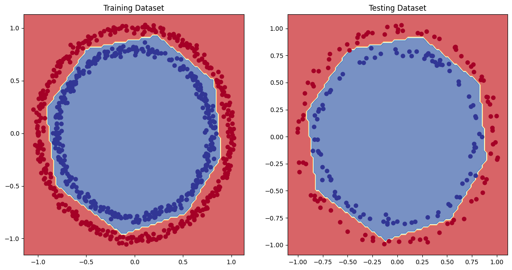


### Finding the ideal learning rate

Comparing the learning progress of the previous two identical experiments - with a difference in learning rate `1e-3` vs `1e-2`

```python
fig, axes = plt.subplots(nrows=1, ncols=2, figsize=(12, 6))
pd.DataFrame(history_lr10e_3.history).plot(ax=axes[0], title="Learning Rate 1e-3")
pd.DataFrame(history_lr10e_2.history).plot(ax=axes[1], title="Learning Rate 1e-2")
# with a larger learning rate the loss/accuracy improves much quicker
# but a larger learning rate also means that we get some overshots / fluctuations in performance
```

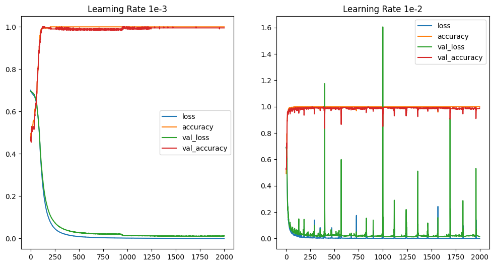


### Dynamically adjust the Learning Rate

We can use the Keras `LearningRateScheduler()` in a __Callback__ to update the learning rate of the used optimizer according to the schedule function with each new epoch.

```python
# create a new model based on model_circles_lr10e_3
tf.random.set_seed(7)

model_circles_lr_callback = tf.keras.Sequential([
    tf.keras.layers.Dense(4, activation="relu", name="input_layer"),
    tf.keras.layers.Dense(4, activation="relu", name="dense_layer"),
    tf.keras.layers.Dense(1, activation="sigmoid", name="output_layer")
])

model_circles_lr_callback.compile(loss="binary_crossentropy",
                                 optimizer=tf.keras.optimizers.Adam(learning_rate=0.001),
                                 metrics=["accuracy"])

# introduce learning scheduler callback to increase the learning rate
# with every epoch by `0.0001 times 10e(epoch/100)`
learning_rate_callback = tf.keras.callbacks.LearningRateScheduler(lambda epoch: 1e-4 * 10**(epoch/100))

history_lr_callback = model_circles_lr_callback.fit(X_train, y_train,
                                      validation_data=(X_test, y_test), epochs=500,
                                      callbacks=[learning_rate_callback], verbose=1)

# the learning rate, initially, increases sensibly. But later explodes leading to a terrible performance:
# Epoch 500/500
# 25/25 [==============================] - 0s 3ms/step - loss: 0.7646 - accuracy: 0.5025 - val_loss: 0.6961 - val_accuracy: 0.5000 - lr: 9.7724
```

```python
# plot the learning rate progression
lr = 1e-4 * (10 ** (tf.range(500)/100))
plt.plot(tf.range(500), lr)
plt.ylabel("Learning Rate")
plt.xlabel("Epoch")
plt.show()
# the adaptive learning rate stays reasonable up until the 300th epoch
```

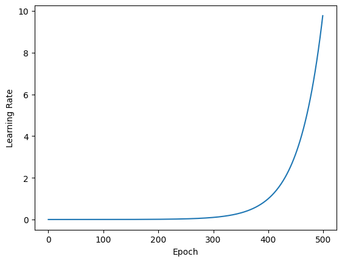

```python
pd.DataFrame(history_lr_callback.history).plot(title="Learning Rate Scheduler")
# and the learning rate abve the 200th epoch leads to more and more fluctuations in loss and accuracy.
```

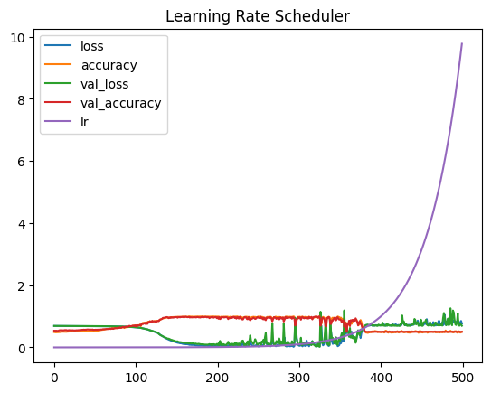

```python
# the "ideal learning rate" is usally 10 times smaller than the value at the bottom of the loss curve (`loss = f(lr)`)
plt.figure(figsize=(10, 7))
plt.xlabel("Learning Rate")
plt.ylabel("Loss")
plt.semilogx(lr, history_lr_callback.history["loss"])
plt.show()
# for the plot below this would be around `3*10e-3` and `4*10e-3`
```

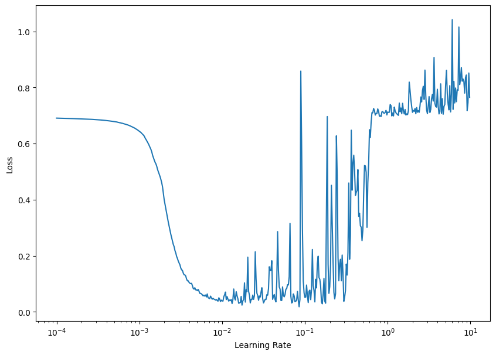

```python
# re-run the model with the ideal learning rate
tf.random.set_seed(42)

model_circles_ideal_lr = tf.keras.Sequential([
    tf.keras.layers.Dense(4, activation="relu", name="input_layer"),
    tf.keras.layers.Dense(4, activation="relu", name="dense_layer"),
    tf.keras.layers.Dense(1, activation="sigmoid", name="output_layer")
])

model_circles_ideal_lr.compile(loss="binary_crossentropy",
                                 optimizer=tf.keras.optimizers.Adam(learning_rate=4*10e-3),
                                 metrics=["accuracy"])

history_ideal_lr = model_circles_ideal_lr.fit(X_train, y_train,
                                      validation_data=(X_test, y_test),
                                      epochs=500, verbose=1)

# Epoch 500/500
# 25/25 [==============================] - 0s 3ms/step - loss: 0.0038 - accuracy: 1.0000 - val_loss: 0.0100 - val_accuracy: 1.0000
```

```python
fig, axes = plt.subplots(nrows=1, ncols=2, figsize=(12, 6))
pd.DataFrame(history_ideal_lr.history).plot(ax=axes[0], title="Ideal Learning Rate")
decision_boundray(model=model_circles_ideal_lr, X=X_test, y=y_test)
```


## Confusion Matrix

So far I used __Accuracy__ as metric to evaluate the performance of a trained model. But accuracy can fall short of representing a dataset with imbalanced classes. If a class only makes up 1% of a dataset even if our model fails 100% of the time to predict the class we still end up with a high accuracy overall:

* _Accuracy = (tp + tn) / (tp + tn + fp + fn)_
  * `tf.keras.metrics.Accuracy()`, `sklearn.metrics.accuracy_score()`

A metric that allows us to indicate the amount of false positive predictions is __Precision__:

* _Precision = tp / (tp + fp)_
  * `tf.keras.metrics.Precision()`, `sklearn.metrics.precision_score()`

A metric to evaluate the amount of false negative predictions is __Recall__:

* _Recall = tp / (tp + fn)_
  * `tf.keras.metrics.Recall()`, `sklearn.metrics.recall_score()`

Depending on our problem we can use precision or recall instead of accuracy as the training performance metric. A metric that combines both recall and precision is the __F1 Score__ in SciKit_Learn:

* _F1-score = 2 * (precision * recall)/(precision + recall)_
  * `sklearn.metrics.f1_score()`
  
A good visual representation of a models performance is the __Confusion Matrix__ that compares predictions to the true value `sklearn.metrics.confusion_matrix()`.

```python
# check loss and accuracy of the previous model
loss, accuracy = model_circles_ideal_lr.evaluate(X_test, y_test)
print(f"INFO :: Model loss - {loss:.5f}")
print(f"INFO :: Model accuracy - {(accuracy*100):.2f}%")
# 7/7 [==============================] - 0s 2ms/step - loss: 0.0100 - accuracy: 1.0000
# INFO :: Model loss - 0.01005
# INFO :: Model accuracy - 100.00%
```

```python
# confusion matrix
## get label predictions using the trained model
y_pred = model_circles_ideal_lr.predict(X_test)
# y_pred, y_test
# the predictions we get are floats while the true values are binary `1` or `0`
# round the prediction to be able to compare them:
y_pred_rnd = tf.round(y_pred)
```

```python
confusion_matrix(y_pred_rnd, y_test)
# array([[100,   0],
#        [  0, 100]])
```

```python
# plot confusion matrix
import itertools

def plot_confusion_matrix(y_pred=y_pred_rnd, y_test=y_test):
        figsize = (10, 10)

        # create the confusion matrix
        cm = confusion_matrix(y_pred_rnd, y_test)

        # normalize
        cm_norm = cm.astype("float") / cm.sum(axis=1)[:, np.newaxis]
        # cm_norm
        # array([[1., 0.],
        #        [0., 1.]])

        number_of_classes = cm.shape[0]
        # 2

        # plot matrix
        fig, ax = plt.subplots(figsize=figsize)
        cax = ax.matshow(cm, cmap=plt.cm.Greens)
        fig.colorbar(cax)

        # create classes
        classes = False

        if classes:
            labels = classes
        else:
            labels = np.arange(cm.shape[0])

        # axes lables
        ax.set(title="Confusion Matrix",
              xlabel="Prediction",
              ylabel="True",
              xticks=np.arange(number_of_classes),
              yticks=np.arange(number_of_classes),
              xticklabels=labels,
              yticklabels=labels)

        ax.xaxis.set_label_position("bottom")
        ax.title.set_size(20)
        ax.xaxis.label.set_size(20)
        ax.yaxis.label.set_size(20)
        ax.xaxis.tick_bottom()


        # colour threshold
        threshold = (cm.max() + cm.min()) / 2.

        # add text to cells
        for i, j in itertools.product(range(cm.shape[0]), range(cm.shape[1])):
            plt.text(j, i , f"{cm[i, j]} ({cm_norm[i, j]*100:.1f}%)",
            horizontalalignment="center",
            color="white" if cm[i, j] > threshold else "black",
            size=15)
```

```python
plot_confusion_matrix(y_pred, y_test)
```

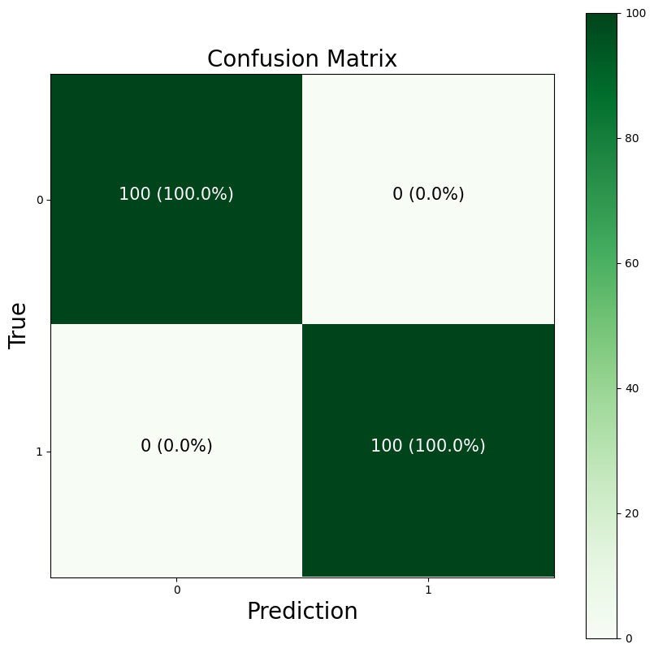


# Multiclass Classifications

Working with the MNIST Fashion Dataset -> 60k images / 10 classes

```python
# importing the mnist dataset with keras
(train_data, train_labels), (test_data, test_labels) = tf.keras.datasets.fashion_mnist.load_data()
train_data.shape, test_data.shape
# ((60000, 28, 28), (10000, 28, 28)) => 60k training images & 10k testing images with 28x28px
```

```python
# show example data

## training labels
class_names = ["T-shirt/Top", "Trousers", "Pullover", "Dress", "Coat", "Sandal", "Shirt", "Sneaker", "Bag", "Ankle Boot"]

## print label and data for index 666
print(f"Training Label:\n{class_names[train_labels[666]]}\n")
print(f"Training Data:\n{train_data[666]}")

plt.imshow(train_data[666], cmap=plt.cm.binary)
plt.title(class_names[train_labels[666]])

# Training Label:
# Sneaker

# Training Data:
# [[  0   0   0   0   0   0   0   0   0   0   0   0   0   0   0   0   0   0   0   0   0   0   0   0   0   0   0  0]
#  [  0   0   0   0   0   0   0   0   0   0   0   0   0   0   0   0   0   0   0   0   0   0   0   0   0   0   0  0]
#  [  0   0   0   0   0   0   0   0   0   0   0   0   0   0   0   0   0   0   0   0   0   0   0   0   0   0   0  0]
#  [  0   0   0   0   0   0   0   0   0   0   0   0   0   0   0   0   0   0   0   0   0   0   0   0   0   0   0  0]
#  [  0   0   0   0   0   0   0   0   0   0   0   0   0   0   0   0   0   0   0   0   0   0   0   0   0   0   0  0]
#  [  0   0   0   0   0   0   0   0   0   0   0   0   0   0   0   0   0   0   0   0   0   0   0   0   0   0   0  0]
#  [  0   0   0   0   0   0   0   0   0   0   0   0   0   0   0   0   0   0   0   0   0   0   0   0   0   0   0  0]
#  [  0   0   0   0   0   0   0   0   0   0   0   0   0   0   0   0   0   0   0   0   0   0   0   0   0   0   0  0]
#  [  0   0   0   0   0   0   0   0   0   0   0   2   0   0   0  25  51   0   5   0   0   0   0   0   0   0   0  0]
#  [  0   0   0   0   0   0   0   0   0   0   0   0   2  72  74 115 175   7   0   7   5   0   2   0 146 110   7  0]
#  [  0   0   0   0   0   0   0   0   0   0   0  54  95  92 123  77 123  72  20   0   0   0   0   0 255 136  51  0]
#  [  0   0   0   0   0   0   2   0   2  38  79  97 118  90 105 121  95 115  128  59  48   5   5  64 118 103  82 0]
#  [  0   0   0   0   0   5   2   0  61 121 108  92 115 162 167 162 175 133  105 113 144 133 110 133 144 146 141 2]
#  [  2   0   0   0   0   0   5  36 113 103  95 118 128 126 110 108 151 182  195 167 139 136 136 115 126 108 123 2]
#  [  0   0   2   0   7  33  51  85 105 123 128  92  90  79 108 133 103 121  162 170 193 206 151 126 123 123 118 5]
#  [  5  33  48  59  72  74  82  82 115 123 121 118 139 115  90 133 139 136  149 164 180 170 157 170 151 139 131 2]
#  [ 61 136 113  90  95  92 100 108 103 103 113 126 133 164 170 146 157 149  115  87  72  82 110 123 128 131 100 0]
#  [ 41  79 118 159 149 139 136 131 113 110 113 118 113  79  85  43  15  25  36  38  51  59  41  41  41  36  54  0]
#  [ 46  66  30  28  28  23  28  25  23  28  30  36  38  54  56  66  92 100  97  92  82  72  77  66  69  74  85 15]
#  [  0  20  54  69  72  72  79  82  79  82  79  82  82  72  82  87  74  72  74  64  54  54  56  51  56  54  51  7]
#  [  0   0   0   0   0   0   0   0   0   0   0   0   0   0   0   0   0   0  0   0   0   0   0   0   0   0   0   0]
#  [  0   0   0   0   0   0   0   0   0   0   0   0   0   0   0   0   0   0  0   0   0   0   0   0   0   0   0   0]
#  [  0   0   0   0   0   0   0   0   0   0   0   0   0   0   0   0   0   0  0   0   0   0   0   0   0   0   0   0]
#  [  0   0   0   0   0   0   0   0   0   0   0   0   0   0   0   0   0   0  0   0   0   0   0   0   0   0   0   0]
#  [  0   0   0   0   0   0   0   0   0   0   0   0   0   0   0   0   0   0  0   0   0   0   0   0   0   0   0   0]
#  [  0   0   0   0   0   0   0   0   0   0   0   0   0   0   0   0   0   0  0   0   0   0   0   0   0   0   0   0]
#  [  0   0   0   0   0   0   0   0   0   0   0   0   0   0   0   0   0   0  0   0   0   0   0   0   0   0   0   0]
#  [  0   0   0   0   0   0   0   0   0   0   0   0   0   0   0   0   0   0  0   0   0   0   0   0   0   0   0   0]]

```

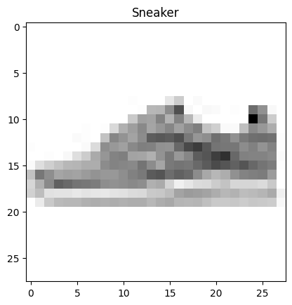

```python
# plot multiple random images with labels
ran_gen = np.random.default_rng()

plt.figure(figsize=(12, 12))

for i in range(12):
    ax = plt.subplot(4, 4, i+1)
    random_index = ran_gen.integers(low=0, high=59999, size=1)
    plt.imshow(train_data[random_index[0]], cmap=plt.cm.binary)
    plt.title(class_names[train_labels[random_index[0]]])
    plt.axis(False)
```

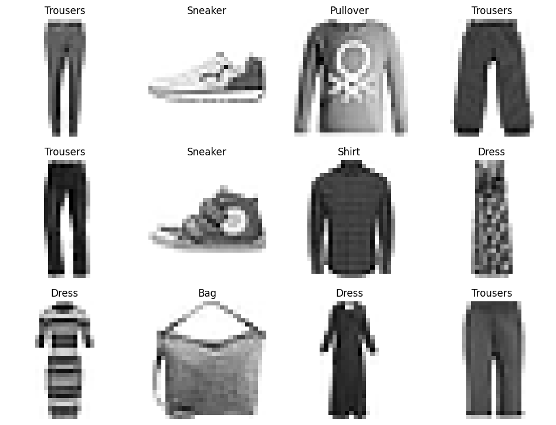


## Multiclass Classification Model

* __Input Shape__: Shape of the input image -> train_data[0].shape = `(28, 28)`
* __Output Shape__: Number of labels -> len(np.unique(train_labels)) = `10`
* __Loss Function__: `tf.keras.losses.CategoricalCrossentropy`
* __Output Layer Activation__: `softmax`

```python
# determin the input and output shape
train_data[0].shape, len(np.unique(train_labels))
# ((28, 28), 10)
```

```python
# building the model - 1st attempt
tf.random.set_seed(42)

model_multiclass = tf.keras.Sequential([
    tf.keras.layers.Dense(4, activation="relu", name="input_layer"),
    tf.keras.layers.Dense(4, activation="relu", name="dense_layer1"),
    tf.keras.layers.Dense(10, activation="softmax", name="output_layer")
])
                          
model_multiclass.compile(loss=tf.keras.losses.CategoricalCrossentropy(),
                        optimizer=tf.keras.optimizers.Adam(learning_rate=0.0001),
                        metrics="accuracy")
                          
history_multi = model_multiclass.fit(train_data, train_labels, batch_size=32,
                    validation_data=(test_data, test_labels),
                    epochs=100, verbose=1)

# ValueError: Shapes (32,) and (32, 28, 10) are incompatible
# => input data needs to be flattened
```

```python
# building the model - 2nd attempt
tf.random.set_seed(42)

model_multiclass = tf.keras.Sequential([
    # flatten data from `28*28` => `None, 784`
    tf.keras.layers.Flatten(input_shape=(28, 28)),
    tf.keras.layers.Dense(4, activation="relu", name="input_layer"),
    tf.keras.layers.Dense(4, activation="relu", name="dense_layer1"),
    tf.keras.layers.Dense(10, activation="softmax", name="output_layer")
])
                          
model_multiclass.compile(loss=tf.keras.losses.CategoricalCrossentropy(),
                        optimizer=tf.keras.optimizers.Adam(learning_rate=0.0001),
                        metrics="accuracy")
                          
history_multi = model_multiclass.fit(train_data, train_labels, batch_size=32,
                    validation_data=(test_data, test_labels),
                    epochs=100, verbose=1)

# ValueError: Shapes (32, 1) and (32, 10) are incompatible
# => CategoricalCrossentropy() expects labels to be OneHot encoded
# use SparseCategoricalCrossentropy() instead
```

> Use `SparseCategoricalCrossentropy()` for "regular" labels

```python
# building the model - 3rd attempt (works!)
tf.random.set_seed(42)

model_multiclass = tf.keras.Sequential([
    # flatten data from `28*28` to `None, 784`
    tf.keras.layers.Flatten(input_shape=(28, 28)),
    tf.keras.layers.Dense(4, activation="relu", name="input_layer"),
    tf.keras.layers.Dense(4, activation="relu", name="dense_layer1"),
    tf.keras.layers.Dense(10, activation="softmax", name="output_layer")
])
                          
model_multiclass.compile(loss=tf.keras.losses.SparseCategoricalCrossentropy(),
                        optimizer=tf.keras.optimizers.Adam(learning_rate=0.0001),
                        metrics="accuracy")
                          
history_multi = model_multiclass.fit(train_data, train_labels, batch_size=32,
                    validation_data=(test_data, test_labels),
                    epochs=100, verbose=1)

# Epoch 100/100
# 1875/1875 [==============================] - 3s 2ms/step - loss: 1.0307 - accuracy: 0.5697 - val_loss: 1.0820 - val_accuracy: 0.5568
```

> Use `CategoricalCrossentropy()` for OneHot encoded labels

```python
# building the model - with OneHot encoded labels (alternative)
## OneHot encode labels
train_labels_hot = tf.one_hot(train_labels, depth=10)
test_labels_hot = tf.one_hot(test_labels, depth=10)

## re-run model with CategoricalCrossentropy() and ecoded labels
tf.random.set_seed(42)

model_multiclass_OneHot = tf.keras.Sequential([
    # flatten data from `28*28` to `None, 784`
    tf.keras.layers.Flatten(input_shape=(28, 28)),
    tf.keras.layers.Dense(4, activation="relu", name="input_layer"),
    tf.keras.layers.Dense(4, activation="relu", name="dense_layer1"),
    tf.keras.layers.Dense(10, activation="softmax", name="output_layer")
])
                          
model_multiclass_OneHot.compile(loss=tf.keras.losses.CategoricalCrossentropy(),
                        optimizer=tf.keras.optimizers.Adam(learning_rate=0.0001),
                        metrics="accuracy")
                          
history_multi_OneHot = model_multiclass_OneHot.fit(train_data, train_labels_hot, batch_size=32,
                    validation_data=(test_data, test_labels_hot),
                    epochs=100, verbose=1)

# Epoch 100/100
# 1875/1875 [==============================] - 4s 2ms/step - loss: 1.3885 - accuracy: 0.3996 - val_loss: 1.4322 - val_accuracy: 0.4055
```

## Model Performance Improvements

```python
model_multiclass.summary()

# Model: "sequential_1"
# _________________________________________________________________
#  Layer (type)                Output Shape              Param #   
# =================================================================
#  flatten_1 (Flatten)         (None, 784)               0         
                                                                 
#  input_layer (Dense)         (None, 4)                 3140      
                                                                 
#  dense_layer1 (Dense)        (None, 4)                 20        
                                                                 
#  output_layer (Dense)        (None, 10)                50        
                                                                 
# =================================================================
# Total params: 3,210
# Trainable params: 3,210
# Non-trainable params: 0
# _________________________________________________________________
```

### Normalize Data Inputs

The images are in grayscale and each pixel has a "dark level" between `0` and `255`. We can use normalization to rearrange this scale to be between `0` and `1` instead. I do not expect there to be an advantage here. Normalization helps to make two features, that have different scales, comparable. Or in transfer learning - where the base model would, very likely, be trained on normalized data. So there should not be an effect here (?)

```python
# check data value scale to verify
train_data.min(), train_data.max()
# (0, 255)
```

```python
# the scaling here is simple - just divide by the maximum 255
train_data_norm = train_data / 255.0
test_data_norm = test_data / 255.0

# verify
train_data_norm.min(), train_data_norm.max(), test_data_norm.min(), test_data_norm.max()
# (0.0, 1.0, 0.0, 1.0)
```

```python
# rebuild the model - this time with normalized data

tf.random.set_seed(42)

model_multiclass_norm = tf.keras.Sequential([
    # flatten data from `28*28` to `None, 784`
    tf.keras.layers.Flatten(input_shape=(28, 28)),
    tf.keras.layers.Dense(4, activation="relu", name="input_layer"),
    tf.keras.layers.Dense(4, activation="relu", name="dense_layer1"),
    tf.keras.layers.Dense(10, activation="softmax", name="output_layer")
])
                          
model_multiclass_norm.compile(loss=tf.keras.losses.SparseCategoricalCrossentropy(),
                        optimizer=tf.keras.optimizers.Adam(learning_rate=0.0001),
                        metrics="accuracy")
                          
history_multi_norm = model_multiclass_norm.fit(train_data_norm, train_labels, batch_size=32,
                    validation_data=(test_data_norm, test_labels),
                    epochs=100, verbose=1)

# oh wow - the loss is still quite high. but there is a big improvement in accuracy. unexpected...
# Epoch 100/100
# 1875/1875 [==============================] - 4s 2ms/step - loss: 0.4706 - accuracy: 0.8376 - val_loss: 0.5227 - val_accuracy: 0.8177
```

```python
# print loss curves
fig, axes = plt.subplots(nrows=1, ncols=2, figsize=(12, 6))
pd.DataFrame(history_multi.history).plot(ax=axes[0], title="Direct Data")
pd.DataFrame(history_multi_norm.history).plot(ax=axes[1], title="Normalized Data")

# nomalized rules!
```

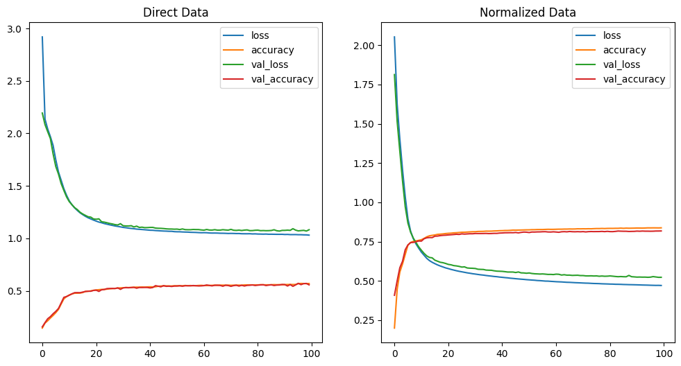

```python
# confusion matrix
test_predictions = model_multiclass_norm.predict(test_data_norm)

confusion_norm = confusion_matrix(test_labels, np.argmax(test_predictions,axis=1))
confusion_norm

# the confusion matrix already  starts to look promising

# array([[757,   1,  27, 101,   4,   4,  85,   0,  19,   2],
#        [  3, 945,   9,  36,   5,   0,   1,   0,   1,   0],
#        [ 31,   3, 699,  10, 147,   0, 106,   0,   4,   0],
#        [ 49,  11,   8, 853,  28,   0,  41,   0,  10,   0],
#        [  1,   3, 111,  36, 738,   0, 102,   0,   9,   0],
#        [  0,   1,   0,   1,   0, 895,   0,  53,   3,  47],
#        [188,   4, 105,  62, 101,   0, 509,   0,  29,   2],
#        [  0,   0,   0,   0,   0,  42,   0, 926,   0,  32],
#        [  7,   2,   2,  11,   2,   4,  39,   5, 927,   1],
#        [  1,   0,   0,   0,   0,  18,   0,  52,   1, 928]])
```

### Finding the Ideal Learning Rate

```python
# add adaptive learning rate
tf.random.set_seed(42)

model_multiclass_norm_lr = tf.keras.Sequential([
    tf.keras.layers.Flatten(input_shape=(28, 28), name="input_layer"),
    tf.keras.layers.Dense(4, activation="relu", name="dense_layer1"),
    tf.keras.layers.Dense(4, activation="relu", name="dense_layer2"),
    tf.keras.layers.Dense(10, activation="softmax", name="output_layer")
])

model_multiclass_norm_lr.compile(loss=tf.keras.losses.SparseCategoricalCrossentropy(),
                                optimizer=tf.keras.optimizers.Adam(),
                                metrics=["accuracy"])

learning_rate_callback = tf.keras.callbacks.LearningRateScheduler(lambda epoch: 1e-4 * 10**(epoch/20))


model_multiclass_norm_lr_history = model_multiclass_norm_lr.fit(train_data_norm, train_labels,
                             callbacks=[learning_rate_callback],
                            validation_data=(test_data_norm, test_labels),
                            epochs=100, verbose=1)

# Epoch 100/100
# 1875/1875 [==============================] - 3s 2ms/step - loss: 3.1371 - accuracy: 0.0984 - val_loss: 2.4865 - val_accuracy: 0.1000 - lr: 8.9125
```

```python
# get ideal learning rate by checking the lr decay curve
lr = 1e-4 * (10 ** (tf.range(100)/20))
plt.figure(figsize=(12, 7))
plt.title("Learning Rate Decay")
plt.xlabel("Learning Rate")
plt.ylabel("Loss")
plt.semilogx(lr, model_multiclass_norm_lr_history.history["loss"])
plt.show()
```

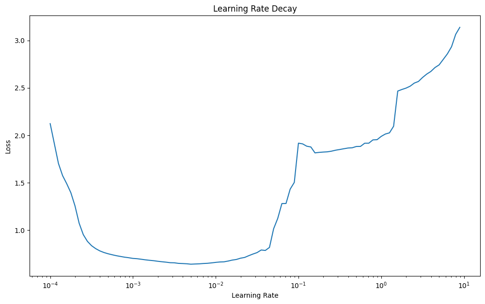

```python
# the lowest point is at 4e-3 -> divide by 10
# the ideal learning rate is 4e-4 => model re-fit

tf.random.set_seed(42)

model_multiclass_norm = tf.keras.Sequential([
    # flatten data from `28*28` to `None, 784`
    tf.keras.layers.Flatten(input_shape=(28, 28)),
    tf.keras.layers.Dense(4, activation="relu", name="input_layer"),
    tf.keras.layers.Dense(4, activation="relu", name="dense_layer1"),
    tf.keras.layers.Dense(10, activation="softmax", name="output_layer")
])
                          
model_multiclass_norm.compile(loss=tf.keras.losses.SparseCategoricalCrossentropy(),
                        optimizer=tf.keras.optimizers.Adam(learning_rate=4e-4),
                        metrics="accuracy")
                          
history_multi_norm = model_multiclass_norm.fit(train_data_norm, train_labels, batch_size=32,
                    validation_data=(test_data_norm, test_labels),
                    epochs=100, verbose=1)

# Epoch 100/100
# 1875/1875 [==============================] - 4s 2ms/step - loss: 0.5323 - accuracy: 0.8042 - val_loss: 0.6132 - val_accuracy: 0.7862
```

```python
# plot confusion matrix
import itertools

def plot_confusion_matrix(y_pred, y_true, classes=None, figsize = (12, 12), text_size=7):

        # create the confusion matrix
        cm = confusion_matrix(y_pred, y_true)

        # normalize
        cm_norm = cm.astype("float") / cm.sum(axis=1)[:, np.newaxis]
        # cm_norm
        # array([[1., 0.],
        #        [0., 1.]])

        number_of_classes = cm.shape[0]
        # 2

        # plot matrix
        fig, ax = plt.subplots(figsize=figsize)
        cax = ax.matshow(cm, cmap=plt.cm.Greens)
        fig.colorbar(cax)

        if classes:
            labels = classes
        else:
            labels = np.arange(cm.shape[0])

        # axes lables
        ax.set(title="Confusion Matrix",
              xlabel="Prediction",
              ylabel="True",
              xticks=np.arange(number_of_classes),
              yticks=np.arange(number_of_classes),
              xticklabels=labels,
              yticklabels=labels)

        ax.xaxis.set_label_position("bottom")
        ax.title.set_size(15)
        ax.xaxis.label.set_size(15)
        ax.yaxis.label.set_size(15)
        ax.xaxis.tick_bottom()


        # colour threshold
        threshold = (cm.max() + cm.min()) / 2.

        # add text to cells
        for i, j in itertools.product(range(cm.shape[0]), range(cm.shape[1])):
            plt.text(j, i , f"{cm[i, j]} ({cm_norm[i, j]*100:.1f}%)",
            horizontalalignment="center",
            color="white" if cm[i, j] > threshold else "black",
            size=text_size)
```

```python
## start by running predictions on the test dataset
test_predictions_ideal = model_multiclass_norm.predict(test_data_norm)
## set class with highest probability to 1 - rest to zero
y_pred = tf.argmax(test_predictions_ideal,axis=1)
## plot the confusion matrix predictions vs true labels
plot_confusion_matrix(y_pred=y_pred, y_true=test_labels, classes=class_names)
```

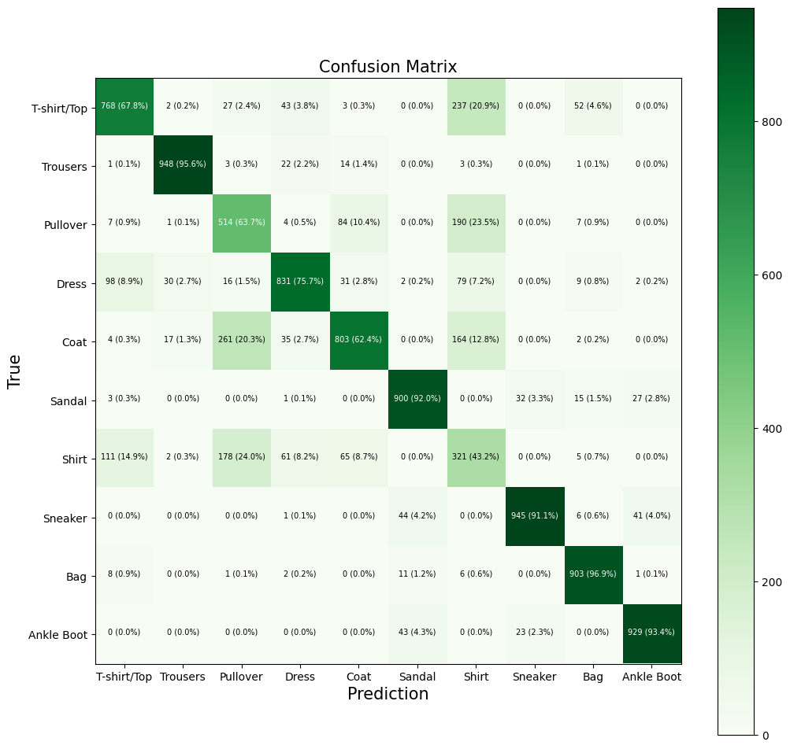


## Making predictions to further evaluate the model

```python
# function to pick a random image and run prediction
def random_image_prediction(model, images, true_labels, classes):
    # create random image index
    i = random.randint(0, len(images))
    # select label of image at index i
    true_label = classes[true_labels[i]]
    # pick corresponding image
    target_image = images[i]
    # reshape image and pass it to prediction
    pred_probabilities = model.predict(target_image.reshape(1, 28, 28))
    # select class with highest probability
    pred_label = classes[pred_probabilities.argmax()]
    
    # plot the b&w image
    plt.imshow(target_image, cmap=plt.cm.binary)
    
    if pred_label == true_label:
        color = "green"
    else:
        color = "red"
        
    plt.xlabel("Prediction: {} {:2.0f}% (True: {})".format(pred_label,
                                                     100*tf.reduce_max(pred_probabilities),
                                                     true_label), color = color)
```

```python
random_image_prediction(model=model_multiclass_norm,
                       images=test_data_norm,
                       true_labels=test_labels,
                       classes=class_names)
```

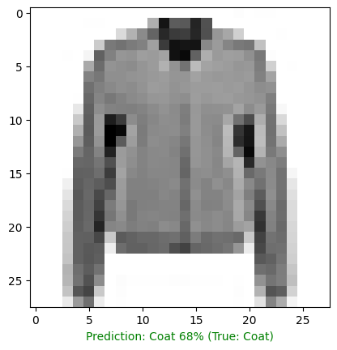

```python
# function to pick a random image and run prediction
def random_image_map_prediction(model, images, true_labels, classes):
    
    ran_gen = np.random.default_rng()
    
    plt.figure(figsize=(12, 12))
    
    for i in range(9):
        # select random image
        random_index = ran_gen.integers(low=0, high=len(images), size=1)
        target_image = images[random_index[0]]
        true_label = classes[true_labels[random_index[0]]]
        # reshape image and pass it to prediction
        pred_probabilities = model.predict(target_image.reshape(1, 28, 28))
        # select class with highest probability
        pred_label = classes[pred_probabilities.argmax()]
        
        ax = plt.subplot(3, 3, i+1)
        # plt.title(classes[train_labels[random_index[0]]])
    
        if pred_label == true_label:
            colour = "green"
            colourmap = "Greens"
        else:
            colour = "red"
            colourmap = "Reds"

        plt.xlabel("Prediction: {} {:2.0f}% (True: {})".format(pred_label,
                                                         100*tf.reduce_max(pred_probabilities),
                                                         true_label), color = colour)
        plt.imshow(target_image, cmap=colourmap)
        plt.axis(True)
        
```

```python
random_image_map_prediction(model=model_multiclass_norm,
                       images=test_data_norm,
                       true_labels=test_labels,
                       classes=class_names)
```

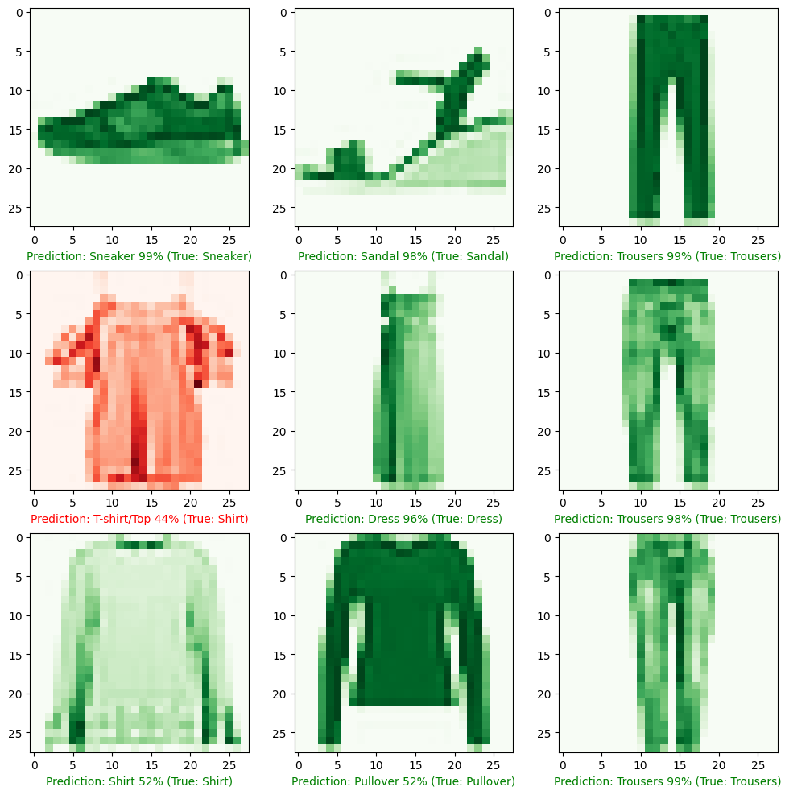


## Weights & Biases

Weights represent the pattern a particular layer of our neural network has learned during training.

```python
model_multiclass_norm.layers

# [<keras.layers.reshaping.flatten.Flatten at 0x7f0e24157940>,
#   <keras.layers.core.dense.Dense at 0x7f0e2423e560>,
#   <keras.layers.core.dense.Dense at 0x7f0eedc336d0>,
#   <keras.layers.core.dense.Dense at 0x7f0e2423e620>]
```

```python
# get weigths of a particular layer
weights, biases = model_multiclass_norm.layers[1].get_weights()

weights.shape, weights, biases.shape, biases, model_multiclass_norm.summary()

# weight.shape
#  (784, 4)) => 28x28 for the image dimensions and 4 hidden units

# weights
# (array([[-1.3565315 , -0.3214511 , -0.16312897, -0.3301181 ],
#         [-1.8619745 ,  0.22111109, -1.3103486 ,  1.1400424 ],
#         [ 1.9727688 , -1.762827  , -1.5388335 ,  0.39442703],
#         ...,
#         [ 0.5418353 ,  0.5226571 ,  0.27219778,  0.4796965 ],
#         [-0.55814236,  0.2910452 ,  0.26502737,  2.1195614 ],
#         [-0.5417867 , -0.16617213,  1.1190995 ,  0.3001483 ]],
#        dtype=float32)
# for every pixel in our sample 28x28px images we get 4 different
# values from the 4 hidden units / neurons inspecting the image for features
# weights

# biases.shape => for every hidden unit we get a bias vector
# (4,),

# biases => dictate how much the corresponding weight should influence the next layer
#  array([ 1.9621418 ,  0.5325201 ,  1.6395437 , -0.04142712], dtype=float32),
#  None)

# model summary
# Model: "sequential_1"
# _________________________________________________________________
#  Layer (type)                Output Shape              Param #   
# =================================================================
#  flatten_1 (Flatten)         (None, 784)               0         
                                                                 
#  input_layer (Dense)         (None, 4)                 3140      
                                                                 
#  dense_layer1 (Dense)        (None, 4)                 20        
                                                                 
#  output_layer (Dense)        (None, 10)                50        
                                                                 
# =================================================================
# Total params: 3,210
# Trainable params: 3,210
# Non-trainable params: 0
# _________________________________________________________________
```
