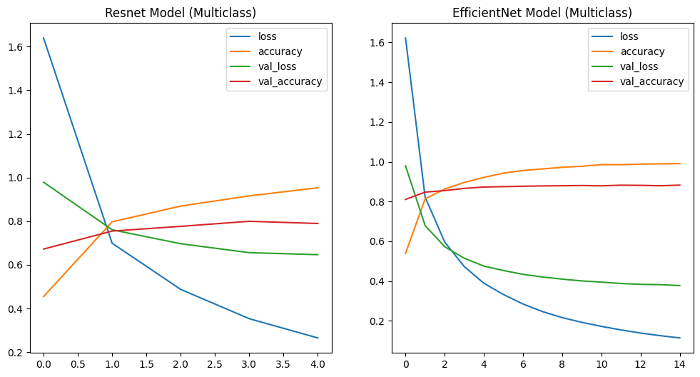
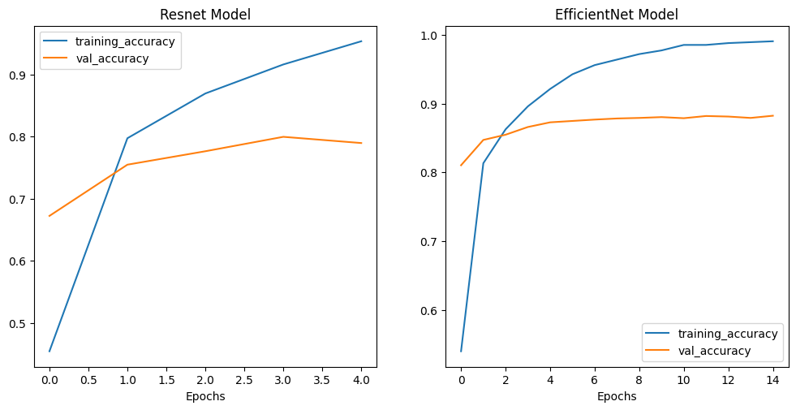

---
jupyter:
  jupytext:
    formats: ipynb,md
    text_representation:
      extension: .md
      format_name: markdown
      format_version: '1.3'
      jupytext_version: 1.14.4
  kernelspec:
    display_name: Python 3 (ipykernel)
    language: python
    name: python3
---

# Transfer Learning

Transfer Learning leverages a pretrained model that is already extremely performant on general feature detection. Our work will be to re-train this model on our specific dataset and add the specialized knowledge needed to solve our task.

Since the model is already pre-trained we can expect that we will only need about `10%` of the amount of data that would be needed to train a fresh model.

## Feature Extraction


* cd datasets
* wget https://storage.googleapis.com/ztm_tf_course/food_vision/10_food_classes_10_percent.zip
* unzip 10_food_classes_10_percent.zip && rm 10_food_classes_10_percent.zip

```
tree -L 2
10_food_classes_10_percent
├── test
│   ├── chicken_curry
│   ├── chicken_wings
│   ├── fried_rice
│   ├── grilled_salmon
│   ├── hamburger
│   ├── ice_cream
│   ├── pizza
│   ├── ramen
│   ├── steak
│   └── sushi
└── train
    ├── chicken_curry
    ├── chicken_wings
    ├── fried_rice
    ├── grilled_salmon
    ├── hamburger
    ├── ice_cream
    ├── pizza
    ├── ramen
    ├── steak
    └── sushi
```

### Visualizing the Data

```python
import datetime
import itertools
import matplotlib.image as mpimg
import matplotlib.pyplot as plt
import numpy as np
import os
import pandas as pd
import pathlib
import random
import tensorflow as tf
import tensorflow_hub as hub
from tensorflow.keras import Sequential
from tensorflow.keras.layers import Dense, Flatten, Conv2D, MaxPool2D, Activation, Rescaling, RandomFlip, RandomRotation, RandomZoom, RandomContrast, RandomBrightness
from tensorflow.keras.optimizers import Adam
from tensorflow.keras.preprocessing.image import ImageDataGenerator
from tensorflow.keras.utils import image_dataset_from_directory
```

```python
# check if you have GPU support
tf.config.list_physical_devices('GPU')
# [PhysicalDevice(name='/physical_device:GPU:0', device_type='GPU')]

# physical_devices = tf.config.list_physical_devices('GPU')
# for device in physical_devices:
#   tf.config.experimental.set_memory_growth(device, True)
```

```python
# set directories
training_directory = "../datasets/10_food_classes_10_percent/train/"
testing_directory = "../datasets/10_food_classes_10_percent/test/"

# get class names
data_dir = pathlib.Path(training_directory)
class_names = np.array(sorted([item.name for item in data_dir.glob('*')]))
len(class_names), class_names 

# the data set has 10 classes:
# (10,
#  array(['chicken_curry', 'chicken_wings', 'fried_rice', 'grilled_salmon',
#         'hamburger', 'ice_cream', 'pizza', 'ramen', 'steak', 'sushi'],
#        dtype='<U14'))
```

```python
# visualizing the dataset
## display random images
def view_random_image(target_dir, target_class):
    target_folder = str(target_dir) + "/" + target_class
    random_image = random.sample(os.listdir(target_folder), 1)
    
    img = mpimg.imread(target_folder + "/" + random_image[0])
    plt.imshow(img)
    plt.title(str(target_class) + str(img.shape))
    plt.axis("off")
    
    return tf.constant(img)

fig = plt.figure(figsize=(12, 6))
plot1 = fig.add_subplot(1, 2, 1)
plot1.title.set_text(f'Class: {class_names[0]}')
pizza_image = view_random_image(target_dir = training_directory, target_class=class_names[0])
plot2 = fig.add_subplot(1, 2, 2)
plot2.title.set_text(f'Class: {class_names[1]}')
steak_image = view_random_image(target_dir = training_directory, target_class=class_names[1])

fig = plt.figure(figsize=(12, 6))
plot3 = fig.add_subplot(1, 2, 1)
plot3.title.set_text(f'Class: {class_names[2]}')
pizza_image = view_random_image(target_dir = training_directory, target_class=class_names[2])
plot4 = fig.add_subplot(1, 2, 2)
plot4.title.set_text(f'Class: {class_names[3]}')
steak_image = view_random_image(target_dir = training_directory, target_class=class_names[3])

fig = plt.figure(figsize=(12, 6))
plot5 = fig.add_subplot(1, 2, 1)
plot5.title.set_text(f'Class: {class_names[4]}')
pizza_image = view_random_image(target_dir = training_directory, target_class=class_names[4])
plot6 = fig.add_subplot(1, 2, 2)
plot6.title.set_text(f'Class: {class_names[5]}')
steak_image = view_random_image(target_dir = training_directory, target_class=class_names[5])

fig = plt.figure(figsize=(12, 6))
plot7 = fig.add_subplot(1, 2, 1)
plot7.title.set_text(f'Class: {class_names[6]}')
pizza_image = view_random_image(target_dir = training_directory, target_class=class_names[6])
plot8 = fig.add_subplot(1, 2, 2)
plot8.title.set_text(f'Class: {class_names[7]}')
steak_image = view_random_image(target_dir = training_directory, target_class=class_names[7])
```


### Preprocessing the Data

```python
SEED = 42
BATCH_SIZE = 16
IMG_SHAPE = (224, 224)

training_data = image_dataset_from_directory(training_directory,
                                              labels='inferred',
                                              label_mode='categorical',
                                              seed=SEED,
                                              shuffle=True,
                                              image_size=IMG_SHAPE,
                                              batch_size=BATCH_SIZE)

testing_data = image_dataset_from_directory(testing_directory,
                                              labels='inferred',
                                              label_mode='categorical',
                                              seed=SEED,
                                              shuffle=True,
                                              image_size=IMG_SHAPE,
                                              batch_size=BATCH_SIZE)


# this time we only work with 10% of the training dataset
# Found 750 files belonging to 10 classes.
# Found 2500 files belonging to 10 classes.
```

### TensorBoard Perfomance Tracking

```python
# create a callback to track experiments in TensorBoard
def create_tensorboard_callback(dir_name, experiment_name):
    # log progress to log directory
    log_dir = dir_name + "/" + experiment_name + "/" + datetime.datetime.now().strftime("%Y%m%d-%H%M%S")
    tensorboard_callback = tf.keras.callbacks.TensorBoard(log_dir=log_dir, histogram_freq=1)
    print(f"Saving TensorBoard Log to: {log_dir}")
    return tensorboard_callback
```

### Building a Model from Tensorflow Hub

Pick a well performing model from the [Image Classification Leaderboard](https://paperswithcode.com/task/image-classification) and try to find it on:

* [Tensorflow Hub](https://tfhub.dev/s?module-type=image-classification,image-feature-vector&network-architecture=efficientnet-b0,resnet-v2-50&tf-version=tf2)
  * [EfficientNetB0 (feature-vector)](https://tfhub.dev/tensorflow/efficientnet/b0/feature-vector/1)
  * [ResNetv250 (feature_vector)](https://tfhub.dev/google/imagenet/resnet_v2_50/feature_vector/5)

```python
# model comparison
resnet_model_url = 'https://tfhub.dev/google/imagenet/resnet_v2_50/feature_vector/5'
efficientnet_model_url = 'https://tfhub.dev/tensorflow/efficientnet/b0/feature-vector/1'
```

```python
# add image augmentations (optional)
data_augmentation_layer = Sequential([
    RandomFlip("horizontal_and_vertical"),
    RandomRotation(0.2),
    RandomZoom(0.1),
    RandomContrast(0.2),
    RandomBrightness(0.2)
])

# helper function to create a model
def create_model(model_url, num_classes):
    # download pre-trained model as a keras layer
    feature_extractor_layer = hub.KerasLayer(model_url,
                                             trainable=False,
                                             name='feature_extractor_layer')
    
    # create sequential model
    model = tf.keras.Sequential([
        Rescaling(1./255, input_shape=IMG_SHAPE+(3,)),
        # data_augmentation_layer,
        feature_extractor_layer,
        tf.keras.layers.Dense(num_classes, activation='softmax', name='output_layer')
    ])

    return model
```

### Creating a ResNet-based Model

```python
resnet_model = create_model(resnet_model_url, len(class_names))

resnet_model.compile(loss="categorical_crossentropy",
                     optimizer=Adam(learning_rate=1e-3),
                     metrics=["accuracy"])
```

```python
resnet_model.summary()

# Model: "sequential_1"
# _________________________________________________________________
#  Layer (type)                Output Shape              Param #   
# =================================================================
#  rescaling (Rescaling)       (None, 224, 224, 3)       0         
#  feature_extractor_layer (Ke (None, 2048)             23564800  
#  rasLayer)
#  output_layer (Dense)        (None, 10)                20490
# =================================================================
# Total params: 23,585,290
# Trainable params: 20,490
# Non-trainable params: 23,564,800
# _________________________________________________________________
```

### Training the ResNet Model

```python
tf.random.set_seed(SEED)
# fitting the model
history_resnet_model = resnet_model.fit(training_data, epochs=5,
                            steps_per_epoch=len(training_data),
                            validation_data=testing_data,
                            validation_steps=len(testing_data))

# Epoch 15/15
# 12s 531ms/step - loss: 5.6705 - accuracy: 0.6680 - val_loss: 22.5076 - val_accuracy: 0.2684
```

### Creating a EfficientNet-based Model

```python
efficientnet_model = create_model(efficientnet_model_url, len(class_names))

efficientnet_model.compile(loss='categorical_crossentropy',
                    optimizer=Adam(learning_rate=1e-3),
                    metrics=['accuracy'])
```

```python
efficientnet_model.summary()

# Model: "sequential_2"
# _________________________________________________________________
#  Layer (type)                Output Shape              Param #   
# =================================================================
#  rescaling_1 (Rescaling)     (None, 224, 224, 3)       0         
#  feature_extractor_layer (Ke (None, 1280)             4049564   
#  rasLayer)                                                       
#  output_layer (Dense)        (None, 10)                12810     
# =================================================================
# Total params: 4,062,374
# Trainable params: 12,810
# Non-trainable params: 4,049,564
# _________________________________________________________________
```

### Training the EfficientNet Model

```python
tf.random.set_seed(SEED)
# fitting the model
history_efficientnet_model = efficientnet_model.fit(training_data, epochs=15,
                            steps_per_epoch=len(training_data),
                            validation_data=testing_data,
                            validation_steps=len(testing_data))

# Epoch 15/15
# 24/24 [==============================] - 10s 426ms/step - loss: 22.2573 - accuracy: 0.6880 - val_loss: 542.0494 - val_accuracy: 0.1132
```

### Comparing both Models

```python
# plotting the loss curves
fig, axes = plt.subplots(nrows=1, ncols=2, figsize=(12, 6))
pd.DataFrame(history_resnet_model.history).plot(ax=axes[0], title="Resnet Model (Multiclass)")
pd.DataFrame(history_efficientnet_model.history).plot(ax=axes[1], title="EfficientNet Model (Multiclass)")
```



```python
# Plot the validation and training accuracy separately
def plot_accuracy_curves(history1, title1, history2, title2):
  accuracy1 = history1.history['accuracy']
  val_accuracy1 = history1.history['val_accuracy']
  epochs1 = range(len(history1.history['accuracy']))

  accuracy2 = history2.history['accuracy']
  val_accuracy2 = history2.history['val_accuracy']
  epochs2 = range(len(history2.history['accuracy']))

  # Plot accuracy
  plt.figure(figsize=(12, 12))
    
  plt.subplot(2, 2, 1)
  plt.plot(epochs1, accuracy1, label='training_accuracy')
  plt.plot(epochs1, val_accuracy1, label='val_accuracy')
  plt.title(title1)
  plt.xlabel('Epochs')
  plt.legend();

  plt.subplot(2, 2, 2)
  plt.plot(epochs2, accuracy2, label='training_accuracy')
  plt.plot(epochs2, val_accuracy2, label='val_accuracy')
  plt.title(title2)
  plt.xlabel('Epochs')
  plt.legend();
```

```python
# plotting the accuracy curves
plot_accuracy_curves(history1=history_resnet_model,
                     title1="Resnet Model",
                     history2=history_efficientnet_model,
                     title2="EfficientNet Model")
```




### Using the Tensorboard Callback

```python
tf.random.set_seed(SEED)
# re-running the resnet training
history_resnet_model = resnet_model.fit(training_data, epochs=15,
        callbacks=create_tensorboard_callback(dir_name='../tensorboard/resnet',
                                              experiment_name='resnet_01'),
        steps_per_epoch=len(training_data),
        validation_data=testing_data,
        validation_steps=len(testing_data))

# Epoch 15/15
# 24/24 [==============================] - 13s 573ms/step - loss: 8.2926 - accuracy: 0.5573 - val_loss: 25.3469 - val_accuracy: 0.2252
```

```python
tf.random.set_seed(SEED)
# re-running the resnet training
history_resnet_model = resnet_model.fit(training_data, epochs=15,
            callbacks=create_tensorboard_callback(dir_name='../tensorboard/efficientnet',
                                                  experiment_name='efficientnet_01'),
            steps_per_epoch=len(training_data),
            validation_data=testing_data,
            validation_steps=len(testing_data))

# Epoch 15/15
# 24/24 [==============================] - 16s 680ms/step - loss: 6.3984 - accuracy: 0.6387 - val_loss: 22.5422 - val_accuracy: 0.2764
```

```python

```

```python

```
