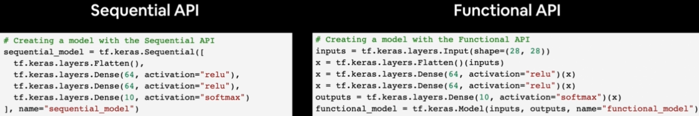
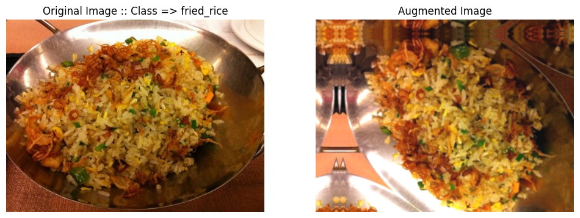
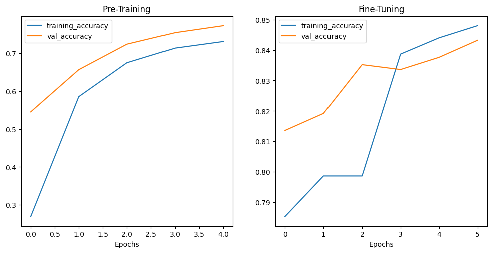
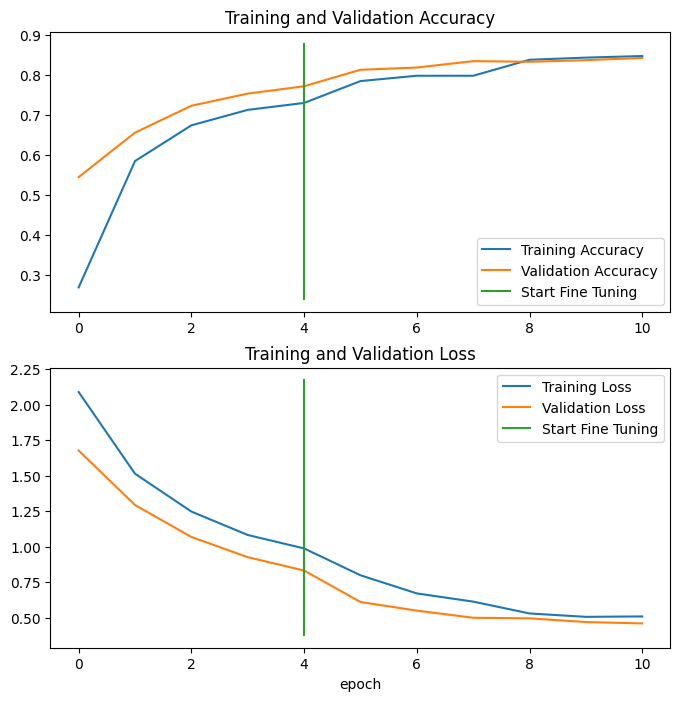
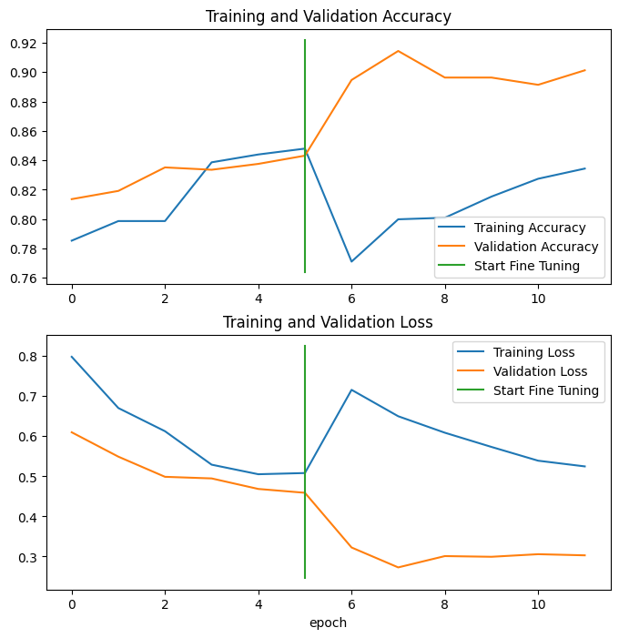
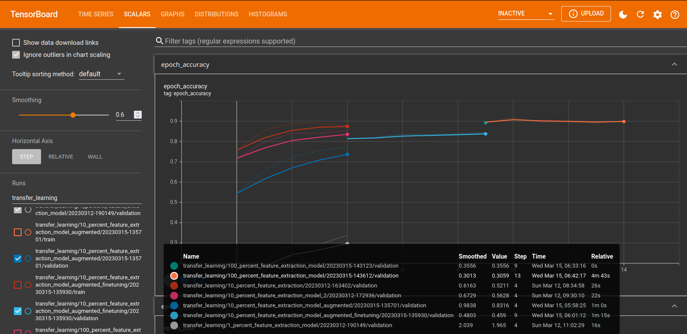
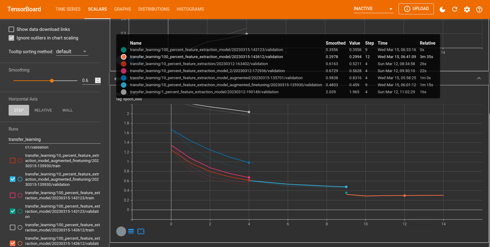

---
jupyter:
  jupytext:
    formats: ipynb,md
    text_representation:
      extension: .md
      format_name: markdown
      format_version: '1.3'
      jupytext_version: 1.14.4
  kernelspec:
    display_name: Python 3 (ipykernel)
    language: python
    name: python3
---

<!-- #region -->
# Transfer Learning

Transfer Learning leverages a pretrained model that is already extremely performant on general feature detection. Our work will be to re-train this model on our specific dataset and add the specialized knowledge needed to solve our task.

Since the model is already pre-trained we can expect that we will only need about 10% of the amount of data that would be needed to train a fresh model.


## Fine-tuning Pre-trained Models

Using a pre-trained model from [tf.keras.applictions](https://www.tensorflow.org/api_docs/python/tf/keras/applications) and fine-tuning it to our problem.
<!-- #endregion -->

```python
import datetime
import matplotlib.image as mpimg
import matplotlib.pyplot as plt
import os
import random
import tensorflow as tf
from tensorflow.keras.utils import image_dataset_from_directory
```

```python
# global variables
SEED = 42
BATCH_SIZE = 32
IMG_SHAPE = (224, 224)
```

```python
# export helper functions from above into helper script
from helper import create_tensorboard_callback, create_checkpoint_callback, plot_accuracy_curves, combine_training_curves
```

```python
# get 10% dataset
# wget https://storage.googleapis.com/ztm_tf_course/food_vision/10_food_classes_10_percent.zip

# set directories for 10% dataset
training_directory_10 = "../datasets/10_food_classes_10_percent/train/"
testing_directory_10 = "../datasets/10_food_classes_10_percent/test/"

training_data_10 = image_dataset_from_directory(training_directory_10,
                                              labels='inferred',
                                              label_mode='categorical',
                                              seed=SEED,
                                              shuffle=True,
                                              image_size=IMG_SHAPE,
                                              batch_size=BATCH_SIZE)

testing_data_10 = image_dataset_from_directory(testing_directory_10,
                                              labels='inferred',
                                              label_mode='categorical',
                                              seed=SEED,
                                              shuffle=True,
                                              image_size=IMG_SHAPE,
                                              batch_size=BATCH_SIZE)

# get class names
class_names_10 = training_data_10.class_names

len(class_names_10), class_names_10 

# Found 750 files belonging to 10 classes.
# Found 2500 files belonging to 10 classes.

# (10,
#  ['chicken_curry',
#   'chicken_wings',
#   'fried_rice',
#   'grilled_salmon',
#   'hamburger',
#   'ice_cream',
#   'pizza',
#   'ramen',
#   'steak',
#   'sushi'])
```

```python
# inspect first image batch
## BatchDataset returns the image data matrices + 1-hot-encoded label matrix
for images, labels in training_data_10.take(1):
    print(images, labels)
```

<!-- #region -->
1. Start by using [EfficientNetV2B0](https://www.tensorflow.org/api_docs/python/tf/keras/applications/efficientnet_v2/EfficientNetV2B0) as a __Feature Extractor__ (all layers frozen, ImageNet pretrained and without top).
2. Find a good sample size to optimize training (data augmentation).
3. Unfreeze layers from the pre-trained model and run fine-tuning (top 10 layers unfrozen).

| Experiment | Data | Pre-processing | Model |
| -- |-- |-- | -- |
| Model 0 | 10% Dataset | None | Feature Extraction: EfficientNetB0 |
| Model 1 | 1% Dataset | Augmented | same as Model 0 |
| Model 2 | same as Model 0 | same as Model 1 | same as Model 0 |
| Model 3 | same as Model 0 | same as Model 1 | Fine-tuning: EfficientNetB0 |
| Model 4 | 100% Dataset | same as Model 1 | same as Model 3 |



<!-- #endregion -->

### Model 0

Using 10% of the training data and extract feature vectors using EfficientNetB0 from Keras Applications.

```python
# build a model from tf.keras.applications
# using the keras functional API

# get base model from keras applications
base_model = tf.keras.applications.efficientnet.EfficientNetB0(
    include_top=False
)

# freeze all layers (don't update pre-learned pattern)
base_model.trainable = False

# create input layer
input_layer = tf.keras.layers.Input(shape=IMG_SHAPE+(3,), name='input_layer')

# start by normalizing your data (not necessary for efficientnet)
# data = tf.keras.layers.Rescaling(1./255)(input_layer)

# pass (normalized) inputs to base model
data = base_model(input_layer)
print(f"INFO :: Input Shape: {data.shape}")
# INFO :: Input Shape: (None, 7, 7, 1280)

# average pool outputs of the base model
data = tf.keras.layers.GlobalAveragePooling2D(name="global_average_pooling_layer")(data)
print(f"INFO :: Feature Vector Shape: {data.shape}")
# INFO :: Feature Vector Shape: (None, 1280)

# create output layer
output_layer = tf.keras.layers.Dense(10, activation="softmax", name="output_layer")(data)

# build the model 0
model_0 = tf.keras.Model(input_layer, output_layer)

# compile model 0
model_0.compile(loss='categorical_crossentropy',
               optimizer=tf.keras.optimizers.Adam(),
               metrics=['accuracy'])
```

```python
# check model_0
model_0.summary()
# Model: "model_2"
# _________________________________________________________________
#  Layer (type)                Output Shape              Param #   
# =================================================================
#  input_layer (InputLayer)    [(None, 224, 224, 3)]     0
#  efficientnetb0 (Functional)  (None, None, None, 1280) 4049571
#  global_average_pooling_laye  (None, 1280)             0         
#  r (GlobalAveragePooling2D)
#  output_layer (Dense)        (None, 10)                12810
# =================================================================
# Total params: 4,062,381
# Trainable params: 12,810
# Non-trainable params: 4,049,571
# _________________________________________________________________

# check base_model layers
for layer_number, layer in enumerate(base_model.layers):
    print(layer_number, layer.name)
    
# 0 input_5
# 1 rescaling_5
# 2 normalization_2
# 3 rescaling_6
# 4 stem_conv_pad
# 5 stem_conv
# 6 stem_bn
# 7 stem_activation
# 8 block1a_dwconv
# ...
# 234 block7a_project_bn
# 235 top_conv
# 236 top_bn
# 237 top_activation
```

```python
# fit model 0
history_model_0 = model_0.fit(
                                training_data_10,
                                epochs=5,
                                steps_per_epoch=len(training_data_10),
                                validation_data=testing_data_10,
                                # speed up validation by skipping 75%
                                validation_steps=int(0.25 * len(testing_data_10)),
                                callbacks=[create_tensorboard_callback(
                                            '../tensorboard/transfer_learning',
                                            '10_percent_feature_extraction')
                                          ])

# Epoch 5/5
# 6s 267ms/step - loss: 0.5430 - accuracy: 0.8773 - val_loss: 0.5211 - val_accuracy: 0.8799
```

### Model 0

Same as above but using the EfficientNet v2 B0 model.

```python
base_model_2 = tf.keras.applications.efficientnet_v2.EfficientNetV2B0(include_top=False)
# run in inference mode so batchnorm statistics don't get updated
# even after unfreezing the base model for fine-tuning
base_model_2.trainable = False

input_layer_2 = tf.keras.layers.Input(shape=IMG_SHAPE+(3,), name='input_layer')
# run in inference mode so batchnorm statistics don't get updated
# even after unfreezing the base model for fine-tuning
data_2 = base_model_2(input_layer_2, training=False)
data_2 = tf.keras.layers.GlobalAveragePooling2D(name="global_average_pooling_layer")(data_2)
output_layer_2 = tf.keras.layers.Dense(10, activation="softmax", name="output_layer")(data_2)

model_0_2 = tf.keras.Model(input_layer_2, output_layer_2)

model_0_2.compile(loss='categorical_crossentropy',
               optimizer=tf.keras.optimizers.Adam(),
               metrics=['accuracy'])
```

```python
# fit model 0
history_model_0_2 = model_0_2.fit(
                                training_data_10,
                                epochs=5,
                                steps_per_epoch=len(training_data_10),
                                validation_data=testing_data_10,
                                # speed up validation by skipping 75%
                                validation_steps=int(0.25 * len(testing_data_10)),
                                callbacks=[create_tensorboard_callback(
                                            '../tensorboard/transfer_learning',
                                            '10_percent_feature_extraction_model_2')
                                          ])

# Epoch 5/5
# 5s 222ms/step - loss: 0.6073 - accuracy: 0.8707 - val_loss: 0.5628 - val_accuracy: 0.8536
```

### Model 1

Before I used 10% of the training dataset. Let's try using only 1% while leveraging Tensorflows augmentation functions to add variations to our dataset.

The idea is to find the absolut minimum of 'effort' with a small dataset and a light-weight base model to get started with. Experiment with this setup that gives you fast results. And once it is working reasonably well add more training data as well as model complexity to find the maximum in prediction accuracy.

```python
# get 1% dataset
# wget https://storage.googleapis.com/ztm_tf_course/food_vision/10_food_classes_1_percent.zip

# set directories for 1% dataset
training_directory_1 = "../datasets/10_food_classes_1_percent/train/"
testing_directory_1 = "../datasets/10_food_classes_1_percent/test/"

training_data_1 = image_dataset_from_directory(training_directory_1,
                                              labels='inferred',
                                              label_mode='categorical',
                                              seed=SEED,
                                              shuffle=True,
                                              image_size=IMG_SHAPE,
                                              batch_size=BATCH_SIZE)

testing_data_1 = image_dataset_from_directory(testing_directory_1,
                                              labels='inferred',
                                              label_mode='categorical',
                                              seed=SEED,
                                              shuffle=True,
                                              image_size=IMG_SHAPE,
                                              batch_size=BATCH_SIZE)

# get class names
class_names_1 = training_data_1.class_names

len(class_names_1), class_names_1 

# Found 70 files belonging to 10 classes.
# Found 2500 files belonging to 10 classes.

# (10,
#  ['chicken_curry',
#   'chicken_wings',
#   'fried_rice',
#   'grilled_salmon',
#   'hamburger',
#   'ice_cream',
#   'pizza',
#   'ramen',
#   'steak',
#   'sushi'])
```

#### Add Augmentation Layer

```python
data_augmentation_layer = tf.keras.Sequential([
    tf.keras.layers.RandomFlip("horizontal_and_vertical"),
    tf.keras.layers.RandomRotation(0.2),
    tf.keras.layers.RandomZoom(0.1),
    tf.keras.layers.RandomContrast(0.2),
    tf.keras.layers.RandomBrightness(0.2),
    tf.keras.layers.RandomTranslation(0.1, 0.1),
    # tf.keras.layers.Rescaling(1./255) # not needed for EfficientNet
], name="data_augmentation_layer")
```

```python
# visualize augmentations
## pick random image from training set
target_class = random.choice(class_names_1)
target_dir = training_directory_1 + target_class
random_image = random.choice(os.listdir(target_dir))
random_image_path = target_dir + '/' + random_image
img = mpimg.imread(random_image_path)

# run image through aug layer
augmented_img = data_augmentation_layer(img, training=True)

plt.figure(figsize=(12, 12))
plt.subplot(2, 2, 1)
plt.title(f"Original Image :: Class => {target_class}")
plt.axis(False)
plt.imshow(img)
plt.subplot(2, 2, 2)
plt.title("Augmented Image")
plt.axis(False)
plt.imshow(augmented_img/255)
```



```python
# build model 1
base_model1 = tf.keras.applications.efficientnet_v2.EfficientNetV2B0(include_top=False)
base_model1.trainable = False

input_layer1 = tf.keras.layers.Input(shape=IMG_SHAPE+(3,), name='input_layer')
data1 = data_augmentation_layer(input_layer1)
# run in inference mode so batchnorm statistics don't get updated
# even after unfreezing the base model for fine-tuning
data1 = base_model1(data1, training=False)
data1 = tf.keras.layers.GlobalAveragePooling2D(name="global_average_pooling_layer")(data1)
output_layer1 = tf.keras.layers.Dense(10, activation="softmax", name="output_layer")(data1)

model_1 = tf.keras.Model(input_layer1, output_layer1)

model_1.compile(loss='categorical_crossentropy',
               optimizer=tf.keras.optimizers.Adam(),
               metrics=['accuracy'])
```

```python
# fit model 1
history_model_1 = model_1.fit(
                                training_data_1,
                                epochs=5,
                                steps_per_epoch=len(training_data_1),
                                validation_data=testing_data_1,
                                # speed up validation by skipping 75%
                                validation_steps=int(0.25 * len(testing_data_1)),
                                callbacks=[create_tensorboard_callback(
                                            '../tensorboard/transfer_learning',
                                            '1_percent_feature_extraction_model')
                                          ])

# Epoch 5/5
# 4s 2s/step - loss: 1.7357 - accuracy: 0.5286 - val_loss: 1.9652 - val_accuracy: 0.3372

# even with only 1% of the data there is still a 34% accuracy over ten
# classes - while the original paper achieved ~50% over 101 classes
# https://data.vision.ee.ethz.ch/cvl/datasets_extra/food-101/
```

### Model 2

Let's try the augmentation layer on 10% of the dataset - so the same as model 0 but with added augmentations.

```python
base_model2 = tf.keras.applications.efficientnet_v2.EfficientNetV2B0(include_top=False)
# run in inference mode so batchnorm statistics don't get updated
# even after unfreezing the base model for fine-tuning
base_model2.trainable = False

input_layer2 = tf.keras.layers.Input(shape=IMG_SHAPE+(3,), name='input_layer')
data2 = data_augmentation_layer(input_layer2)
# run in inference mode so batchnorm statistics don't get updated
# even after unfreezing the base model for fine-tuning
data2 = base_model2(data2, training=False)
data2 = tf.keras.layers.GlobalAveragePooling2D(name="global_average_pooling_layer")(data2)
output_layer2 = tf.keras.layers.Dense(10, activation="softmax", name="output_layer")(data2)

model_2 = tf.keras.Model(input_layer2, output_layer2)

model_2.compile(loss='categorical_crossentropy',
               optimizer=tf.keras.optimizers.Adam(),
               metrics=['accuracy'])
```

### Adding ModelCheckpoint Callback

Added to `helper.py`:
    
```py
# create a training checkpoint callback
def create_checkpoint_callback(dir_name, experiment_name):
    # log progress to log directory
    filepath = dir_name + "/" + experiment_name
    tf.keras.callbacks.ModelCheckpoint(
        filepath=filepath, monitor='val_accuracy', verbose=0, save_best_only=True,
        save_weights_only=True, save_freq='epoch')
    print(f"Saving Checkpoint to: {filepath}")
    return checkpoint_callback
```


```python
# fit model 2
# training epochs before fine-tuning
pretraining_epochs = 5

history_model_2 = model_2.fit(
                                training_data_10,
                                epochs=pretraining_epochs,
                                steps_per_epoch=len(training_data_10),
                                validation_data=testing_data_10,
                                validation_steps=len(testing_data_10),
                                callbacks=[create_tensorboard_callback(
                                            '../tensorboard/transfer_learning',
                                            '10_percent_feature_extraction_model_augmented'),
                                           create_checkpoint_callback('../checkpoints/transfer_learning',
                                            '10_percent_feature_extraction_model_augmented')
                                          ])

# Epoch 5/5
# 15s 634ms/step - loss: 0.9873 - accuracy: 0.7307 - val_loss: 0.8316 - val_accuracy: 0.7724
# INFO :: Saving TensorBoard Log to: ../tensorboard/transfer_learning/10_percent_feature_extraction_model_augmented/20230315-135701
# INFO :: Saving Checkpoint to: ../checkpoints/transfer_learning/10_percent_feature_extraction_model_augmented
```

### Restoring Model from Checkpoint

The __ModelCheckpoint__ callback allows us to return a compiled model back to a past state by loading the saved weights that were generated by a previous training.

```python
# check current validation metrics
model_2_validation_metric_5_epochs = model_2.evaluate(testing_data_10)
print(model_2_validation_metric_5_epochs)

# 79/79 [==============================] - 6s 73ms/step - loss: 0.8056 - accuracy: 0.7972
# [0.805601179599762, 0.7972000241279602]
```

```python
# load latest checkpoint and "restore" weights
checkpoint_path = '../checkpoints/transfer_learning/10_percent_feature_extraction_model_augmented/20230312-201041'
model_2.load_weights(checkpoint_path)

# check validation metrics from loaded weights
model_2_validation_metric_5_epochs_loaded = model_2.evaluate(testing_data_10)
print(model_2_validation_metric_5_epochs_loaded)

# 79/79 [==============================] - 6s 74ms/step - loss: 0.6724 - accuracy: 0.8320
# [0.6724268794059753, 0.8320000171661377]
```

## Model Fine-tuning

1. Freeze the imported model and find best parameters to use it for your prediction problem (as done above).
2. Train the model with found parameters on a large dataset from your porediction problem.
3. Unfreeze "some" of the layers of the imported model and re-run the training to fine-tune your model.

```python
# layers in the trained model
model_2.layers

# [<keras.engine.input_layer.InputLayer at 0x7faa5f7b3df0>,
#  <keras.engine.sequential.Sequential at 0x7faa5f7b2380>,
#  <keras.engine.functional.Functional at 0x7faa3ffaf4f0>,
#  <keras.layers.pooling.global_average_pooling2d.GlobalAveragePooling2D at 0x7fa9d069fb80>,
#  <keras.layers.core.dense.Dense at 0x7fa9d07c0eb0>]
```

```python
# trainable layers in model

for layer in model_2.layers:
    print(layer, layer.trainable)
    
# <keras.engine.input_layer.InputLayer object at 0x7faa5f7b3df0> True
# <keras.engine.sequential.Sequential object at 0x7faa5f7b2380> True
# <keras.engine.functional.Functional object at 0x7faa3ffaf4f0> False
# <keras.layers.pooling.global_average_pooling2d.GlobalAveragePooling2D object at 0x7fa9d069fb80> True
# <keras.layers.core.dense.Dense object at 0x7fa9d07c0eb0> True
```

```python
# layer 2 is the frozen imported model (efficientnetb0)
for layer_number, layer in enumerate(model_2.layers[2].layers):
    print(layer_number, layer.name, layer.trainable)
    
# 0 input_1 False
# 1 rescaling False
# 2 normalization False
# 3 stem_conv False
# 4 stem_bn False
# 5 stem_activation False
# ...
# 257 block6h_activation False
# 258 block6h_se_squeeze False
# 259 block6h_se_reshape False
# 260 block6h_se_reduce False
# 261 block6h_se_expand False
# 262 block6h_se_excite False
# 263 block6h_project_conv False
# 264 block6h_project_bn False
# 265 block6h_drop False
# 266 block6h_add False
# 267 top_conv False
# 268 top_bn False
# 269 top_activation False
```

```python
# the entire model is frozen for now
print(len(model_2.layers[2].trainable_variables))
# 0
```

```python
# make last 10 layers trainable
## unfreeze ALL layers
base_model2.trainable = True

## re-freeze ALL BUT the last 10 layers
for layer in base_model2.layers[:-10]:
    layer.trainable = False
```

```python
# we now have 10 trainable layers
print(len(model_2.layers[2].trainable_variables))
# 10

for layer in base_model2.layers[-10:]:
    print(layer.name, layer.trainable)
# block6h_se_reduce True
# block6h_se_expand True
# block6h_se_excite True
# block6h_project_conv True
# block6h_project_bn True
# block6h_drop True
# block6h_add True
# top_conv True
# top_bn True
# top_activation True
```

```python
# recompile the model with the new basemodel
# to prevent overfitting / to better hold on to pre-training
# the learning rate during fine-tuning should be lowered 10x
# default Adam(lr)=1e-3 => 1e-4
model_2.compile(loss='categorical_crossentropy',
               optimizer=tf.keras.optimizers.Adam(1e-4),
               metrics=['accuracy'])
```

```python
for layer_number, layer in enumerate(model_2.layers[2].layers):
    print(layer_number, layer.name, layer.trainable)
    
# the model is now compiled with the 10 new trainable layers from base_model (efficientnetb0)
# 0 input_1 False
# 1 rescaling False
# 2 normalization False
# 3 stem_conv False
# 4 stem_bn False
# 5 stem_activation False
# ...
# 257 block6h_activation False
# 258 block6h_se_squeeze False
# 259 block6h_se_reshape False
# 260 block6h_se_reduce True
# 261 block6h_se_expand True
# 262 block6h_se_excite True
# 263 block6h_project_conv True
# 264 block6h_project_bn True
# 265 block6h_drop True
# 266 block6h_add True
# 267 top_conv True
# 268 top_bn True
# 269 top_activation True
```

### Re-Run the Training

```python
# fit model 2
fine_tuning_epochs = pretraining_epochs + 5

fine_tuning_model_2 = model_2.fit(
                    training_data_10,
                    epochs = fine_tuning_epochs,
                    # start from last pre-training checkpoint
                    # training from epoch 6 - 10
                    initial_epoch = history_model_2.epoch[-1],
                    steps_per_epoch = len(training_data_10),
                    validation_data = testing_data_10,
                    validation_steps = len(testing_data_10),
                    callbacks = [create_tensorboard_callback(
                                '../tensorboard/transfer_learning',
                                '10_percent_feature_extraction_model_augmented_finetuning'),
                               create_checkpoint_callback('../checkpoints/transfer_learning',
                                '10_percent_feature_extraction_model_augmented_finetuning')
                              ])

# Epoch 10/10
# 15s 640ms/step - loss: 0.5083 - accuracy: 0.8480 - val_loss: 0.4590 - val_accuracy: 0.8432
# INFO :: Saving Checkpoint to: ../checkpoints/transfer_learning/10_percent_feature_extraction_model_augmented_finetuning
```

```python
plot_accuracy_curves(history_model_2, "Pre-Training", fine_tuning_model_2, "Fine-Tuning")
```




Added helper function to `helper.py`:
    
```py
def combine_training_curves(original_history, new_history, pretraining_epochs):
    # Get original history measurements
    acc = original_history.history["accuracy"]
    loss = original_history.history["loss"]

    print(len(acc))

    val_acc = original_history.history["val_accuracy"]
    val_loss = original_history.history["val_loss"]

    # Combine original history with new history
    total_acc = acc + new_history.history["accuracy"]
    total_loss = loss + new_history.history["loss"]

    total_val_acc = val_acc + new_history.history["val_accuracy"]
    total_val_loss = val_loss + new_history.history["val_loss"]

    print(len(total_acc))
    print(total_acc)

    # Make plots
    plt.figure(figsize=(8, 8))
    plt.subplot(2, 1, 1)
    plt.plot(total_acc, label='Training Accuracy')
    plt.plot(total_val_acc, label='Validation Accuracy')
    plt.plot([pretraining_epochs-1, pretraining_epochs-1],
              plt.ylim(), label='Start Fine Tuning') # reshift plot around epochs
    plt.legend(loc='lower right')
    plt.title('Training and Validation Accuracy')

    plt.subplot(2, 1, 2)
    plt.plot(total_loss, label='Training Loss')
    plt.plot(total_val_loss, label='Validation Loss')
    plt.plot([pretraining_epochs-1, pretraining_epochs-1],
              plt.ylim(), label='Start Fine Tuning') # reshift plot around epochs
    plt.legend(loc='upper right')
    plt.title('Training and Validation Loss')
    plt.xlabel('epoch')
    plt.show()
```

```python
combine_training_curves(history_model_2, fine_tuning_model_2, pretraining_epochs=5)

# 5
# 11
# [0.2879999876022339, 0.6066666841506958, 0.671999990940094, 0.7293333411216736, 0.7639999985694885, 0.7879999876022339, 0.8173333406448364, 0.8199999928474426, 0.8053333163261414, 0.8346666693687439, 0.8413333296775818]

# The fine-tuning works - accuracy keeps going up during the tuning epochs:
```




## Final Training

1. Finding parameters to train simple pre-trained models with small datasets.
2. Find the right amount of layers to unfreeze for fine-tuning the pre-trained model.
3. Train the developed model with the found parameters on your whole dataset.

```python
# get 100% dataset
# wget https://storage.googleapis.com/ztm_tf_course/food_vision/10_food_classes_all_data.zip

# set directories for 10% dataset
training_directory_100 = "../datasets/10_food_classes_all_data/train/"
testing_directory_100 = "../datasets/10_food_classes_all_data/test/"

training_data_100 = image_dataset_from_directory(training_directory_100,
                                              labels='inferred',
                                              label_mode='categorical',
                                              seed=SEED,
                                              shuffle=True,
                                              image_size=IMG_SHAPE,
                                              batch_size=BATCH_SIZE)

testing_data_100 = image_dataset_from_directory(testing_directory_100,
                                              labels='inferred',
                                              label_mode='categorical',
                                              seed=SEED,
                                              shuffle=True,
                                              image_size=IMG_SHAPE,
                                              batch_size=BATCH_SIZE)

# get class names
class_names_100 = training_data_100.class_names

len(class_names_100), class_names_100 

# Found 7500 files belonging to 10 classes.
# Found 2500 files belonging to 10 classes.

# (10,
#  ['chicken_curry',
#   'chicken_wings',
#   'fried_rice',
#   'grilled_salmon',
#   'hamburger',
#   'ice_cream',
#   'pizza',
#   'ramen',
#   'steak',
#   'sushi'])
```

```python
# run the training

model_2.compile(loss='categorical_crossentropy',
               optimizer=tf.keras.optimizers.Adam(1e-4),
               metrics=['accuracy'])

final_training_epochs = fine_tuning_epochs + 5

history_model_2_full = model_2.fit(
                    training_data_100,
                    epochs = final_training_epochs,
                    # start from last fine tuning checkpoint
                    # training from epoch 11 - 15
                    initial_epoch = fine_tuning_model_2.epoch[-1],
                    steps_per_epoch = len(training_data_100),
                    validation_data = testing_data_100,
                    validation_steps = int(0.25 * len(testing_data_100)),
                    callbacks = [create_tensorboard_callback(
                                '../tensorboard/transfer_learning',
                                '100_percent_feature_extraction_model'),
                               create_checkpoint_callback('../checkpoints/transfer_learning',
                                '100_percent_feature_extraction_model')
                              ])

# Epoch 15/15
# 70s 299ms/step - loss: 0.5249 - accuracy: 0.8344 - val_loss: 0.3030 - val_accuracy: 0.9013
# INFO :: Saving Checkpoint to: ../checkpoints/transfer_learning/10_percent_feature_extraction_model_augmented_finetuning
```

```python
print(model_2.evaluate(testing_data_100))
# 21s 266ms/step - loss: 0.3093 - accuracy: 0.8972
# [0.3092549443244934, 0.8971999883651733]
```

```python
combine_training_curves(fine_tuning_model_2, history_model_2_full, pretraining_epochs=6)
```



```python
# Load TensorBoard
%load_ext tensorboard
%tensorboard --logdir '../tensorboard/'
```





```python

```
