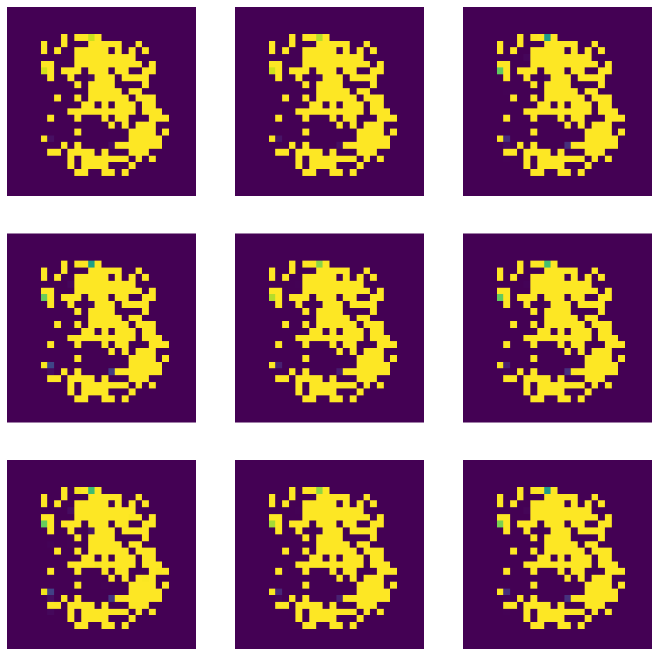

---
jupyter:
  jupytext:
    formats: ipynb,md
    text_representation:
      extension: .md
      format_name: markdown
      format_version: '1.3'
      jupytext_version: 1.14.4
  kernelspec:
    display_name: Python 3 (ipykernel)
    language: python
    name: python3
---

# Generative Adverserial Networks

GANs are a framework for teaching a DL model to capture the training data’s distribution so we can generate new data from that same distribution.

```python
import matplotlib.pyplot as plt
import numpy as np
import pandas as pd
import tensorflow as tf
from tensorflow.keras.datasets import mnist
from tensorflow.keras.layers import Dense,Reshape,Dropout,LeakyReLU,Flatten,BatchNormalization,Conv2D,Conv2DTranspose
from tensorflow.keras.models import Sequential
```

```python
SEED = 42
INPUT_SHAPE = 100
BATCH_SIZE = 32
EPOCHS = 25
```

## Dataset

Using a GAN to generate "fake" MNIST digit images.

```python
# setting up the dataset
(X_train, y_train), (X_test, y_test) = mnist.load_data()

plt.imshow(X_train[8888])
plt.title(y_train[8888])
plt.show()
```


```python
# to speed up the training we can pre-select
# only images with label `3`
X_train_three = X_train[y_train==3]
print(X_train_three.shape)
# there are 6131 images that represent the digit 3
# (6131, 28, 28)
```

```python
# plot results
plt.figure(figsize=(12, 12))
# ROW 1
plt.subplot(3, 3, 1)
plt.axis(False)
plt.imshow(X_train_three[1])
plt.subplot(3, 3, 2)
plt.axis(False)
plt.imshow(X_train_three[2])
plt.subplot(3, 3, 3)
plt.axis(False)
plt.imshow(X_train_three[3])
# ROW 2
plt.subplot(3, 3, 4)
plt.axis(False)
plt.imshow(X_train_three[4])
plt.subplot(3, 3, 5)
plt.axis(False)
plt.imshow(X_train_three[5])
plt.subplot(3, 3, 6)
plt.axis(False)
plt.imshow(X_train_three[6])
# ROW 3
plt.subplot(3, 3, 7)
plt.axis(False)
plt.imshow(X_train_three[7])
plt.subplot(3, 3, 8)
plt.axis(False)
plt.imshow(X_train_three[8])
plt.subplot(3, 3, 9)
plt.axis(False)
plt.imshow(X_train_three[9])
```


### Create Batched Dataset

```python
dataset = tf.data.Dataset.from_tensor_slices(X_train_three).shuffle(buffer_size=1000)
dataset = dataset.batch(BATCH_SIZE, drop_remainder=True).prefetch(1)
```

## Building the Model

### Generator

```python
tf.random.set_seed(SEED)

generator = Sequential(name="generator")
generator.add(Dense(100, activation="relu", input_shape=[INPUT_SHAPE]))
generator.add(Dense(150,activation='relu'))
generator.add(Dense(784, activation="sigmoid")) # 28*28 = 784
generator.add(Reshape([28,28]))
```

### Discriminator

```python
discriminator = Sequential(name="discriminator")
discriminator.add(Flatten(input_shape=[28,28]))
discriminator.add(Dense(150,activation='relu'))
discriminator.add(Dense(100,activation='relu'))
discriminator.add(Dense(1,activation="sigmoid"))

discriminator.compile(loss="binary_crossentropy", optimizer="adam")
discriminator.trainable = False
```

```python
GAN = Sequential([generator, discriminator])

GAN.compile(loss="binary_crossentropy", optimizer="adam")

GAN.summary()

# Model: "sequential"
# _________________________________________________________________
#  Layer (type)                Output Shape              Param #   
# =================================================================
#  generator (Sequential)      (None, 28, 28)            143634    
                                                                 
#  discriminator (Sequential)  (None, 1)                 132951    
                                                                 
# =================================================================
# Total params: 276,585
# Trainable params: 143,634
# Non-trainable params: 132,951
# _________________________________________________________________
```

## Training the Model

```python
# Grab the seprate components
generator, discriminator = GAN.layers

# For every epcoh
for epoch in range(EPOCHS):
    print(f"INFO :: Epoch: {epoch+1}")
    i = 0
    # For every batch in the dataset
    for X_batch in dataset:
        i=i+1
        if i%100 == 0:
            print(f"\tBatch number: {i} of {len(X_train_three)//BATCH_SIZE}")
        #####################################
        ## TRAINING THE DISCRIMINATOR ######
        ###################################
        
        # Create Noise
        noise = tf.random.normal(shape=[BATCH_SIZE, INPUT_SHAPE])
        
        # Generate numbers based just on noise input
        gen_images = generator(noise)
        
        # Concatenate Generated Images against the Real Ones
        # TO use tf.concat, the data types must match!
        X_fake_vs_real = tf.concat([gen_images, tf.dtypes.cast(X_batch,tf.float32)], axis=0)
        
        # Targets set to zero for fake images and 1 for real images
        y1 = tf.constant([[0.]] * BATCH_SIZE + [[1.]] * BATCH_SIZE)
        
        # This gets rid of a Keras warning
        discriminator.trainable = True
        
        # Train the discriminator on this batch
        discriminator.train_on_batch(X_fake_vs_real, y1)
        
        
        #####################################
        ## TRAINING THE GENERATOR     ######
        ###################################
        
        # Create some noise
        noise = tf.random.normal(shape=[BATCH_SIZE, INPUT_SHAPE])
        
        # We want discriminator to belive that fake images are real
        y2 = tf.constant([[1.]] * BATCH_SIZE)
        
        # Avois a warning
        discriminator.trainable = False
        
        GAN.train_on_batch(noise, y2)
        
print("INFO :: Training Completed")
```

## Making Predictions

The Generator expects a noise input tensor with input shape = INPUT_SHAPE. To have the Generator create an image - based on the previous training - we have to input such tensor of beautiful randomness.

```python
# generate noise for 10 images
noise_input = tf.random.normal(shape=[10, INPUT_SHAPE])

print(noise_input.shape)
# (10, 100)
plt.imshow(noise_input)
```


```python
generated_images = generator(noise_input)
generated_images.shape
# TensorShape([10, 28, 28])
```

```python
# plot results
plt.figure(figsize=(12, 12))
# ROW 1
plt.subplot(3, 3, 1)
plt.axis(False)
plt.imshow(generated_images[0])
plt.subplot(3, 3, 2)
plt.axis(False)
plt.imshow(generated_images[1])
plt.subplot(3, 3, 3)
plt.axis(False)
plt.imshow(generated_images[2])
# ROW 2
plt.subplot(3, 3, 4)
plt.axis(False)
plt.imshow(generated_images[3])
plt.subplot(3, 3, 5)
plt.axis(False)
plt.imshow(generated_images[4])
plt.subplot(3, 3, 6)
plt.axis(False)
plt.imshow(generated_images[5])
# ROW 3
plt.subplot(3, 3, 7)
plt.axis(False)
plt.imshow(generated_images[6])
plt.subplot(3, 3, 8)
plt.axis(False)
plt.imshow(generated_images[7])
plt.subplot(3, 3, 9)
plt.axis(False)
plt.imshow(generated_images[8])
```



Why do all generated `3`'s look the same? => [Combating Mode Collapse in GAN training: An Empirical Analysis using Hessian Eigenvalues](https://arxiv.org/abs/2012.09673)

<!-- #region -->
# Deep Convolutional Generative Adversarial Networks (DCGAN)

A DCGAN is a direct extension of the GAN described above, except that it explicitly uses convolutional and convolutional-transpose layers in the discriminator and generator, respectively. It was first described by Radford et. al. in the paper [Unsupervised Representation Learning With Deep Convolutional Generative Adversarial Networks](https://arxiv.org/pdf/1511.06434.pdf).


The __Discriminator__ is made up of strided convolution layers, batch norm layers, and LeakyReLU activations. The input is a 3x64x64 input image and the output is a scalar probability that the input is from the real data distribution.


The __Generator__ is comprised of convolutional-transpose layers, batch norm layers, and ReLU activations. The input is a latent vector, \(z\), that is drawn from a standard normal distribution and the output is a 3x64x64 RGB image. The strided conv-transpose layers allow the latent vector to be transformed into a volume with the same shape as an image.
<!-- #endregion -->

## Dataset

```python
# Generator will use tanh activation function for the last layer,
# so we want to reshape X_train to be within -1 to 1 limits
X_train_norm = X_train/255
X_train_reshaped = X_train_norm.reshape(-1, 28, 28, 1) * 2. - 1.

print(X_train_norm.shape, X_train_reshaped.shape, X_train_reshaped.min(), X_train_reshaped.max())
```

```python
# only images with label `3`
X_train_three_dcgan = X_train_reshaped[y_train==3]
print(X_train_three_dcgan.shape)
# (6131, 28, 28, 1)
```

### Create Batched Dataset

```python
dataset = tf.data.Dataset.from_tensor_slices(X_train_three_dcgan).shuffle(buffer_size=1000)
dataset = dataset.batch(BATCH_SIZE, drop_remainder=True).prefetch(1)
```

## Building the Model

### Generator

```python
tf.random.set_seed(SEED)

generator = Sequential()
generator.add(Dense(7 * 7 * 128, input_shape=[INPUT_SHAPE]))
generator.add(Reshape([7, 7, 128]))
generator.add(BatchNormalization())
generator.add(Conv2DTranspose(64, kernel_size=5, strides=2, padding="same",
                                 activation="relu"))
generator.add(BatchNormalization())
generator.add(Conv2DTranspose(1, kernel_size=5, strides=2, padding="same",
                                 activation="tanh"))
```

### Discriminator

```python
discriminator = Sequential()
discriminator.add(Conv2D(64, kernel_size=5, strides=2, padding="same",
                        activation=LeakyReLU(0.3),
                        input_shape=[28, 28, 1]))
discriminator.add(Dropout(0.5))
discriminator.add(Conv2D(128, kernel_size=5, strides=2, padding="same",
                        activation=LeakyReLU(0.3)))
discriminator.add(Dropout(0.5))
discriminator.add(Flatten())
discriminator.add(Dense(1, activation="sigmoid"))

discriminator.compile(loss="binary_crossentropy", optimizer="adam")
discriminator.trainable = False
```

```python
GAN = Sequential([generator, discriminator])
GAN.compile(loss="binary_crossentropy", optimizer="adam")
GAN.summary()

# Model: "sequential_4"
# _________________________________________________________________
#  Layer (type)                Output Shape              Param #   
# =================================================================
#  sequential_1 (Sequential)   (None, 28, 28, 1)         840705    
                                                                 
#  sequential_3 (Sequential)   (None, 1)                 212865    
                                                                 
# =================================================================
# Total params: 1,053,570
# Trainable params: 840,321
# Non-trainable params: 213,249
# _________________________________________________________________
```

## Model Training

```python
# Grab the seprate components
generator, discriminator = GAN.layers

# For every epcoh
for epoch in range(EPOCHS):
    print(f"INFO :: Epoch: {epoch+1}")
    i = 0
    # For every batch in the dataset
    for X_batch in dataset:
        i=i+1
        if i%20 == 0:
            print(f"\tBatch number: {i} of {len(X_train_three)//BATCH_SIZE}")
        #####################################
        ## TRAINING THE DISCRIMINATOR ######
        ###################################
        
        # Create Noise
        noise = tf.random.normal(shape=[BATCH_SIZE, INPUT_SHAPE])
        
        # Generate numbers based just on noise input
        gen_images = generator(noise)
        
        # Concatenate Generated Images against the Real Ones
        # TO use tf.concat, the data types must match!
        X_fake_vs_real = tf.concat([gen_images, tf.dtypes.cast(X_batch,tf.float32)], axis=0)
        
        # Targets set to zero for fake images and 1 for real images
        y1 = tf.constant([[0.]] * BATCH_SIZE + [[1.]] * BATCH_SIZE)
        
        # This gets rid of a Keras warning
        discriminator.trainable = True
        
        # Train the discriminator on this batch
        discriminator.train_on_batch(X_fake_vs_real, y1)
        
        
        #####################################
        ## TRAINING THE GENERATOR     ######
        ###################################
        
        # Create some noise
        noise = tf.random.normal(shape=[BATCH_SIZE, INPUT_SHAPE])
        
        # We want discriminator to belive that fake images are real
        y2 = tf.constant([[1.]] * BATCH_SIZE)
        
        # Avois a warning
        discriminator.trainable = False
        
        GAN.train_on_batch(noise, y2)
        
print("TRAINING COMPLETE")            
```

## Making Predictions

The Generator expects a noise input tensor with input shape = INPUT_SHAPE. To have the Generator create an image - based on the previous training - we have to input such tensor of beautiful randomness.

```python
# generate noise for 10 images
noise_input = tf.random.normal(shape=[10, INPUT_SHAPE])

print(noise_input.shape)
# (10, 100)
```

```python
generated_images = generator(noise_input)
generated_images.shape
# TensorShape([10, 28, 28])
```

```python
# plot results
plt.figure(figsize=(12, 12))
# ROW 1
plt.subplot(3, 3, 1)
plt.axis(False)
plt.imshow(generated_images[0])
plt.subplot(3, 3, 2)
plt.axis(False)
plt.imshow(generated_images[1])
plt.subplot(3, 3, 3)
plt.axis(False)
plt.imshow(generated_images[2])
# ROW 2
plt.subplot(3, 3, 4)
plt.axis(False)
plt.imshow(generated_images[3])
plt.subplot(3, 3, 5)
plt.axis(False)
plt.imshow(generated_images[4])
plt.subplot(3, 3, 6)
plt.axis(False)
plt.imshow(generated_images[5])
# ROW 3
plt.subplot(3, 3, 7)
plt.axis(False)
plt.imshow(generated_images[6])
plt.subplot(3, 3, 8)
plt.axis(False)
plt.imshow(generated_images[7])
plt.subplot(3, 3, 9)
plt.axis(False)
plt.imshow(generated_images[8])
```

